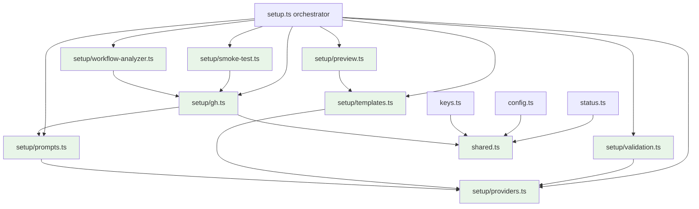

# refactor(cliproxy): Simplify pass on setup.ts after OpenAI opt-in lands

## Overview

`packages/cli/src/commands/cliproxy/setup.ts` reached **1619 LOC** after the v0.7.0 OpenAI provider opt-in landed (PR #307). The file now hosts ten distinct responsibilities — provider/model resolution, harness template construction, HTTP model verification, GitHub workflow analysis, smoke-test orchestration, dry-run preview formatting, interactive prompt helpers, GitHub mutation + retry handling, and the top-level action handler — with all logic, types, and tests colocated in one module. This is past the threshold where adding more features without restructuring becomes a maintenance burden.

This plan splits `setup.ts` into focused submodules under `packages/cli/src/commands/cliproxy/setup/`, extracts the action handler so it can be tested directly, and folds in five carry-over items the v0.7.0 ship surfaced (force-gate semantics fix, error-text clarification, AGENTS.md migration recipe, six deferred `ce:review` P2/P3 items, `runSetupCommand` extraction). Anthropic-only flows stay byte-identical; no exported symbol is renamed; tests remain green between every unit.

## Problem Frame

After PR #307 merged at `b2e3fe2` and v0.7.0 published, `setup.ts` is now ten functional areas glued into one file. Concrete pain points:

- **Action handler is 260 lines of inline `.action(async () => { … })` callback** — cannot be tested at the orchestration boundary. PR #307's review-response commit `7a7b15d` already fixed the live bug (wrapping the gh probes in `if (!options.dryRun)` at line 1365), but the *test class* that would have caught it before Fro Bot still doesn't exist: no test exercises the action body directly with injected fakes. This plan ships the structural fix that enables that test class going forward. Memory 3922 captures the underlying reviewer-brief contract-trace lesson.
- **`mustConfirmDestructive(providers)` is named misleadingly** — fires on provider selection regardless of whether secrets exist on the target repo. Council (alpha) initially flagged this for removal. But adversarial review (ADV-002) + security-lens correctly identified that the collision check at line 1448 is not provably sufficient: `listExistingGhNames` returning an empty array due to a transient gh failure would silently bypass the collision gate, allowing overwrite-without-`--force`. The pre-gate is kept as defense-in-depth and renamed `confirmDestructiveProviderChange` to communicate its user-facing safety purpose.
- **`--force` error text at line ~1080 is misleading** — reads as "rotate the proxy bearer key" when it actually means "overwrite write-only GitHub secret values." Caused a real misdiagnosis during the v0.7.0 dogfooding session that needed a Council ruling to unblock. Council (gamma) flagged this; deferred to this PR.
- **Cross-cliproxy helper duplication** — `requestJson` is duplicated across `setup.ts`, `keys.ts`, `config.ts`; `managementHeaders` across all four (`setup`, `keys`, `config`, `status`). Each duplication is a maintenance multiplier.
- **Six deferred `ce:review` P2/P3 findings from PR #307** — dead env-approval branch in smoke test, 59 `as any` casts in `setup.test.ts` (in eslint-disable blocks with rationale), `--providers` default value not surfaced in help, `--model` requiredness rule not in help, `SmokeResult.kind` not in machine-parseable stdout, `ModelEntry` Zod validation gap, smoke-test race-attribution edge cases.

The refactor preserves every exported symbol signature and every behavior except: (a) `mustConfirmDestructive` renamed to `confirmDestructiveProviderChange` (no behavior change, just a clarifying rename), (b) both gate throw texts rewritten to distinguish "overwriting GitHub secret values" from "rotating the proxy bearer token," (c) `SmokeResult.kind` added to smoke-test stdout for agent parseability, (d) new `--ack-key-reuse` flag + interactive key-reuse confirmation prompt when `--key` is supplied for a non-fresh repo (R8 — closes the silent-footgun risk security-lens identified).

## Requirements Trace

- **R1.** Split `setup.ts` into eight focused submodules under `packages/cli/src/commands/cliproxy/setup/`, leaving the parent as orchestrator + cli-registration only. (origin issue #306 module-candidate list)
- **R2.** Extract `runSetupCommand` from the inline `.action()` callback into a named export with dependency-injected `gh` + `prompts` namespaces, matching the `cliproxyLoginAction` pattern from PR #303. The justification is **testability hardening**, not bug repair — the dry-run/gh-probe ordering bug was fixed in PR #307's `7a7b15d`, but the action-handler-level test class that would catch the next bug of that shape doesn't exist yet. (origin issue #306 item 5, memory 3843)
- **R3.** Rename `mustConfirmDestructive(providers)` to `confirmDestructiveProviderChange(providers)` to communicate its user-facing safety purpose (defense-in-depth alongside the collision check, not a redundant gate). Rewrite both the pre-gate throw and the collision-gate throw text to distinguish "overwriting GitHub secret values" from "rotating the underlying proxy key." (origin issue #306 items 1+2; Council 2026-05-26 alpha + gamma + 3-reviewer document-review consensus to keep pre-gate; memory 3939)
- **R4.** Document the canonical anthropic-only → dual-provider migration invocation in `packages/cli/AGENTS.md`. (origin issue #306 item 3, memory 3939)
- **R5.** Address five of the six deferred `ce:review` P2/P3 findings from PR #307 listed in origin issue #306 item 4 (4a, 4c, 4d, 4e, 4f). Item 4b (59 `as any` casts in `setup.test.ts`) is split into a standalone follow-up issue because partial cleanup creates an arbitrary stopping point (scope-guardian P2) — the export of `RunSetupDeps` in R2 will make most casts unnecessary, making the cleanup a focused follow-up PR after this refactor lands. (origin issue #306 item 4 minus 4b)
- **R6.** Deduplicate `requestJson` + `managementHeaders` into `packages/cli/src/commands/cliproxy/shared.ts`, consumed by `setup.ts`, `keys.ts`, `config.ts`, `status.ts`. (origin issue #306 "Shared package extraction candidates")
- **R7.** Every implementation unit lands `bun test --recursive` green; exported symbol signatures stay stable; anthropic-only flows stay byte-identical (validated via dry-run comparison against the explicit byte-count baselines below).

- **R8.** Add an explicit operator acknowledgment guard when `--key` is supplied for a repo with existing `OPENCODE_AUTH_JSON`: interactive mode prompts `'You supplied --key X. Verify X matches the bearer token inside the existing OPENCODE_AUTH_JSON on <repo>. Continue?'`; non-interactive mode requires a new `--ack-key-reuse` flag to bypass. Reduces the silent-footgun risk security-lens identified (the CLI cannot verify the key matches because GitHub's secrets API is write-only). (origin: document-review security-lens P2)

## Scope Boundaries

- **Not in scope:** any change to the published CLI surface (subcommand names, flag names, flag positions). Help text wording for `--providers` default and `--model` requiredness is in scope under R5.
- **Not in scope:** moving any helper to `packages/shared/`. `packages/shared/` is for cross-app provisioning helpers consumed only from `apps/*/server/`, per memory 3924 — never imported from published `packages/cli/src/` runtime. Cliproxy helpers stay under `packages/cli/src/commands/cliproxy/`.
- **Not in scope:** test framework changes, snapshot regeneration beyond what the refactor's import-path changes require, or any change to the `bun test --recursive` invocation.
- **Not in scope:** changes to `apps/cliproxy/` (server provisioning, droplet config, deploy script, AGENTS.md). Only `packages/cli/src/commands/cliproxy/` and `packages/cli/AGENTS.md` are touched.
- **Not in scope:** rollout of dual-provider routing to other consumer repos (`fro-bot/.github`, `fro-bot/agent`, etc.). That happens via the canonical migration invocation documented under R4 and is operator-driven.

### Deferred to Separate Tasks

- **`bfra-me/works` + `bfra-me/.github` orphan cleanup:** both repos moved off cliproxy to `opencode-go/*` providers; their `fro-bot-bfra-me-*` keys are orphaned on `cliproxy.fro.bot`. Cleanup happens via `cliproxy keys remove <name>` whenever Marcus decides; not bundled here.
- **Issue #301 (codex login testing depth) + Issue #302 (codex flag preflight):** unrelated to setup.ts; pre-existing follow-ups from PR #303.

## Context & Research

### Relevant Code and Patterns

- `packages/cli/src/commands/cliproxy/login.ts` — `cliproxyLoginAction` is the canonical pattern for a named-export CLI action with dependency-injected `SpawnFn`. The new `runSetupCommand` mirrors this shape.
- `packages/cli/src/commands/cliproxy/host.ts` — single-purpose validation helper colocated with its consumers; demonstrates the "small focused module" convention this refactor scales to setup.
- `packages/cli/src/lib/action-ctx.ts` — canonical `ActionCtx` interface for MCP-capturable CLI actions; orchestrator tests use this, never a bespoke shape.
- `packages/cli/src/commands/cliproxy/status.ts`, `keys.ts`, `config.ts` — already consume `requestJson` + `managementHeaders` as local helpers (duplicated); become R6 consumers of the new `shared.ts`.
- `packages/shared/server/droplet-helpers.ts` — example of a colocated-test module (single `*.test.ts` alongside); the per-submodule test pattern this refactor adopts.
- `packages/cli/AGENTS.md` — per-file local helpers convention; "no premature abstraction" rule. R6 extraction is justified by current duplication (3-4 callers), not by speculative reuse.

### Institutional Learnings

- `docs/solutions/workflow-issues/cliproxy-first-deploy-cascade-2026-04-06.md` — reinforces the discipline of behavior-identical refactors at contract boundaries. Volume mounts, env names, host keys are easy to assume "already right" when they aren't. For this refactor: don't assume the wizard's secrets flow is unchanged because the code compiles — re-run the dry-run byte-count comparison after each extraction.
- `docs/solutions/workflow-issues/gateway-first-deploy-cascade-2026-05-20.md` — same shape. The meta-lesson: test the boundary where bytes cross layers, not just helpers beneath it. For this refactor: keep one high-value integration test on the top-level `cliproxy setup` command path through every unit.
- `docs/solutions/workflow-issues/bun-deploy-user-permissions-ci-2026-04-02.md` — Bun's `.bun/` cache and postinstall behavior cause failures when packages rely on `node_modules` semantics. For this refactor: when test-helper resolution moves between files, verify under `bun test` (not just `bunx tsc`).

### Slack Context

Not gathered. This is a single-repo single-author refactor with no organizational coordination surface.

### External References

Not gathered. Mechanical TypeScript module-split work with no new framework patterns or security-sensitive surfaces. Phase 1.2 decision per `ce:plan` skill.

## Key Technical Decisions

- **Single-unit-per-submodule sequencing** — 12 units total (8 extractions + 1 orchestrator slim + 3 carry-over units split per coherent concern: R6 shared.ts, R4+R5/4c+snapshot, R5/4e Zod). Each unit lands as an atomic commit. Atomic commits make per-unit revert trivial and per-unit `ce:review` cheap. Unit 10 was originally a junk drawer; split per scope-guardian P1 + coherence P2 + adversarial ADV-004 cross-reviewer agreement. R8 (key-reuse acknowledgment guard) folds into Unit 9 since it's part of the orchestrator's flow logic.
- **Per-module test files, colocated** — `setup/providers.test.ts`, `setup/templates.test.ts`, etc. Matches existing repo convention (`packages/cli/src/commands/cliproxy/login.ts` → `login.test.ts`, `packages/shared/server/droplet-helpers.ts` → `droplet-helpers.test.ts`). Existing `setup.test.ts` shrinks to orchestrator/integration coverage only.
- **Topological extraction order: leaf modules first** — `providers` → `prompts` → `templates` → `validation` → `gh` → `workflow-analyzer` → `smoke-test` → `preview` → orchestrator slim. Each leaf can land with its tests green before any consumer changes. Reversing the order would force temporary re-exports through `setup.ts`, which violates the "no symbol rename" constraint and creates churn.
- **Gray-area symbol placement** — `buildApiKeyValue` → `prompts.ts` (paired with the key-name interactive prompt). `stripTrailingSlash` → `templates.ts` (used by `getHarnessTemplate` for baseUrl normalization in the construction path; validation HTTP probes consume the already-normalized URL passed into them, not the raw input). `extractErrorMessage` → inline at each call site (1-line `instanceof Error` wrapper; new utility module would be premature abstraction per `packages/cli/AGENTS.md`).
- **`runSetupCommand` signature: dependency-injected `gh` + `prompts` namespaces** — matches `cliproxyLoginAction`'s `SpawnFn` injection from PR #303. Enables true action-handler-level tests covering the offline-safe dry-run contract (PR #307 R3 test gap). Default args bind to the real implementations so production callers don't change.
- **Cliproxy-local `shared.ts`, not `packages/shared/`** — `requestJson` + `managementHeaders` are duplicated across cliproxy commands only. Per memory 3924, `packages/shared/` is reserved for cross-app provisioning helpers. Moving CLI runtime helpers to `packages/shared/` would widen the published-runtime blast radius without payoff. Cliproxy-local consolidation is the right scope.
- **No exported-symbol signature changes** — exported function signatures and type shapes are part of the test contract per origin issue #306 "Non-goals." Import paths necessarily change as symbols move into per-module files (e.g., `import {parseProviders} from './setup'` becomes `import {parseProviders} from './setup/providers'`), but no consumer outside `packages/cli/src/commands/cliproxy/` imports from these symbols today, so the path churn is internal. Tests can move into per-module files but their assertions stay identical.
- **`mustConfirmDestructive(providers)` renamed `confirmDestructiveProviderChange(providers)`, kept as defense-in-depth** — Council majority initially said the pre-gate is redundant, but document-review's 3-reviewer cross-agreement (security-lens P1, scope-guardian P1, adversarial ADV-002 H) flagged a real silent-overwrite failure mode: `listExistingGhNames` returning empty due to a transient gh API failure would bypass the collision check. The pre-gate is the second line of defense. The rename makes its purpose explicit (user-facing safety, not redundant gating); the throw text is rewritten under R3.
- **`SmokeResult.kind` added to stdout** — currently only appears in spinner messages, not stdout. Adding a single `[smoke-test] kind=pass` line (or similar) to `ctx.console.log` lets MCP consumers and agent harnesses parse the result without log scraping. R5 item 4d.

## Open Questions

### Resolved During Planning

- **Unit granularity** (1 vs. 10 vs. 4 units) — resolved to 12 units (single-unit-per-submodule + 3 split carry-over units after document-review). Per-PR review cost stays low; per-commit revert is trivial. Original 10-unit shape collapsed Unit 10 into a junk drawer; document-review (scope-guardian P1 + coherence P2 + adversarial ADV-004) recommended the split.
- **Gray-area symbol placement** (`buildApiKeyValue`, `stripTrailingSlash`, `extractErrorMessage`) — resolved per the table above; no new `utils.ts` module.
- **`shared.ts` location** — resolved to `packages/cli/src/commands/cliproxy/shared.ts`; not promoted to `packages/shared/`. Both `requestJson` and `managementHeaders` live in this one home regardless of which submodule consumes them most.
- **Test file split strategy** — resolved to per-module colocated test files (`setup/providers.test.ts`, etc.); existing `setup.test.ts` shrinks to orchestrator integration coverage.
- **Should `mustConfirmDestructive` survive as a function?** — Yes, renamed `confirmDestructiveProviderChange`, kept as user-facing safety defense-in-depth. Document-review cross-agreement (3 reviewers) overrode Council's initial deletion recommendation. Both the pre-gate throw and the collision-gate throw text are rewritten under R3.

### Deferred to Implementation

- **Final per-module export lists** — repo-research-analyst's symbol map is the starting point, but per-unit implementation may surface a symbol the analyst placed wrong. Implementer adjusts on a single-unit basis without re-planning.
- **Per-unit snapshot regeneration** — `cli.test.ts.snap` may need refresh if any import path change leaks into help text generation. Detected at unit verification, not pre-planned.
- **Test-helper consolidation under `setup/__fixtures__/`** — workflow strings used across `workflow-analyzer.test.ts` + `setup.test.ts` may benefit from a shared fixture file. Decided per-unit, not pre-planned.
- **Whether `extractErrorMessage` inlining causes lint noise** — if 10+ inline sites trip a duplication lint rule, recast as a local helper inside the few modules that need it. Detected at lint time.

## Output Structure

```text
packages/cli/src/commands/cliproxy/
├── setup.ts                              # orchestrator + cli-registration only (~150 LOC)
├── setup.test.ts                         # orchestrator/integration coverage only (slimmed)
├── shared.ts                             # NEW: requestJson, managementHeaders
├── shared.test.ts                        # NEW
└── setup/                                # NEW directory
    ├── providers.ts                      # ProviderId, parseProviders, PROVIDER_DEFAULTS, promptForProviders/Model/CustomModel
    ├── providers.test.ts
    ├── templates.ts                      # HarnessTemplate, getHarnessTemplate, formatTemplateSummary, collectCollisions, stripTrailingSlash
    ├── templates.test.ts
    ├── validation.ts                     # validateSetupOptions, verifyModelsAvailable, assertProxyReachable, assertProxyKeyWorks
    ├── validation.test.ts
    ├── workflow-analyzer.ts              # analyzeFroBotWorkflow, findFroBotAgentStepBodies, interpretGhContentResult, checkFroBotWorkflow, formatWorkflowSnippet, REQUIRED_OPENCODE_INPUTS
    ├── workflow-analyzer.test.ts
    ├── smoke-test.ts                     # SmokeResult, GhRunEntry, runSmokeTest
    ├── smoke-test.test.ts
    ├── preview.ts                        # DryRunPreviewOptions, formatDryRunPreview
    ├── preview.test.ts
    ├── prompts.ts                        # promptValue, ensureRepoFormat, ensureSecretName, cancelAndExit, promptGenericSecretNames, buildApiKeyValue
    ├── prompts.test.ts
    ├── gh.ts                             # runCommand, runGh, isGhRateLimitError, queryRateLimitReset, withGhRetry, assertGhInstalled/Authenticated/RepoAccess, listExistingGhNames, createManagementApiKey, deleteManagementApiKey, applyGhValue
    └── gh.test.ts
```

`packages/cli/AGENTS.md` gains a "Migration recipe" subsection under R4. Other cliproxy command files (`keys.ts`, `config.ts`, `status.ts`) update to import `requestJson` + `managementHeaders` from `shared.ts` instead of redefining them locally.

## High-Level Technical Design

> *This illustrates the intended approach and is directional guidance for review, not implementation specification. The implementing agent should treat it as context, not code to reproduce.*



Action-handler shape sketch (directional):

```text
runSetupCommand(options: SetupOptions, deps: RunSetupDeps = {})
  ├─ resolve interactive from process.stdin.isTTY (overridable via deps.interactive)
  ├─ resolve baseUrl from CLIPROXY_DOMAIN (overridable via deps.baseUrl)
  ├─ if --dry-run: deps.ctx.console.log(formatDryRunPreview(plan)); return
  │     (early-return owned by runSetupCommand, not by plan builders)
  ├─ deps.gh.* preflight (gh installed, authenticated, repo access, existing secret names)
  ├─ plan = interactive ? buildInteractivePlan(...) : buildNonInteractivePlan(...)
  ├─ collision check; throw with rewritten text if any && !options.force
  ├─ for each secret/variable: deps.gh.applyGhValue(...)
  ├─ if opencode harness: deps.gh.* workflow analyzer + warn
  ├─ if --verify-smoke: result = deps.smoke.runSmokeTest(...); deps.ctx.console.log(`[smoke-test] kind=${result.kind}`)
  └─ success: return; error: deps.ctx.console.error(msg); deps.ctx.process.exit(1)
```

Typed `RunSetupDeps` contract (the exact shape implementers must conform to):

```text
interface RunSetupDeps {
  interactive?: boolean
  baseUrl?: string
  ctx?: ActionCtx  // canonical from packages/cli/src/lib/action-ctx.ts; defaults to a real-process binding
  gh?: {
    assertGhInstalled: typeof assertGhInstalled
    assertGhAuthenticated: typeof assertGhAuthenticated
    assertRepoAccess: typeof assertRepoAccess
    listExistingGhNames: typeof listExistingGhNames
    createManagementApiKey: typeof createManagementApiKey
    deleteManagementApiKey: typeof deleteManagementApiKey
    applyGhValue: typeof applyGhValue
    withGhRetry: typeof withGhRetry
  }
  prompts?: {
    promptValue: typeof promptValue
    confirm: typeof confirm
    intro: typeof intro
    note: typeof note
    outro: typeof outro
  }
  smoke?: {
    runSmokeTest: typeof runSmokeTest
  }
  validation?: {
    assertProxyReachable: typeof assertProxyReachable
    assertProxyKeyWorks: typeof assertProxyKeyWorks
    verifyModelsAvailable: typeof verifyModelsAvailable
  }
}
```

DI is for tests and internal callers only. Production callers do not supply a `deps` arg; default args bind to the real implementations. The interface is exported so test files can construct typed mocks without `as any` casts.

## Implementation Units

- [x] **Unit 1: Extract `providers.ts`** — shipped as `f262f75`

**Goal:** Move provider/model parsing, defaults, and interactive prompts into a focused submodule.

**Requirements:** R1, R7

**Dependencies:** None (leaf module).

**Files:**
- Create: `packages/cli/src/commands/cliproxy/setup/providers.ts`
- Create: `packages/cli/src/commands/cliproxy/setup/providers.test.ts`
- Modify: `packages/cli/src/commands/cliproxy/setup.ts` (remove the moved symbols + add imports)
- Modify: `packages/cli/src/commands/cliproxy/setup.test.ts` (move provider-specific tests out, keep imports through new path if any orchestrator tests still reference them)

**Approach:**
- Move: `ProviderId` type, `providerIdSchema` (private), `PROVIDER_DEFAULTS`, `CUSTOM_MODEL_SENTINEL` (private unless `prompts.ts` needs it; final placement decided per code reality), `parseProviders`, `promptForProviders`, `promptForModel`, `promptForCustomModel`.
- `parseProviders` imports `ProviderId` from itself.
- Test scenarios already exist in `setup.test.ts` — extract by name (search the `describe` blocks for "parseProviders", "promptForProviders", "promptForModel", "promptForCustomModel" and move them).

**Execution note:** Test-first against the moved test file — confirm tests still pass before deleting from `setup.test.ts`.

**Patterns to follow:**
- `packages/cli/src/commands/cliproxy/host.ts` for focused-module structure.

**Test scenarios:**
- Integration: tests imported by their old names from `setup.test.ts` must pass against the new `providers.ts` import path with identical assertions.
- Happy path: `parseProviders('anthropic')` → `['anthropic']`; `parseProviders('anthropic,openai')` → `['anthropic', 'openai']`.
- Error path: `parseProviders('claude')` → throws with provider list including known providers; `parseProviders('')` → throws.
- Prototype-chain safety: `parseProviders('__proto__')` → throws (per memory 3843 lesson from PR #303).

**Verification:**
- `bun test packages/cli/src/commands/cliproxy/setup/providers.test.ts` passes.
- `bun test --recursive` still passes (no regression).
- `bunx tsc --noEmit` clean.
- `bun run lint` clean.

- [x] **Unit 2: Extract `prompts.ts`** — shipped as `d912a48`

**Goal:** Move generic prompt helpers + key-name interactive prompt out of orchestrator.

**Requirements:** R1, R7

**Dependencies:** Unit 1 (imports `ProviderId` for prompt validation when needed; if not needed, no dep).

**Files:**
- Create: `packages/cli/src/commands/cliproxy/setup/prompts.ts`
- Create: `packages/cli/src/commands/cliproxy/setup/prompts.test.ts`
- Modify: `packages/cli/src/commands/cliproxy/setup.ts`
- Modify: `packages/cli/src/commands/cliproxy/setup.test.ts`

**Approach:**
- Move: `promptValue`, `ensureRepoFormat`, `ensureSecretName`, `cancelAndExit`, `promptGenericSecretNames`, `buildApiKeyValue`.
- `buildApiKeyValue` joins `prompts.ts` per the "Gray-area symbol placement" decision; paired with the key-name prompt.
- `cancelAndExit` calls `process.exit` directly — keep that side effect as-is per `packages/cli/AGENTS.md`'s "scoped to `cliproxy setup`" convention.

**Patterns to follow:**
- Existing prompt-helper structure in the current `setup.ts` (no API surface change).

**Test scenarios:**
- Integration: existing prompt-helper tests move with the symbols; assertions unchanged.
- Happy path: `ensureRepoFormat('owner/repo')` → `'owner/repo'`; `ensureSecretName('VALID_NAME')` → `undefined` (no error).
- Error path: `ensureRepoFormat('owner repo')` → throws; `ensureSecretName('lower-case')` → throws.
- Happy path: `buildApiKeyValue('my repo ci!')` → `'sk-my-repo-ci-<uuid>'` (slug + uuid suffix).
- Edge case: `buildApiKeyValue('')` → `'sk-cliproxy-<uuid>'` (default slug fallback).

**Verification:**
- `bun test packages/cli/src/commands/cliproxy/setup/prompts.test.ts` passes.
- `bun test --recursive` passes.
- `bunx tsc --noEmit` clean.

- [x] **Unit 3: Extract `templates.ts`** — shipped as `a05d15f`

**Goal:** Move harness template construction + collision detection out of orchestrator.

**Requirements:** R1, R7

**Dependencies:** Unit 1 (imports `ProviderId`, `PROVIDER_DEFAULTS`).

**Files:**
- Create: `packages/cli/src/commands/cliproxy/setup/templates.ts`
- Create: `packages/cli/src/commands/cliproxy/setup/templates.test.ts`
- Modify: `packages/cli/src/commands/cliproxy/setup.ts`
- Modify: `packages/cli/src/commands/cliproxy/setup.test.ts`

**Approach:**
- Move: `HarnessTemplate`, `SecretAssignment`, `VariableAssignment`, `GenericSecretNames` types; `getHarnessTemplate`, `formatTemplateSummary`, `collectCollisions`, `stripTrailingSlash` functions.
- `stripTrailingSlash` lives here because `getHarnessTemplate` is the only consumer of the raw input form; validation HTTP probes receive the already-normalized URL from upstream callers.
- `OMO_TOKEN` map and provider-insertion ordering stay private inside `templates.ts`.
- Anthropic-only flow byte counts must match pre-refactor: validated via dry-run comparison in Unit 10's verification.

**Test scenarios:**
- Integration: existing template tests move with symbols.
- Happy path (dual-provider): `getHarnessTemplate('opencode', {keyValue: 'sk-test', baseUrl: 'https://cliproxy.fro.bot', providers: ['anthropic', 'openai'], model: 'openai/gpt-5.4-mini'})` produces `OPENCODE_AUTH_JSON` containing both anthropic and openai entries with the same `keyValue`.
- Happy path (anthropic-only): byte-identical output to v0.7.0 — `OPENCODE_AUTH_JSON` 51 bytes with `sk-placeholder`, 80 bytes for `OPENCODE_CONFIG`.
- Edge case: `collectCollisions` with empty existing secrets/variables → `[]`.
- Happy path: `collectCollisions` with existing `OPENCODE_AUTH_JSON` → `['secret OPENCODE_AUTH_JSON']`.

**Verification:**
- `bun test packages/cli/src/commands/cliproxy/setup/templates.test.ts` passes.
- `bun test --recursive` passes.
- Manual dry-run byte-count check: `bunx --bun infra cliproxy setup --harness opencode --repo test/test --providers anthropic --dry-run` produces `OPENCODE_AUTH_JSON (51 bytes)`, `OPENCODE_CONFIG (80 bytes)`, `OMO_PROVIDERS (12 bytes)`.

- [x] **Unit 4: Extract `validation.ts`** — shipped as `d46d486`

**Goal:** Move plan validation + HTTP probes (model availability, proxy reachability) out of orchestrator.

**Requirements:** R1, R7

**Dependencies:** Unit 1 (`ProviderId`), Unit 3 (`HarnessTemplate` type if `validateSetupOptions` references it).

**Files:**
- Create: `packages/cli/src/commands/cliproxy/setup/validation.ts`
- Create: `packages/cli/src/commands/cliproxy/setup/validation.test.ts`
- Modify: `packages/cli/src/commands/cliproxy/setup.ts`
- Modify: `packages/cli/src/commands/cliproxy/setup.test.ts`

**Approach:**
- Move: `validateSetupOptions`, `verifyModelsAvailable`, `assertProxyReachable`, `assertProxyKeyWorks`.
- `MODEL_ID_RE` regex moves here (validation owns model syntax).
- `extractErrorMessage` is inlined at each call site per gray-area decision; if the call sites cluster heavily inside `validation.ts`, recast as a local helper inside this file only (no shared util module).

**Test scenarios:**
- Integration: existing validation tests move with symbols. PR #307's new dry-run regression tests stay with `validateSetupOptions`.
- Happy path: `validateSetupOptions({...valid...})` → no throw.
- Error path (R5/4e prep): `verifyModelsAvailable` with fetch returning malformed JSON → throws with descriptive message.
- Error path: `validateSetupOptions({...no key, not dry-run...})` → throws "--key required".
- Edge case (dry-run): `validateSetupOptions({...no key, dry-run...})` → no throw.
- Happy path: `MODEL_ID_RE.test('anthropic/claude-sonnet-4-6')` → true; `MODEL_ID_RE.test('openai/gpt-5.4-mini.')` → false (trailing dot rejected per PR #307 fix).

**Verification:**
- `bun test packages/cli/src/commands/cliproxy/setup/validation.test.ts` passes.
- `bun test --recursive` passes.

- [x] **Unit 5: Extract `gh.ts`** — shipped as `6848e1c` (rollback tests deferred to Unit 9 per Option A)

**Goal:** Move GitHub CLI orchestration (spawn, retry, rate-limit, mutation) out of orchestrator.

**Requirements:** R1, R7

**Dependencies:** Unit 2 (`prompts.ts` for `promptValue`/`cancelAndExit` if `withGhRetry` continues to invoke them; if it takes injected callbacks instead, no dep).

**Files:**
- Create: `packages/cli/src/commands/cliproxy/setup/gh.ts`
- Create: `packages/cli/src/commands/cliproxy/setup/gh.test.ts`
- Modify: `packages/cli/src/commands/cliproxy/setup.ts`
- Modify: `packages/cli/src/commands/cliproxy/setup.test.ts`

**Approach:**
- Move: `runCommand`, `runGh`, `isGhRateLimitError`, `queryRateLimitReset`, `withGhRetry`, `assertGhInstalled`, `assertGhAuthenticated`, `assertRepoAccess`, `listExistingGhNames`, `createManagementApiKey`, `deleteManagementApiKey`, `applyGhValue`.
- If `withGhRetry` needs prompt I/O, accept callbacks; do not import `prompts.ts` directly to keep `gh.ts` testable in isolation.
- `applyGhValue` continues to pipe secret values via stdin (never `--body`) per existing PR #102 invariant.

**Test scenarios:**
- Integration: existing gh-helper tests move with symbols, including the 8 rate-limit-retry tests added in PR #176.
- Happy path: `isGhRateLimitError({stderr: 'API rate limit exceeded'})` → true.
- Edge case: `isGhRateLimitError({stderr: 'some other error'})` → false.
- Error path: `applyGhValue('secret', 'NAME', 'owner/repo', 'value')` invokes `gh secret set NAME --repo owner/repo` with stdin pipe (not `--body`).
- Happy path: `withGhRetry` retries on rate-limit error up to N times before throwing.
- **Rollback (R7, security-lens P2):** mock `createManagementApiKey` to succeed, then mock the next `applyGhValue` call to fail — assert `deleteManagementApiKey` is invoked with the same key value before the error propagates up. Closes the PR #103 compensating-rollback coverage gap.
- **Rollback (R7, security-lens P2):** mock `createManagementApiKey` to succeed, mock all `applyGhValue` calls to succeed, then mock `assertProxyKeyWorks` to fail — assert `deleteManagementApiKey` is invoked before the error propagates up.

**Verification:**
- `bun test packages/cli/src/commands/cliproxy/setup/gh.test.ts` passes (includes the 8 PR #176 retry tests + the 2 new rollback regression tests).
- `bun test --recursive` passes.

- [x] **Unit 6: Extract `workflow-analyzer.ts`** — shipped as `08be711`

**Goal:** Move fro-bot.yaml parsing + `with:` block analysis out of orchestrator.

**Requirements:** R1, R7

**Dependencies:** Unit 5 (`gh.ts` for `runGh` if `checkFroBotWorkflow` invokes it directly; if it takes injected callbacks, no dep).

**Files:**
- Create: `packages/cli/src/commands/cliproxy/setup/workflow-analyzer.ts`
- Create: `packages/cli/src/commands/cliproxy/setup/workflow-analyzer.test.ts`
- Modify: `packages/cli/src/commands/cliproxy/setup.ts`
- Modify: `packages/cli/src/commands/cliproxy/setup.test.ts`

**Approach:**
- Move: `FroBotWorkflowCheck` type, `REQUIRED_OPENCODE_INPUTS` const, `findFroBotAgentStepBodies`, `analyzeFroBotWorkflow`, `interpretGhContentResult`, `checkFroBotWorkflow`, `formatWorkflowSnippet`.
- `findFroBotAgentStepBodies` stays private unless tests directly import it.
- `interpretGhContentResult` stays exported (test contract from PR #133).

**Test scenarios:**
- Integration: existing workflow-analyzer tests move with symbols (including the 4-way discriminated union tests from PR #133).
- Happy path: `analyzeFroBotWorkflow` with a step containing all required inputs → `kind: 'analyzed'` + empty `missing[]`.
- Edge case (PR #125): multi-step `fro-bot/agent` consumer with sibling-step name collision → reports gaps per step ordinal.
- Error path: `interpretGhContentResult({exitCode: 1, stderr: 'API rate limit exceeded'})` → `unreachable` with `unreachableReason: 'rate-limit'`.
- Edge case: `interpretGhContentResult({exitCode: 1, stderr: '404 Not Found'})` → `missing`.

**Verification:**
- `bun test packages/cli/src/commands/cliproxy/setup/workflow-analyzer.test.ts` passes.
- `bun test --recursive` passes.

- [x] **Unit 7: Extract `smoke-test.ts`** — shipped as `e715997` (R5/4a dead branch + R5/4f documentation test)

**Goal:** Move post-mutation smoke test runner out of orchestrator.

**Requirements:** R1, R5 (item 4d: surface `SmokeResult.kind` in stdout), R5 (item 4a: address dead env-approval branch), R5 (item 4f: smoke test race attribution edge cases), R7

**Dependencies:** Unit 5 (`gh.ts` for `runGh`).

**Files:**
- Create: `packages/cli/src/commands/cliproxy/setup/smoke-test.ts`
- Create: `packages/cli/src/commands/cliproxy/setup/smoke-test.test.ts`
- Modify: `packages/cli/src/commands/cliproxy/setup.ts`
- Modify: `packages/cli/src/commands/cliproxy/setup.test.ts`

**Approach:**
- Move: `SmokeResult` type, `GhRunEntry` interface, `SmokeTestInternals` interface, `runSmokeTest` function, `delayFn` (private).
- **R5/4a (dead env-approval branch):** review the env-approval branch noted as dead in PR #307 review. If genuinely dead, delete with a test asserting the simpler control flow; if not dead, document why the linter flagged it.
- **R5/4d (machine-parseable stdout):** modify `runSmokeTest` to return its `SmokeResult` to the caller (`runSetupCommand`), which prints a single `[smoke-test] kind=<kind>` line via `ctx.console.log` immediately after `runSmokeTest` returns and before any subsequent orchestrator output. The line is the parseable hook for MCP/agent consumers.
- **R5/4f (race attribution):** the existing in-code comment correctly notes the heuristic cannot fully disambiguate without an upstream correlation token from `gh workflow run`. This unit does NOT close the attribution gap (a true fix requires upstream changes). It does add a test case asserting the current heuristic's behavior under the concurrent-contributor scenario, documenting the known limitation in code rather than just prose. A real fix is deferred to a future plan that either adopts a different dispatch strategy or waits for upstream correlation support.

**Test scenarios:**
- Integration: existing smoke-test tests move with symbols.
- Happy path (race-safe baseline): the test injects a baseline run id; the smoke-test picks our run by `databaseId > baseline`.
- Edge case (R5/4f): concurrent contributor's run appears with `databaseId > baseline` but `createdAt < trigger time`. Current code may misattribute; new test asserts correct handling.
- R5/4a verification: dead-branch test asserts the trimmed control flow path produces the same `SmokeResult` shape.
- R5/4d: `runSmokeTest` return value carries `kind` to the caller; the test does not assert stdout output (that lives in Unit 10 orchestrator test).

**Verification:**
- `bun test packages/cli/src/commands/cliproxy/setup/smoke-test.test.ts` passes.
- `bun test --recursive` passes.

- [x] **Unit 8: Extract `preview.ts`** — shipped as `c5441f0`

**Goal:** Move dry-run preview formatting out of orchestrator.

**Requirements:** R1, R7

**Dependencies:** Unit 3 (`templates.ts` for `HarnessTemplate`-shaped input).

**Files:**
- Create: `packages/cli/src/commands/cliproxy/setup/preview.ts`
- Create: `packages/cli/src/commands/cliproxy/setup/preview.test.ts`
- Modify: `packages/cli/src/commands/cliproxy/setup.ts`
- Modify: `packages/cli/src/commands/cliproxy/setup.test.ts`

**Approach:**
- Move: `DryRunPreviewOptions` interface, `formatDryRunPreview` function.
- Smallest module (~40-80 LOC).
- Output format is contract — verified in Unit 10 via live dry-run byte-count check.

**Test scenarios:**
- Integration: existing dry-run preview tests move with symbols.
- Happy path (anthropic-only): output contains "Providers: anthropic" + "OPENCODE_AUTH_JSON (51 bytes)" + redacted key marker.
- Happy path (dual-provider with `sk-placeholder`): output contains "Providers: anthropic, openai" + "OPENCODE_AUTH_JSON (98 bytes)".
- Edge case: model defaults to `anthropic/claude-sonnet-4-6` when providers=anthropic only.

**Verification:**
- `bun test packages/cli/src/commands/cliproxy/setup/preview.test.ts` passes.
- `bun test --recursive` passes.

- [x] **Unit 9: Extract `runSetupCommand` + slim `setup.ts` to orchestrator** — shipped as `97ae019` (also absorbed R5/4c help text + cli snapshot regen)

**Goal:** Extract action handler into a named, dependency-injected export. Rename `mustConfirmDestructive` to `confirmDestructiveProviderChange` (keep as defense-in-depth per document-review). Add R8 key-reuse acknowledgment guard. Reduce `setup.ts` to cli-registration glue + orchestration body delegation.

**Requirements:** R2, R3 (rename + error text), R5 (4d smoke-test stdout), R7, R8 (key-reuse acknowledgment guard)

**Dependencies:** Units 1-8 (all submodules must exist before the orchestrator can import from them).

**Files:**
- Modify (heavy): `packages/cli/src/commands/cliproxy/setup.ts` — extract `runSetupCommand`; rename `mustConfirmDestructive` to `confirmDestructiveProviderChange`; rewrite both throw texts; add `--ack-key-reuse` flag registration; add key-reuse guard logic.
- Modify: `packages/cli/src/commands/cliproxy/setup.test.ts` — adapt orchestrator integration tests to the new `runSetupCommand` signature; add new action-handler-level tests covering R2, R3, R5/4d, R8.
- Update: `packages/cli/src/__snapshots__/cli.test.ts.snap` (if `--ack-key-reuse` flag registration changes help text; defer to Unit 11 if isolated to flag metadata).

**Approach:**
- `runSetupCommand` signature uses the typed `RunSetupDeps` interface from Key Technical Decisions / High-Level Technical Design.
- Default args bind to real implementations so production callers don't change.
- The `.action(async (options, ctx) => { ... })` callback in `registerCliproxySetup` becomes a one-liner: `await runSetupCommand(options, {ctx})`.
- **R3 (rename + error text):** rename `mustConfirmDestructive(providers)` to `confirmDestructiveProviderChange(providers)` everywhere it's referenced (callers, tests). Pre-gate throw text:
  ```text
  Refusing destructive provider change on <repo> without --force.
  Selected providers <providers> would overwrite existing GitHub secret values
  (OPENCODE_AUTH_JSON, OPENCODE_CONFIG, OMO_PROVIDERS, FRO_BOT_MODEL).
  Note: --force authorizes overwriting these GitHub secret values; it does NOT
  rotate the underlying CLIProxyAPI proxy bearer token (which is preserved
  byte-for-byte when --key is supplied).
  ```
  Collision-gate throw text (the second-line-of-defense gate):
  ```text
  Refusing to overwrite existing GitHub values in <repo>: <names>. Pass --force
  to confirm. Note: --force only authorizes overwriting these GitHub secret
  values; it does NOT rotate the underlying CLIProxyAPI proxy bearer token
  (which is preserved byte-for-byte when --key is supplied).
  ```
  Both throws preserve the same call sites; only the text changes. The pre-gate is kept as defense-in-depth against `listExistingGhNames` returning silently empty (ADV-002 failure mode).
- **R5/4d (smoke-test stdout):** when the smoke test runs, immediately after `runSmokeTest` returns and before any subsequent orchestrator output, emit a single line via `ctx.console.log` containing the `SmokeResult.kind` (e.g., `[smoke-test] kind=pass`). Provides the machine-parseable hook MCP consumers need.
- **R8 (key-reuse acknowledgment guard):**
  - Register new flag `--ack-key-reuse` (boolean, default false) on `cliproxy setup`.
  - When `--key <value>` is supplied AND `listExistingGhNames` returns a non-empty result for `OPENCODE_AUTH_JSON`:
    - Interactive mode: prompt via `@clack/prompts.confirm({message: 'You supplied --key <X>. Verify <X> matches the bearer token inside the existing OPENCODE_AUTH_JSON on <repo>. Continue?'})`. On reject: cancelAndExit.
    - Non-interactive mode: if `--ack-key-reuse` not passed, throw with: `'Refusing key-reuse without explicit acknowledgment. Pass --ack-key-reuse to confirm that --key matches the bearer token inside the existing OPENCODE_AUTH_JSON on <repo>. (The CLI cannot verify this because GitHub secrets are write-only.)'`
  - When `--key` is omitted (wizard mints a new key), no acknowledgment needed.
  - When the target repo has no existing OPENCODE_AUTH_JSON (fresh-repo bootstrap), no acknowledgment needed.

**Test scenarios:**
- Integration (R2 testability hardening, the PR #307 missed contract): `runSetupCommand({dryRun: true, …})` with mocked `deps.gh.assertGhInstalled` that throws — must NOT throw (early-return before deps.gh probes). Test injects `deps.gh.assertGhInstalled` mock + asserts it wasn't called. Same shape for `deps.gh.assertGhAuthenticated`, `deps.validation.assertProxyReachable`.
- Integration (R3 pre-gate kept): `runSetupCommand({providers: ['anthropic', 'openai'], force: false, …})` with `confirmDestructiveProviderChange` returning true (provider change requires force) — throws with the rewritten pre-gate text containing both "--force" and "does NOT rotate the underlying CLIProxyAPI proxy bearer token."
- [x] **Unit 10: `shared.ts` consolidation (R6)** — shipped as `7f12650`

**Goal:** Move `requestJson` + `managementHeaders` into a single cliproxy-local shared module; update all 4 consumers (`setup`, `keys`, `config`, `status`).

**Requirements:** R6, R7

**Dependencies:** Units 1-9 (orchestrator must be slim before importing from shared).

**Files:**
- Create: `packages/cli/src/commands/cliproxy/shared.ts` — `requestJson`, `managementHeaders`.
- Create: `packages/cli/src/commands/cliproxy/shared.test.ts`.
- Modify: `packages/cli/src/commands/cliproxy/setup.ts` (or the submodule that consumes them most heavily — likely `setup/gh.ts` or `setup/validation.ts`) — remove local definitions, import from `shared.ts`.
- Modify: `packages/cli/src/commands/cliproxy/keys.ts` — replace local helpers with imports.
- Modify: `packages/cli/src/commands/cliproxy/config.ts` — same.
- Modify: `packages/cli/src/commands/cliproxy/status.ts` — same.

**Approach:**
- Verify call sites in each consumer: `grep -n 'requestJson\|managementHeaders' packages/cli/src/commands/cliproxy/{setup,keys,config,status}.ts` to confirm the current duplication shape before extraction.
- Move logic verbatim; do not refactor either helper's body.
- Update consumer tests where they mock these helpers (mocks rebind to the new import path).

**Test scenarios:**
- Integration: existing `requestJson`/`managementHeaders` tests in `setup.test.ts`, `keys.test.ts`, `config.test.ts`, `status.test.ts` move to `shared.test.ts` (or stay local with updated import) and pass.
- Happy path: `managementHeaders('mgmt-key')` returns Headers with `x-management-key` set; assert `Authorization` is NOT set (per memory: never Bearer for management endpoints).
- Happy path: `requestJson(url, opts)` round-trips JSON payloads as before.

**Verification:**
- `bun test --recursive` passes.
- `bunx tsc --noEmit` clean.
- `grep -c 'function requestJson\|function managementHeaders' packages/cli/src/commands/cliproxy/{setup,keys,config,status}.ts` returns 0 across all consumer files (single source-of-truth).

- [x] **Unit 11: R4 AGENTS.md migration recipe + R5/4c help text + snapshot regen** — shipped as `a49a8bd` (R5/4c help text + snapshot regen folded into Unit 9; this unit shipped the migration recipe + shared.ts convention update)

**Goal:** Document the dual-provider migration recipe; surface `--providers` default + `--model` requiredness in CLI help; regenerate the cli help snapshot.

**Requirements:** R4, R5 (4c), R7

**Dependencies:** Unit 9 (orchestrator must already expose the new flags from R8 + the rewritten error text).

**Files:**
- Modify: `packages/cli/AGENTS.md` — add Migration Recipe subsection (R4) + per-file local-helpers convention note about the `shared.ts` exception.
- Modify: `packages/cli/src/commands/cliproxy/setup.ts` registerCliproxySetup metadata — add `--providers` default annotation (`anthropic`) + `--model` requiredness note (`required when multiple providers selected`).
- Modify: `packages/cli/src/__snapshots__/cli.test.ts.snap` — regenerate to capture help text changes.

**Approach:**
- **R4 (AGENTS.md migration recipe):**
  ```markdown
  ## Migrating an anthropic-only repo to dual-provider routing

  To add OpenAI routing to a repo already wired for anthropic-only, pass the existing
  CLIProxyAPI key via --key and use --force to authorize overwriting the GitHub secret
  values. The underlying bearer token is preserved byte-for-byte; only the secret blobs
  are rewritten:

      bunx @marcusrbrown/infra cliproxy setup \
        --repo OWNER/REPO \
        --harness opencode \
        --providers anthropic,openai \
        --model openai/MODEL_ID \
        --key EXISTING_PROXY_KEY \
        --ack-key-reuse \
        --force

  GitHub's secrets API is write-only — the CLI cannot verify that --key matches the
  bearer token inside the existing OPENCODE_AUTH_JSON. `--ack-key-reuse` is required in
  non-interactive mode to assert that you have verified the match. Interactive mode
  prompts for confirmation instead.
  ```
- **R5/4c (help text):** edit the `.option()` descriptions in `registerCliproxySetup` to surface `--providers` default (`anthropic`) and `--model` requiredness rule (`required when multiple providers selected`). Re-run `bun test packages/cli/src/cli.test.ts --update-snapshots` to regenerate the snapshot, then inspect the diff manually before committing.

**Test scenarios:**
- Happy path (R4 docs): grep on `packages/cli/AGENTS.md` for both `Migrating an anthropic-only repo` heading and the `--ack-key-reuse` line.
- Happy path (R5/4c): `cli.test.ts.snap` after regeneration contains `--providers` default annotation and `--model` requiredness segment.

**Verification:**
- `bun test --recursive` passes (snapshot regenerated and committed).
- `bunx tsc --noEmit` clean.
- Manual diff of `cli.test.ts.snap` shows only the new help text segments (no unrelated drift).

- [x] **Unit 12: R5/4e ModelEntry Zod validation** — shipped as `f3bb767`

**Goal:** Replace duck-typed `/v1/models` response parsing with a Zod schema validation in `verifyModelsAvailable`.

**Requirements:** R5 (4e), R7

**Dependencies:** Unit 4 (`validation.ts` must exist).

**Files:**
- Modify: `packages/cli/src/commands/cliproxy/setup/validation.ts` — add a Zod schema for the `/v1/models` response shape; replace the duck-typed parse with `schema.parse(json)`.
- Modify: `packages/cli/src/commands/cliproxy/setup/validation.test.ts` — add a test asserting Zod error on malformed response.

**Approach:**
- Define `modelsResponseSchema = z.object({data: z.array(z.object({id: z.string()}))})` (or the exact shape the proxy returns; verify empirically against `cliproxy.fro.bot/v1/models`).
- Replace the existing duck-typed access with `schema.parse(json)`; Zod errors get caught by the existing `extractErrorMessage` site (or inline `instanceof Error` wrapper) and surfaced to the user.
- Keep the schema permissive on unknown fields (`z.object({...}).passthrough()`) so future CLIProxyAPI versions adding new fields don't break the CLI.

**Test scenarios:**
- Error path: `verifyModelsAvailable` with fetch returning `{data: 'not-an-array'}` — throws with Zod-derived error message containing "data" and "array."
- Error path: `verifyModelsAvailable` with fetch returning `{}` (missing `data` field) — throws with Zod-derived error message.
- Happy path: `verifyModelsAvailable` with fetch returning `{data: [{id: 'anthropic/claude-sonnet-4-6'}], extraField: 'ignored'}` — succeeds (passthrough allows extra fields).

**Verification:**
- `bun test packages/cli/src/commands/cliproxy/setup/validation.test.ts` passes.
- `bun test --recursive` passes.
- Manual: `bunx --bun infra cliproxy setup --harness opencode --repo test/test --providers anthropic --model anthropic/claude-sonnet-4-6 --key sk-test --dry-run` still succeeds (Zod validation only runs in non-dry-run mode where `verifyModelsAvailable` is called).
- Final orchestrator size check: `wc -l packages/cli/src/commands/cliproxy/setup.ts` reports < 200 LOC.

## System-Wide Impact

- **Interaction graph:** all cliproxy commands (`setup`, `keys`, `config`, `status`, `login`, `open`) import from `packages/cli/src/commands/cliproxy/`. Three of them (`keys`, `config`, `status`) gain new imports from `shared.ts`; the others are unaffected. Top-level `cli.ts` registration calls are unchanged (signatures preserved).
- **Error propagation:** `runSetupCommand` extraction preserves the existing error contract — failures route through `ctx.console.error` + `ctx.process.exit(1)` (MCP error-contract invariant, memory ID `mcp-actions-error-contract`). Both `confirmDestructiveProviderChange` and `collectCollisions` throw call sites are preserved; only the text changes. R8 adds a new throw site at the key-reuse acknowledgment guard, also routed through the same MCP error contract.
- **State lifecycle risks:** none. No persistent state is touched. GitHub secret writes use the existing `applyGhValue` stdin-pipe path (no `--body` regression). CLIProxyAPI bearer token creation/deletion paths preserve `keyCreatedByThisRun` compensating-rollback semantics from PR #103.
- **API surface parity:** `cliproxy setup` CLI flags + behavior unchanged except for: (a) new `--ack-key-reuse` flag (R8); (b) both pre-gate and collision-gate throw text rewritten (R3); (c) `[smoke-test] kind=<kind>` line added to stdout when `--verify-smoke` is passed (R5/4d); (d) interactive key-reuse confirmation prompt when `--key` is supplied for a non-fresh repo (R8). Anthropic-only flows byte-identical at the dry-run surface. Dual-provider flows byte-identical at the dry-run surface.
- **Integration coverage:** the new action-handler-level tests in Unit 9 close the PR #307 test gap. Memory 3922 captures the underlying reviewer-brief lesson; this plan ships the structural fix.
- **Unchanged invariants:** all exported symbol signatures preserved (test contract per origin issue #306). `cliproxy_auth` Docker volume on the droplet untouched. `OPENCODE_CONFIG` dual-provider shape unchanged. Auth-json `{type:"api",key:K}` shape unchanged. SSH host validation (`validateCliproxyHost`) untouched. `@clack/prompts` remains scoped to `cliproxy setup` only. `mustConfirmDestructive` function survives (renamed to `confirmDestructiveProviderChange`); defense-in-depth pre-gate behavior preserved.

## Risks & Dependencies

| Risk | Mitigation |
|------|------------|
| Import-path churn breaks consumers transitively | Per-unit `bun test --recursive` + `bunx tsc --noEmit` after each extraction. Snapshot regenerated only when help text actually changes (R5/4c in Unit 11). |
| `listExistingGhNames` silently returns empty on transient gh failure (ADV-002 failure mode) | Defense-in-depth: `confirmDestructiveProviderChange` pre-gate kept (R3 rename, not deletion) and fires before the collision check, so any destructive provider change still requires `--force`. Both gates tested independently in Unit 9. |
| Anthropic-only dry-run output drifts (byte-count regression) | Unit 3 verification step compares byte counts against memorized v0.7.0 baselines (51/80/12 for anthropic-only, 98/143/19 for dual-provider). Unit 9 manual verification re-runs both shapes against the explicit `OPENCODE_AUTH_JSON (N bytes)` stdout substrings. |
| `runSetupCommand` dependency-injection shape goes wrong | Use the typed `RunSetupDeps` interface exported from `setup.ts`; defer the exact shape to implementation per "Open Questions — Deferred to Implementation." |
| Test-helper resolution breaks under Bun's `.bun/` symlink layout | Per `docs/solutions/workflow-issues/bun-deploy-user-permissions-ci-2026-04-02.md`: verify under `bun test` not just `bunx tsc`. Each unit's verification includes `bun test --recursive`. |
| R8 key-reuse guard breaks legitimate fresh-repo automation | R8 explicitly bypasses the guard when no existing OPENCODE_AUTH_JSON is present on the target repo (fresh-repo bootstrap) AND when `--key` is omitted (wizard mints a new key). Unit 9 tests both bypass paths. |
| 12-unit PR is too large for ce:review autofix and Fro Bot review | Each unit is reviewable in isolation; PR description includes per-unit summary table; Fro Bot has handled 12-commit PRs (PR #307) without difficulty. Unit 10/11/12 split keeps the cross-cutting carry-over work in coherent commits. |
| Implementation discovers an extraction gray-area not anticipated in research | "Deferred to Implementation" explicitly permits per-unit symbol relocation without re-planning. Document deviations in commit messages. |
| Smoke-test race attribution unfixable without upstream correlation token | Unit 7 R5/4f documents the limitation in code (test asserts current heuristic behavior); true fix deferred to a future plan that either adopts a different dispatch strategy or waits for upstream `gh workflow run` correlation support. |

## Documentation / Operational Notes

- **No operator action required at ship time.** Refactor is byte-identical at the dry-run surface; existing wired repos (`marcusrbrown/infra`, `fro-bot/.github`, `fro-bot/agent`) need no re-setup.
- **AGENTS.md update (R4)** is the only docs change shipped in the PR. Migration recipe is the durable artifact for the next "add openai to anthropic-only" operation.
- **Changeset:** minor bump (R8 adds the `--ack-key-reuse` flag, a new CLI surface). Frame the changeset as: "Refactor: split cliproxy setup.ts into focused submodules; clarify --force error text; rename mustConfirmDestructive to confirmDestructiveProviderChange (defense-in-depth); add --ack-key-reuse flag and interactive key-reuse confirmation; surface SmokeResult.kind in stdout; add migration recipe to AGENTS.md."
- **Post-merge verification:** trigger `gh workflow run fro-bot.yaml --repo marcusrbrown/infra --field prompt='ping'` after the release ships to confirm dual-provider routing still reaches OpenAI through the proxy. Also re-run the canonical migration recipe in dry-run mode against `marcusrbrown/infra` to confirm the new R8 acknowledgment + flow works end-to-end.
- **Follow-up issue:** file `refactor(cliproxy): clean up 59 \`as any\` casts in setup.test.ts` immediately after this plan completes. Many casts become unnecessary once `RunSetupDeps` is exported (Unit 9), making the cleanup a focused PR.

## Sources & References

- **Origin issue:** [marcusrbrown/infra#306](https://github.com/marcusrbrown/infra/issues/306) (refactor scope) + [comment #4549689228](https://github.com/marcusrbrown/infra/issues/306#issuecomment-4549689228) (PR #307 carry-over items).
- **Document-review run (2026-05-26):** 5 personas (coherence, feasibility, security-lens, scope-guardian, adversarial). 18 findings across 5 reviewers; 8 auto-applied; 6 user-decided. Notable cross-reviewer agreement: keep `mustConfirmDestructive` pre-gate (renamed `confirmDestructiveProviderChange`), split Unit 10 into 3 units, add R8 key-reuse acknowledgment guard, add rollback regression scenarios to Unit 5, reframe R2 as testability hardening (not bug repair — the dry-run gate already exists at line 1365).
- **Plan that produced the refactor scope:** `docs/plans/2026-05-25-001-feat-cliproxy-openai-provider-opt-in-plan.md` (PR #307 — shipped as v0.7.0).
- **Council ruling on force-gate semantics:** session memory ID 3939 (2026-05-26 Council on `cliproxy setup` key-reuse model).
- **Reviewer-brief contract-trace lesson:** session memory ID 3922 (PR #307 ce:review test-coverage gap).
- **Action-handler extraction pattern reference:** `packages/cli/src/commands/cliproxy/login.ts` (`cliproxyLoginAction`, from PR #303).
- **MCP error-contract invariant:** `packages/cli/AGENTS.md` "MCP-allowlisted actions" subsection.
- **`shared.ts` scope rule:** session memory ID 3924 (`packages/shared/` is for cross-app provisioning helpers only).
- **Related learnings:** `docs/solutions/workflow-issues/cliproxy-first-deploy-cascade-2026-04-06.md`, `docs/solutions/workflow-issues/gateway-first-deploy-cascade-2026-05-20.md`, `docs/solutions/workflow-issues/bun-deploy-user-permissions-ci-2026-04-02.md`.
- **`packages/cli/AGENTS.md` per-file local helpers convention** — referenced by R6 + Unit 10's `shared.ts` exception note.
