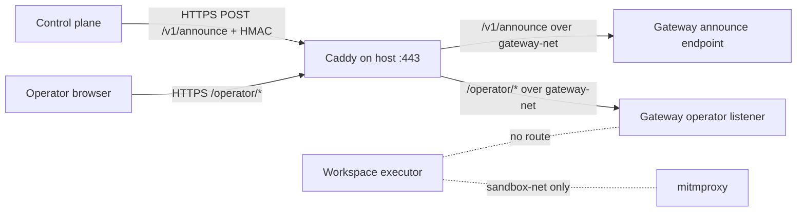

# feat: Gateway operator listener reverse-proxy topology

## Overview

Prepare the infra deploy topology that exposes the Gateway operator listener through the public Caddy edge while keeping the listener private to `gateway-net`. The upstream listener contract is now defined by `fro-bot/agent#931` and released in `fro-bot/agent v0.66.0`: `GATEWAY_OPERATOR_BIND_HOST`, `GATEWAY_OPERATOR_BIND_PORT`, and `GATEWAY_OPERATOR_PUBLIC_ORIGIN` enable the listener only when all three are present, and the current route surface is `GET /operator/health`.

This plan is readiness/design for `marcusrbrown/infra#579`. It does not wire operator auth/session secrets (`infra#580`) or decide the dashboard hosting origin (`infra#581`).

## Problem Frame

The gateway has one public ingress today: Caddy terminates TLS for `gateway.fro.bot` and path-scopes the HMAC announce webhook to `/v1/announce`. The operator control surface needs a browser-facing public origin that reaches the upstream operator listener without publishing that listener to the host and without making it reachable from the workspace `sandbox-net`.

`fro-bot/agent#929` shipped only the shared web-surface spine. `fro-bot/agent#931` later shipped the Unit 2 listener/topology contract, so the exact config names are no longer speculative. Privileged operator behavior remains gated by later agent units.

## Requirements Trace

- R1. Route public operator traffic to the upstream operator listener over `gateway-net`, not host-published ports.
- R2. Keep the operator listener unreachable from `sandbox-net` and the workspace.
- R3. Preserve `/v1/announce` as a separate HMAC ingress path; do not route announce traffic through the browser operator trust boundary.
- R4. Disable proxy buffering for future operator SSE routes so streaming does not fail silently when agent Unit 4 lands.
- R5. Reject unsafe deploy topology: all-interface binds, loopback-only production binds behind the reverse proxy, sandbox-net binds, invalid ports, non-HTTPS public origins, and missing/partial operator config.
- R6. Add post-deploy probes for operator health now and coarse unauthenticated auth failure once upstream exposes authenticated routes.
- R7. Treat the original Unit 2 name blocker as resolved by `fro-bot/agent#931`; keep implementation blocked from guessing future auth/session/route config names.

## Scope Boundaries

- No guessed future agent config. The only operator env names in scope are the Unit 2 names from `fro-bot/agent#931`: `GATEWAY_OPERATOR_BIND_HOST`, `GATEWAY_OPERATOR_BIND_PORT`, and `GATEWAY_OPERATOR_PUBLIC_ORIGIN`. The original “blocked on Unit 2 config names” state is resolved; auth/session/route config remains blocked on later agent units.
- No operator OAuth/session/CSRF/allowlist secret wiring; that stays in `infra#580` after agent Unit 3 lands.
- No live run observation, launch, approvals, or repo-selector implementation; those wait for later Gateway Phase B units.
- No broad public gateway API. `/v1/announce` and `/operator/*` remain distinct route families with distinct trust boundaries.
- No host `ports:` entry for the operator listener.

### Deferred to Separate Tasks

- Same-origin dashboard/operator hosting decision: `marcusrbrown/infra#581`.
- Operator auth/config secret wiring: `marcusrbrown/infra#580`, blocked on agent Unit 3.
- Dashboard live operator client and UI work: `fro-bot/dashboard#25` and `fro-bot/dashboard#26`, blocked on later agent units for live calls.

## Context & Research

### Relevant Code and Patterns

- `apps/gateway/src/deploy.ts`:
  - `buildComposeOverride()` already owns the generated override that pins gateway/workspace images, mounts `workspace-repos`, and conditionally adds Caddy for announce ingress.
  - `buildCaddyfile()` currently emits the `/v1/announce` route and catch-all 404.
  - `getAnnounceState()` and `buildSecretFileList()` are the pattern for both-or-neither opt-in config and fail-closed validation.
  - `main()` writes `.env`, secret files, `compose.override.yaml`, `Caddyfile`, pulls images, runs `docker compose up --no-build --wait --remove-orphans`, and verifies running image digests.
- `apps/gateway/src/deploy.test.ts` already covers override shape, Caddy `gateway-net`, Caddy mounts/ports, route path-scoping, no host build, and deploy orchestration.
- `apps/gateway/AGENTS.md` documents the current Caddy/announce topology and post-cutover probes.
- `docs/plans/2026-06-03-002-feat-gateway-announce-presence-ingress-plan.md` is the closest plan shape for opt-in gateway public ingress.
- `docs/solutions/integration-issues/gateway-caddy-announce-ingress-self-404-2026-06-04.md` records the Caddy handler-ordering gotcha: use mutually exclusive `handle` blocks; do not let catch-all 404 shadow intended routes.

### Upstream Contract

- `fro-bot/agent#931` merged at `198905b57545902d82fe0668fc7daa3cf3d339d4` and defines the operator listener contract.
- `fro-bot/agent v0.66.0` contains `fro-bot/agent#931`; current infra gateway pin `v0.64.3` does not.
- `deploy/compose.yaml` comments the three opt-in env vars under the gateway service:
  - `GATEWAY_OPERATOR_BIND_HOST`
  - `GATEWAY_OPERATOR_BIND_PORT`
  - `GATEWAY_OPERATOR_PUBLIC_ORIGIN`
- `deploy/validate-stack.sh` rejects all-interface, loopback, sandbox-net, IPv6, invalid port, non-HTTPS origin, and partial operator config when the listener is enabled.
- `packages/gateway/src/web/server.ts` currently exposes only `GET /operator/health`; privileged routes are future work.

### External References

- Caddy `reverse_proxy` docs: `flush_interval -1` disables response buffering and flushes after each write; Caddy also flushes immediately when upstream returns `Content-Type: text/event-stream`.

## Key Technical Decisions

- **Reuse the existing Caddy edge.** The gateway already has a Caddy service on `gateway-net` for `/v1/announce`; extending that edge keeps the public TLS boundary in one place and avoids a second host-published listener.
- **Route operator traffic by path, not by host-published port.** Caddy owns the public `:80`/`:443` mapping; the gateway operator listener receives only container-to-container traffic over `gateway-net`.
- **Make the gateway-net bind address deterministic.** Upstream requires `GATEWAY_OPERATOR_BIND_HOST` to be a literal gateway-net IP. Infra should set a deterministic gateway service `ipv4_address` on `gateway-net` in the generated override, or otherwise derive and validate a stable gateway-net address before writing `.env`. A guessed bridge IP is not acceptable.
- **Keep announce and operator route inventories separate.** Caddy should have an explicit `/v1/announce` handler and a separate `/operator/*` handler. The announce route continues to target the existing daemon announce path; operator browser traffic targets the operator listener port.
- **Add no-buffering now, before SSE exists.** The operator route should include the Caddy streaming subdirective (`flush_interval -1`) for `/operator/*` so Unit 4 SSE does not inherit a buffered proxy path.
- **Use upstream validation as a contract, but still guard infra output.** The generated override should be covered by infra tests, and the deploy should rely on the upstream `deploy/validate-stack.sh` once the pinned upstream ref includes `fro-bot/agent#931` or a release containing it.

## Open Questions

### Resolved During Planning

- **Are Unit 2 config names still blocked?** No. The original issue text was correct when written, but `fro-bot/agent#931` has since merged and defines `GATEWAY_OPERATOR_BIND_HOST`, `GATEWAY_OPERATOR_BIND_PORT`, and `GATEWAY_OPERATOR_PUBLIC_ORIGIN`.
- **What route exists now?** Only `GET /operator/health`; auth/session and privileged routes remain later agent work.
- **What Caddy directive covers no-buffering?** Use `reverse_proxy { flush_interval -1 }` for the operator route; SSE responses also flush immediately when `Content-Type: text/event-stream` is present.

### Deferred to Implementation

- **Exact upstream pin or release tag:** resolved after planning started — `fro-bot/agent v0.66.0` contains `fro-bot/agent#931` and is the first checked release suitable for the topology implementation path.
- **Final public operator origin value:** coordinate with `infra#581`; the topology supports the chosen HTTPS origin, but this plan does not decide the dashboard hosting path.
- **Operator bind IP strategy:** implementation must choose and test either a deterministic `gateway-net` static IP in the override or a safe derivation mechanism. Do not use an implicit Docker bridge address.
- **Coarse unauthenticated auth failure probe:** blocked until upstream exposes an authenticated route in a later agent unit.

## High-Level Technical Design

> *This illustrates the intended approach and is directional guidance for review, not implementation specification. The implementing agent should treat it as context, not code to reproduce.*

The Caddy edge is the only host-published HTTP surface. `gateway` stays dual-homed (`gateway-net` + `sandbox-net`) because that is the upstream trust model; `workspace` stays on `sandbox-net` only. The operator listener binds to the gateway container's `gateway-net` address and does not add any host `ports:` mapping.

## Implementation Units

- [ ] **Unit 1: Advance and pin the upstream listener contract**

**Goal:** Move `apps/gateway/upstream.json` to `fro-bot/agent v0.66.0`, then verify infra sees the Unit 2 compose and validation contract.

**Requirements:** R5, R7

**Dependencies:** `fro-bot/agent v0.66.0` remains available and deployable.

**Files:**
- Modify: `apps/gateway/upstream.json`
- Test: `apps/gateway/src/deploy.test.ts`

**Approach:**
- Treat the upstream deploy README, compose comments, and `deploy/validate-stack.sh` as the source of truth for the operator listener contract.
- Keep the existing daemon upgrade practice: verify required-secret/topology deltas at the target ref before changing infra wiring.
- Do not add auth/session/operator secret names beyond the three Unit 2 vars.

**Execution note:** Characterize the new upstream contract first; this is a topology/security boundary.

**Patterns to follow:** Previous gateway upstream bump plans and the v0.55.2/v0.64.x deploy pin checks in `apps/gateway/AGENTS.md`.

**Test scenarios:**
- Happy path: the pinned upstream ref contains `GATEWAY_OPERATOR_BIND_HOST`, `GATEWAY_OPERATOR_BIND_PORT`, and `GATEWAY_OPERATOR_PUBLIC_ORIGIN` in its deploy contract.
- Error path: implementation does not proceed against a ref that lacks `deploy/validate-stack.sh` operator validation.

**Verification:** Upstream pin points at `v0.66.0`; local tests can exercise the new infra wiring without guessed names.

- [ ] **Unit 2: Generate operator topology in compose override**

**Goal:** Extend the generated gateway `compose.override.yaml` so the operator listener is enabled only with complete config, bound to `gateway-net`, and never host-published.

**Requirements:** R1, R2, R5, R7

**Dependencies:** Unit 1.

**Files:**
- Modify: `apps/gateway/src/deploy.ts`
- Modify: `packages/cli/src/commands/gateway/deploy.ts`
- Test: `apps/gateway/src/deploy.test.ts`

**Approach:**
- Add an operator config state helper mirroring `getAnnounceState()`: disabled when all three vars are absent, enabled when all three are present, invalid when partial.
- Include the three Unit 2 env vars in the remote `.env` or gateway service environment only when enabled.
- Set a deterministic gateway-net bind address for the gateway service; reject any design that relies on Docker assigning an incidental bridge IP.
- Ensure the gateway service has no operator `ports:` entry; only Caddy publishes host ports.
- Keep `workspace` on `sandbox-net` only and keep Caddy on `gateway-net` only.

**Execution note:** Implement test-first; the invalid/unsafe topology cases are security-relevant.

**Patterns to follow:** `getAnnounceState()`, `buildComposeOverride()`, `buildGatewayEnvFileContents()`, and the existing no-host-build/no-stale-override tests.

**Test scenarios:**
- Happy path: complete operator config produces gateway env wiring for `GATEWAY_OPERATOR_BIND_HOST`, `GATEWAY_OPERATOR_BIND_PORT`, and `GATEWAY_OPERATOR_PUBLIC_ORIGIN`.
- Happy path: generated override has no operator listener `ports:` entry on `gateway`.
- Happy path: Caddy and the gateway operator target share `gateway-net`; workspace remains only on `sandbox-net`.
- Error path: partial operator config fails before any SSH/spawn.
- Error path: `GATEWAY_OPERATOR_BIND_HOST=0.0.0.0` is rejected.
- Error path: loopback binds such as `127.0.0.1` are rejected when reverse-proxied.
- Error path: sandbox-net binds such as `10.x.x.x` are rejected.
- Error path: invalid/non-HTTPS `GATEWAY_OPERATOR_PUBLIC_ORIGIN` is rejected.

**Verification:** Generated compose topology is fail-closed, deterministic, and private to `gateway-net`; focused gateway deploy tests pass.

- [ ] **Unit 3: Extend Caddy routing for operator paths and SSE**

**Goal:** Route `/operator/*` through Caddy to the operator listener while preserving `/v1/announce` as a separate HMAC path and disabling buffering for future streams.

**Requirements:** R1, R3, R4, R6

**Dependencies:** Unit 2.

**Files:**
- Modify: `apps/gateway/src/deploy.ts`
- Test: `apps/gateway/src/deploy.test.ts`

**Approach:**
- Extend `buildCaddyfile()` to render separate `handle /v1/announce` and `handle /operator/*` blocks.
- The operator route proxies to the configured gateway-net operator listener target and includes `flush_interval -1` in the `reverse_proxy` block.
- Keep the catch-all 404 as the final handler.
- Preserve the Caddy ACME-safe handler shape documented in the existing announce ingress solution.

**Execution note:** Add characterization coverage for the current announce Caddyfile before extending it.

**Patterns to follow:** `docs/solutions/integration-issues/gateway-caddy-announce-ingress-self-404-2026-06-04.md` and current `buildCaddyfile()` tests.

**Test scenarios:**
- Happy path: `/operator/*` routes to the operator listener target over `gateway-net`.
- Happy path: `/v1/announce` remains a separate handler targeting the announce endpoint.
- Happy path: operator `reverse_proxy` includes `flush_interval -1`.
- Edge case: catch-all 404 remains after both route handlers.
- Error path: no Caddy route is generated for partial operator config.

**Verification:** Caddyfile tests prove route separation and no-buffering; generated config keeps announce and operator trust boundaries distinct.

- [ ] **Unit 4: Add validation and post-deploy probes**

**Goal:** Ensure deploy validation rejects unsafe topology and deployment verification proves the operator listener is reachable only through the intended public proxy path.

**Requirements:** R5, R6

**Dependencies:** Units 1-3.

**Files:**
- Modify: `apps/gateway/src/deploy.ts`
- Modify: `apps/gateway/AGENTS.md`
- Test: `apps/gateway/src/deploy.test.ts`

**Approach:**
- Invoke or preserve upstream `deploy/validate-stack.sh` coverage after writing the generated override, once the pinned upstream ref includes the operator validation rules.
- Add a post-deploy operator health probe through the public Caddy route once `GET /operator/health` is available on the deployed ref.
- Add a coarse unauthenticated auth-failure probe only after upstream ships an authenticated operator route; do not invent a route for it now.
- Document manual verification: no host port for the operator listener, gateway/Caddy on `gateway-net`, workspace not attached to `gateway-net`, `/operator/health` returns healthy through Caddy.

**Execution note:** Test-first for local validation branches; live probes should be added only when the route exists at the pinned upstream ref.

**Patterns to follow:** Existing gateway post-cutover verification ritual in `apps/gateway/AGENTS.md` and deploy image-digest verification tests.

**Test scenarios:**
- Happy path: deploy runs upstream stack validation after materializing operator topology.
- Happy path: public `/operator/health` probe succeeds after compose up.
- Error path: stack validation failure aborts deploy before checksum success is persisted.
- Deferred integration: authenticated operator route returns a coarse unauthenticated failure without route/auth-detail leaks once upstream exposes such a route.

**Verification:** Deploy fails closed on invalid topology and records health evidence for the public operator path.

- [ ] **Unit 5: Operator documentation and tracking updates**

**Goal:** Document the operator topology, blocked follow-up work, and rollout probes without conflating it with announce ingress or future auth work.

**Requirements:** R3, R6, R7

**Dependencies:** Units 1-4 for final code-linked wording; this plan can land before implementation as readiness documentation.

**Files:**
- Modify: `apps/gateway/AGENTS.md`
- Modify: `apps/gateway/README.md`
- Modify: root `AGENTS.md` gateway notes if new environment variables become part of the deploy contract
- Update: `marcusrbrown/infra#579`
- Update: `fro-bot/.github#3512`

**Approach:**
- Explain that `/v1/announce` is HMAC ingress and `/operator/*` is browser/operator ingress; these are separate by design.
- List the three Unit 2 vars and the still-deferred Unit 3 auth/secret wiring.
- Keep public docs current-behavior oriented; avoid claiming privileged operator routes exist before upstream ships them.
- Comment on the tracking issue with `@fro-bot` when the topology plan lands and again when implementation completes.

**Test scenarios:** Test expectation: none — documentation/tracking only. Verify links and grep for forbidden plan-taxonomy leakage outside `docs/plans/` if source/docs are updated.

**Verification:** Operator docs and issue tracking reflect current rollout state: Unit 2 topology contract landed, infra topology work ready, Unit 3 auth still blocked.

## System-Wide Impact

- **Interaction graph:** Browser/operator traffic reaches Caddy, then the gateway operator listener over `gateway-net`. Workspace traffic remains `sandbox-net → mitmproxy → egress-net`; it does not gain a path to the operator listener.
- **Error propagation:** Partial or unsafe operator config fails before SSH/spawn where possible; upstream stack validation failures abort deploy before checksum success is persisted.
- **State lifecycle risks:** Caddy config changes are generated in the override/Caddyfile path already included in checksum-driven recreate behavior. A failed deploy should leave the previous checksum intact for retry.
- **API surface parity:** CLI remote deploy must pass through any new operator env vars for local mode only when they are part of the environment contract; MCP remains read-only.
- **Integration coverage:** Unit tests prove generated topology; post-deploy probes prove public health through Caddy and absence of host-published listener ports.
- **Unchanged invariants:** `/v1/announce` remains HMAC-authenticated and path-scoped; workspace remains sandbox-contained; no mutating operator route exists until later upstream units ship it.

## Risks & Dependencies

| Risk | Mitigation |
|------|------------|
| Docker assigns a different gateway-net IP than the configured bind host. | Make the bind IP deterministic in compose override or derive it safely; never assume an incidental bridge address. |
| Caddy buffers future SSE and makes dashboard run observation appear flaky. | Add `flush_interval -1` to the operator reverse proxy route before SSE routes ship. |
| Announce and operator traffic collapse into one trust boundary. | Keep separate Caddy `handle` blocks and test both route inventories. |
| Infra implements against a merged but unreleased upstream commit. | Use `fro-bot/agent v0.66.0`, which contains `fro-bot/agent#931`; do not pin an arbitrary merge SHA. |
| Auth probes are added before auth routes exist. | Probe `/operator/health` now; defer unauthenticated auth failure until upstream exposes an authenticated route. |

## Documentation / Operational Notes

- Update `apps/gateway/AGENTS.md` before deploying operator topology so operators know which surfaces are public and which routes remain unavailable.
- Add post-deploy verification for `docker compose config`, `docker compose ps`, public `/operator/health`, and a negative check that the operator listener has no host-published port.
- Keep `fro-bot/.github#3512` updated with `@fro-bot` when this repo moves from readiness to implementation and when implementation completes.

## Sources & References

- Issue: [marcusrbrown/infra#579](https://github.com/marcusrbrown/infra/issues/579)
- Cross-repo tracker: [fro-bot/.github#3512](https://github.com/fro-bot/.github/issues/3512)
- Upstream foundation: [fro-bot/agent#929](https://github.com/fro-bot/agent/pull/929)
- Upstream listener topology: [fro-bot/agent#931](https://github.com/fro-bot/agent/pull/931)
- Upstream tracking: [fro-bot/agent#907](https://github.com/fro-bot/agent/issues/907)
- Existing ingress plan: `docs/plans/2026-06-03-002-feat-gateway-announce-presence-ingress-plan.md`
- Caddy handler gotcha: `docs/solutions/integration-issues/gateway-caddy-announce-ingress-self-404-2026-06-04.md`
- Caddy reverse proxy docs: <https://caddyserver.com/docs/caddyfile/directives/reverse_proxy>
