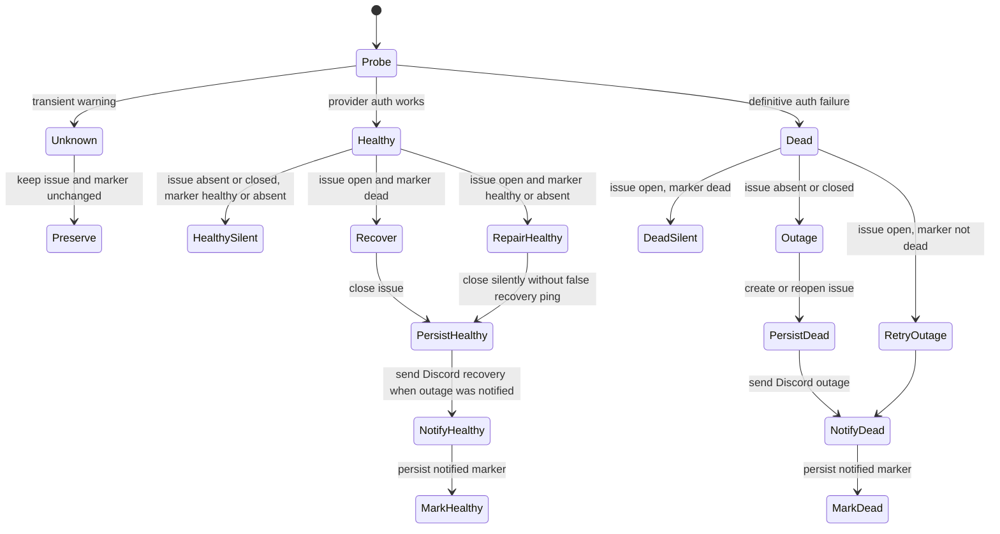

# feat: Monitor CLIProxyAPI Anthropic authentication

## Overview

Add a focused CLI-only monitor and a dedicated scheduled workflow that reuse the existing Anthropic provider-auth probe, persist health through one tracking issue, and deliver transition-only Discord notifications. The implementation extends existing CLI and workflow patterns without adding a service, database, provider failover, or automated OAuth login.

---

## Problem Frame

The proxy's single upstream Anthropic OAuth credential has failed twice, on 2026-06-20 and 2026-07-21. When refresh fails, every Anthropic-routed repository loses model access while the proxy itself remains reachable. The failures were discovered through red or hung consumer CI runs rather than a direct operator alert.

The existing `cliproxy status` path already performs the correct end-to-end provider probe and distinguishes definitive authentication failure from transient warnings. The missing capability is a deterministic scheduled consumer of that signal with durable, deduplicated alert state and an immediate operator notification (see origin: `docs/brainstorms/2026-07-21-cliproxy-anthropic-auth-monitoring-requirements.md`).

---

## Requirements Trace

| Requirement | Plan coverage |
| --- | --- |
| R1. Reuse provider-auth semantics | U1 extracts a structured result while preserving `cliproxy status`; U2 consumes it directly. |
| R2. Nominal 15-minute cadence | U3 schedules at four offset minutes per hour and documents GitHub cron as best-effort. |
| R3. Protected secret handling | U2 accepts credentials through environment-only inputs; U3 uses repo-scoped secrets and no PR trigger. |
| R4. Definitive dead vs transient unknown | U1 defines the three-state contract; U2 preserves prior state on unknown. |
| R5. Transition-only alerting | U2 implements the state matrix and silence for unchanged states. |
| R6. Persist prior state | U2 uses one GitHub issue as canonical state. |
| R7. Safe bootstrap | U2 treats no issue as healthy baseline but opens immediately when the first definitive result is dead. |
| R8. Failure issue + Discord | U2 opens or reopens the canonical issue before sending the outage notification. |
| R9. Recovery issue + Discord | U2 closes the canonical issue before sending the recovery notification. |
| R10. Actionable, secret-free alerts | U2 uses fixed message templates with the manual login remediation. |
| R11. No raw upstream output | U1 returns structured state; U2 never forwards response bodies, URLs, stack traces, or arbitrary errors. |

---

## Scope Boundaries

- No automated Anthropic re-authentication; browser OAuth and callback paste remain operator actions.
- No pre-emptive expiry prediction or periodic rotation reminder until the suspected monthly lifetime is verified.
- No provider failover or routing changes in consumer repositories.
- No modification of the broad Fro Bot autohealing prompt; this monitor is deterministic and independently scheduled.
- No MCP exposure; the command mutates GitHub issues and sends notifications.
- No external dead-man service. GitHub's workflow-failure notification plus an issue heartbeat during active outages is the accepted monitoring posture.

### Deferred to Separate Tasks

- `fro-bot/agent#1253` owns fail-fast surfacing of upstream model-auth errors inside Fro Bot runs; this plan does not modify that repository.
- Pre-emptive re-auth reminders remain a future task if additional incidents confirm a predictable credential lifetime.

---

## Context & Research

### Relevant Code and Patterns

- `packages/cli/src/commands/cliproxy/status.ts` — `checkProviderAuth`, current provider classification, trusted-URL handling, and CLI exit semantics.
- `packages/cli/src/commands/cliproxy/status.test.ts` — boundary-mocked provider probe tests.
- `packages/cli/src/commands/cliproxy/index.ts` — command registration.
- `packages/cli/src/commands/mcp.ts` — explicit read-only allowlist; the monitor stays absent and is documented as CLI-only.
- `packages/cli/src/conventions.test.ts` — workflow pinning and sensitive-command policy checks.
- `.github/workflows/fro-bot.yaml` — schedule, manual dispatch, concurrency, SHA-pinned setup actions, and frozen Bun install patterns.

### Institutional Learnings

- `docs/solutions/integration-issues/cliproxy-claude-oauth-refresh-expiry-2026-06-20.md` — provider-family diagnosis, manual login recovery, and the original candidate guardrail.
- `docs/solutions/workflow-issues/fro-bot-schedule-session-bloat-no-op-2026-06-14.md` — a green scheduled run is insufficient evidence; the workflow must prove the probe executed.
- `docs/solutions/workflow-issues/aggregate-deploy-concurrency-cancels-gated-deploys-2026-06-25.md` — use monitor-specific concurrency rather than an aggregate group that can hide work through cancellation.
- `docs/solutions/integration-issues/gateway-caddy-announce-ingress-self-404-2026-06-04.md` — new secrets must be wired through every workflow boundary and verified end to end.

### External References

- [GitHub Actions schedule event](https://docs.github.com/en/actions/reference/workflows-and-actions/events-that-trigger-workflows#schedule) — default-branch execution, five-minute minimum, and delayed/dropped run caveats.
- [GitHub Actions workflow permissions](https://docs.github.com/en/actions/reference/workflows-and-actions/workflow-syntax#permissions) — least-privilege `GITHUB_TOKEN` configuration.
- [GitHub Issues REST API](https://docs.github.com/en/rest/issues) — list, create, reopen, update, and close semantics.
- [Discord webhook resource](https://docs.discord.com/developers/resources/webhook) — webhook response behavior and `wait` semantics.
- [Discord rate limits](https://docs.discord.com/developers/topics/rate-limits) — transient retry and `Retry-After` handling.

---

## Key Technical Decisions

- **Structured probe state:** introduce a provider-auth result of `healthy`, `dead`, or `unknown`; `cliproxy status` formats it for humans and the monitor consumes it without parsing prose.
- **Dual-surface probe contract:** automation receives only safe state and bounded reason categories, while existing human status output may retain diagnostic detail. The monitor never consumes presentation strings or raw exceptions.
- **Focused public CLI command:** add `cliproxy monitor` as an automation-facing, CLI-only command. It receives secret-bearing inputs through environment variables only and remains outside `MCP_ALLOWLIST`.
- **Monitor-specific trusted origin:** forward the environment API key only to the exact canonical HTTPS proxy origin. Reject arbitrary origins, userinfo, paths, query strings, and non-HTTPS configuration before any network request or mutation.
- **Direct REST adapters:** use Bun `fetch` for GitHub and Discord rather than adding an SDK or spawning `gh`; both integrations remain easy to mock at the network boundary.
- **Issue-backed state:** one issue represents the lifecycle: open means dead, closed or absent means healthy. A dedicated label and fixed hidden identity marker locate it even if the operator edits the title.
- **Deterministic issue lookup:** search all issue states for the identity marker, prefer the unique label-plus-marker match, restore a missing label from a unique marker-only match, and fail before mutation when identity is ambiguous. Never adopt a label-only issue with no marker.
- **Fixed issue identities:** production uses the dedicated `cliproxy-auth-monitor` label; isolated validation uses `cliproxy-auth-monitor-test`. Label creation/restoration is required state reconciliation, and failure is terminal rather than silently falling back to title matching.
- **Issue-first ordering:** persist the target issue state before Discord delivery. Write the Discord-notified marker only after successful delivery so the next run retries a lagging notification.
- **At-least-once Discord:** accept a rare duplicate when Discord succeeds but marker persistence fails; preventing that last ambiguity would require a larger outbox/idempotency system that does not pay rent here.
- **Unknown preserves state:** network timeouts and unrelated warnings neither open nor close the issue. They remain visible in workflow logs but do not create alert churn.
- **Known outage is monitor success:** an active or newly detected outage exits successfully after required state and notification work completes. Missing inputs, GitHub API failures, and exhausted Discord delivery failures fail the workflow.
- **Public output allowlist:** issue and Discord bodies use fixed templates plus UTC timestamps. Raw provider responses, hostnames, URLs, headers, exception strings, and credentials never cross the public alert boundary.
- **Log output allowlist:** workflow stdout/stderr and summaries also use fixed state/action categories. GitHub Actions logs are not treated as a safe sink for raw errors, URLs, response bodies, webhook responses, or stack traces.
- **Unattended repo secrets:** use the existing downstream API key and a new dedicated outbound Discord webhook as repository secrets. Do not attach an approval-gated Environment to a 15-minute monitor.
- **Best-effort cadence:** schedule away from the top of the hour at nominal 15-minute spacing; do not claim a hard detection SLA because GitHub may delay or drop scheduled runs.

---

## Open Questions

### Resolved During Planning

- **Where does transition state live?** The canonical GitHub issue state supplies health persistence; an issue-body marker supplies last Discord-notified state.
- **How is Discord reached?** A dedicated outbound incoming-webhook URL stored as a repo secret. The gateway's existing webhook is inbound HMAC-protected announce traffic and is not reusable.
- **How are partial deliveries handled?** GitHub state first, Discord second, marker third. Marker lag retries Discord on the next run; rare duplicate delivery is accepted.
- **Should definitive auth failure be debounced?** No. The probe alerts immediately for the known auth signatures; warnings and transport failures do not transition.
- **How is the monitor itself watched?** Native workflow-failure notifications plus a last-check timestamp in an open outage issue. No external heartbeat service.
- **Is the proxy URL secret?** No. `CLIPROXY_URL` is non-sensitive configuration and may use the existing canonical default or a repository variable; only the downstream key and Discord webhook are secrets.

### Deferred to Implementation

- Exact helper and adapter names may follow existing test seams after the implementation agent reads the neighboring modules.
- Discord retry count and backoff remain bounded implementation details; `429` honors `Retry-After`, transient network/5xx responses may retry, and `404` fails without retrying the revoked webhook.
- Fixed public issue titles, hidden identity-marker text, and non-semantic label color/description may be finalized during implementation; the production/test label names and separation are not deferred.

---

## High-Level Technical Design

> *This illustrates the intended approach and is directional guidance for review, not implementation specification. The implementing agent should treat it as context, not code to reproduce.*

| Canonical issue | Notified marker | Probe | Result |
| --- | --- | --- | --- |
| Absent/closed | Absent/healthy | Healthy | Healthy baseline; no issue or Discord mutation. |
| Absent/closed | Any | Dead | Create/reopen issue, notify outage, then mark dead. |
| Open | Dead | Dead | No Discord; update only the safe last-check heartbeat. |
| Open | Absent/healthy | Dead | Retry outage Discord, then mark dead. |
| Open | Dead | Healthy | Close issue, notify recovery, then mark healthy. |
| Open | Absent/healthy | Healthy | Repair/close issue silently; do not manufacture a recovery notification. |
| Any | Any | Unknown | Preserve issue state and marker; emit only safe local status. |

---

## Implementation Units

- [x] **Unit 1: Separate provider-auth classification from presentation**

- **Goal:** expose one structured provider-auth result for both human status output and automation without changing existing `cliproxy status` behavior.
- **Requirements:** R1, R4, R11.
- **Dependencies:** None.
- **Files:**
  - Modify: `packages/cli/src/commands/cliproxy/status.ts`
  - Modify: `packages/cli/src/commands/cliproxy/status.test.ts`
- **Approach:**
  - Extract or layer a structured probe contract under `checkProviderAuth` with three outcomes and bounded safe reasons: healthy, definitive auth-dead, and unknown/transient.
  - Keep the current `CheckResult` formatting and exit behavior as a presentation adapter so existing CLI and MCP output do not drift.
  - Keep response bodies and exception strings internal to presentation/classification; return only safe state/reason categories to automation. Missing API credentials are monitor input failure, not unknown provider state.
- **Execution note:** Implement the structured contract test-first and preserve existing status snapshots/expectations as characterization coverage.
- **Patterns to follow:**
  - Existing fetch boundary and timeout handling in `checkProviderAuth`.
  - Existing trusted-URL and secret-forwarding guards in `cliproxyStatusAction`.
- **Test scenarios:**
  - **Happy path:** a successful minimal completion maps to healthy and retains the current human-readable status line.
  - **Auth failure:** HTTP 401 maps to dead without exposing the response body.
  - **Auth failure:** HTTP 503 with each supported auth-unavailable marker maps to dead.
  - **Transient:** unrelated 503, another non-2xx response, timeout, and network exception map to unknown and retain warning-level status output.
  - **Boundary isolation:** automation-safe results contain no summary text, URL, response body, headers, or exception string while human status retains current bounded diagnostic behavior.
  - **Regression:** existing status action still exits nonzero only for error-level checks and remains MCP-capturable.
- **Verification:** status behavior is unchanged for operators, while a test can consume structured state without parsing summary text.

- [x] **Unit 2: Implement the issue-backed monitor state machine**

- **Goal:** add the CLI-only command that reconciles live provider state, canonical issue state, and Discord notification state safely and idempotently.
- **Requirements:** R3, R5-R11.
- **Dependencies:** U1.
- **Files:**
  - Create: `packages/cli/src/commands/cliproxy/monitor.ts`
  - Create: `packages/cli/src/commands/cliproxy/monitor.test.ts`
  - Modify: `packages/cli/src/commands/cliproxy/index.ts`
  - Modify: `packages/cli/src/commands/mcp.ts`
  - Modify: `packages/cli/src/conventions.test.ts`
  - Modify: `opencode.jsonc`
- **Approach:**
  - Read the downstream API key, GitHub token/repository identity, and Discord webhook from environment-only inputs; reject missing values before any mutation.
  - Validate the proxy destination against an exact monitor-specific HTTPS origin before forwarding the environment API key. Reject hostile or malformed overrides before the provider probe, GitHub mutation, or Discord request.
  - Query all issue states through GitHub REST. Locate the canonical issue by label plus fixed identity marker, fall back to a unique marker-only match to repair a removed label, and fail on duplicates or ambiguous identity. Never rely on title or adopt label-only matches.
  - Ensure the fixed production label `cliproxy-auth-monitor` exists when the first outage issue must be created; use `cliproxy-auth-monitor-test` for synthetic validation. Keep issue title/body and Discord messages fixed and generic, with only UTC timestamps dynamic.
  - Treat open issue as dead and closed/absent issue as healthy. A definitive probe result computes the target state; unknown leaves canonical state unchanged.
  - Reconcile in strict order: persist issue state, deliver Discord if marker lags, then persist the notified marker. Update a last-check timestamp while an outage issue remains open.
  - Send Discord with mentions disabled. Retry only bounded transient/rate-limit failures; treat a revoked webhook as terminal.
  - Produce a fixed safe workflow summary per run: probe attempted, safe probe state, transition decision, issue action, Discord action, and UTC timestamp. Do not log raw exceptions or response-derived data.
  - Exit 0 after a successful reconciliation even when the provider is dead. Exit nonzero only when monitor inputs, GitHub persistence, or required notification reconciliation fails.
  - Keep the command absent from MCP, deny the exact generated tool ID `infra_cliproxy_monitor` in the OpenCode sensitive-tool backstop, and enforce both layers in conventions tests.
- **Execution note:** Implement the state table test-first; mock `fetch` at the GitHub, provider, and Discord boundaries rather than mocking internal helpers.
- **Patterns to follow:**
  - Action extraction and injectable boundary patterns in existing command tests.
  - `ActionCtx` output/exit capture instead of global process writes.
  - Sensitive-command source gating in `packages/cli/src/commands/mcp.ts` and `packages/cli/src/conventions.test.ts`.
- **Test scenarios:**
  - **Bootstrap healthy:** no canonical issue + healthy probe performs no mutation or Discord request.
  - **Bootstrap dead:** no issue + dead probe creates the label/issue, sends one outage message, and records the dead marker.
  - **Unchanged healthy:** closed/absent issue + healthy marker stays silent.
  - **Unchanged dead:** open issue + dead marker sends no duplicate alert and refreshes only the last-check marker.
  - **Outage transition:** closed issue + dead probe reopens before Discord delivery, then writes the dead marker.
  - **Recovery transition:** open issue + healthy probe closes before Discord recovery, then writes the healthy marker.
  - **Transient while healthy/dead:** unknown probe result preserves issue state and sends no notification.
  - **Manual issue close:** closed issue + still-dead probe reopens and alerts again.
  - **Operator edits:** changed title or removed label still resolves through the hidden marker and restores the dedicated label.
  - **Identity ambiguity:** multiple marker matches or a label-only/no-marker issue fails before mutation; deleting both marker and label is documented as unsupported manual breakage.
  - **Discord lag:** target issue state already persisted but marker stale retries only the missing Discord transition.
  - **Partial delivery:** GitHub mutation failure prevents Discord; Discord failure leaves marker stale and exits nonzero; marker write failure after Discord may duplicate once on retry and exits nonzero.
  - **Discord API:** `429` honors retry guidance, transient 5xx/network failure uses bounded retry, `404` fails immediately, and messages disable mentions.
  - **Public safety:** issue/Discord requests contain only fixed text and timestamps; hostile/raw provider bodies and exception strings never appear.
  - **Trusted destination:** hostile, non-HTTPS, path-bearing, query-bearing, or credential-bearing proxy origins fail before any Authorization header is sent.
  - **Log safety:** captured stdout/stderr and workflow-summary data never contain hostile response bodies, thrown exception text, URLs, headers, webhook responses, or secrets.
  - **Input/permission failures:** missing env, malformed repository identity, denied GitHub mutation, and ambiguous duplicate canonical issues fail before unsafe mutation.
  - **Exit contract:** active outage with completed reconciliation exits 0; monitoring machinery failure exits nonzero.
  - **Defense in depth:** command is absent from `MCP_ALLOWLIST` and denied by the OpenCode infra-tool permission backstop.
- **Verification:** the command passes the complete state matrix, produces no secrets or raw errors in public payloads, and is unavailable through MCP.

- [x] **Unit 3: Add the unattended scheduled workflow**

- **Goal:** run the monitor from the default branch at nominal 15-minute intervals with least privilege, serialized execution, and a manual validation path.
- **Requirements:** R2, R3, R5.
- **Dependencies:** U2; repository secrets available before live enablement.
- **Files:**
  - Create: `.github/workflows/cliproxy-auth-monitor.yaml`
  - Modify: `packages/cli/src/conventions.test.ts`
- **Approach:**
  - Trigger on `schedule` and `workflow_dispatch`; use offset minutes rather than the top of the hour to reduce GitHub scheduler congestion.
  - Define one explicit manual-dispatch choice input with `live`, `synthetic-dead`, and `synthetic-healthy` modes. Scheduled events always force live mode and cannot select or inherit synthetic state.
  - Restrict synthetic modes to the repository owner; unauthorized synthetic dispatch fails before provider, issue, or Discord activity. Normal manual live probing remains limited by GitHub's workflow-dispatch write-access boundary.
  - Serialize scheduled and manual runs with a monitor-specific concurrency group and `cancel-in-progress: false`.
  - Grant `issues: write` and only the content permission needed for checkout; all unspecified token permissions remain disabled.
  - Check out the default branch without persisted credentials, set up the pinned Bun action, install from the frozen lockfile with scripts disabled, and run the source CLI command.
  - Pass the built-in `GITHUB_TOKEN`, existing downstream proxy key, optional non-sensitive URL configuration, and the dedicated Discord webhook through explicit environment bindings. Do not attach a protected Environment or expose the workflow to PR events.
  - Ensure every run writes a fixed safe job summary proving the probe ran and recording only safe state/action categories; workflow conclusion alone is not evidence.
- **Patterns to follow:**
  - SHA pins/version comments, setup ordering, and frozen install in `.github/workflows/fro-bot.yaml`.
  - Workflow convention checks in `packages/cli/src/conventions.test.ts`.
- **Test scenarios:**
  - **Static workflow contract:** correct `.yaml` extension, SHA-pinned actions, no `secrets: inherit`, no PR trigger, explicit minimal permissions, and no approval-gated Environment.
  - **Scheduling:** four offset invocations per hour and manual dispatch share one non-cancelling concurrency group.
  - **Secret wiring:** secret values are referenced only through environment expressions and never echoed or embedded in command arguments.
  - **Integration:** a manual healthy run reaches the provider probe, logs the safe no-transition result, creates no outage issue, and sends no Discord alert.
  - **Synthetic integration:** manual validation drives an isolated dead transition (test issue + clearly marked Discord test alert) followed by healthy recovery (close + test recovery alert) without changing real Anthropic auth or touching the production monitor issue.
  - **Isolation:** scheduled events reject/ignore synthetic inputs, and synthetic identity/labels/markers cannot collide with production state.
  - **Authorization:** non-owner synthetic dispatch fails before any issue or Discord request; owner synthetic dispatch uses only the test identity.
  - **Failure path:** missing/revoked secrets or API permissions produce a failed workflow with actionable private logs and no unsafe public payload.
- **Verification:** manual dispatch succeeds on a healthy route and repository Actions shows the schedule enabled on the default branch; documentation states cadence is nominal, not guaranteed.

- [ ] **Unit 4: Document and release the operator capability**

- **Goal:** make setup, recovery, and maintenance explicit and version the user-facing CLI addition.
- **Requirements:** R3, R8-R11; success criteria from the origin document.
- **Dependencies:** U1-U3.
- **Files:**
  - Modify: `apps/cliproxy/AGENTS.md`
  - Modify: `packages/cli/AGENTS.md`
  - Modify: `README.md`
  - Modify: `docs/solutions/integration-issues/cliproxy-claude-oauth-refresh-expiry-2026-06-20.md`
  - Create: `.changeset/<generated>.md`
- **Approach:**
  - Document the command, nominal cadence, issue/Discord lifecycle, secret names and scope, manual workflow dispatch, and `cliproxy login claude` recovery including the localhost callback paste fallback.
  - State that the public issue contains generic fixed text and that raw provider errors remain only in private workflow logs.
  - Document how to create/test the dedicated Discord webhook and add it as a repository secret without using an approval-gated Environment.
  - Document the isolated synthetic validation path, pre-enable stop conditions, first-24-hour observation, rollback, and immediate post-reauth manual reconciliation.
  - Update the prior incident's Prevention section from candidate guardrail to the implemented monitor, without rewriting the incident history.
  - Use the repository's generated-document skill for owned README/AGENTS surfaces, and add a minor changeset for the new public CLI command.
- **Patterns to follow:**
  - Existing cliproxy runbooks and command documentation.
  - `generating-project-docs` skill ownership for generated public docs.
- **Test scenarios:**
  - **Documentation contract:** every required secret/config value appears with the correct scope and no concrete secret value.
  - **Recovery accuracy:** instructions describe copying the full refused localhost callback URL into the login prompt and verifying with `cliproxy status`.
  - **Release scope:** changeset names only `@marcusrbrown/infra` and describes the monitoring command/operator outcome.
- **Verification:** a future operator can configure and validate the webhook, prove both transitions without breaking auth, interpret the tracking issue, re-authenticate, and trigger immediate recovery reconciliation without reconstructing this incident.

---

## System-Wide Impact

- **Interaction graph:** scheduled workflow → CLI monitor → provider probe + GitHub issue REST + Discord webhook. Existing status/MCP paths share only the structured provider probe.
- **Error propagation:** definitive provider auth death becomes durable issue state, not workflow failure. Monitor machinery and delivery reconciliation failures fail the workflow and retain retryable markers.
- **State lifecycle risks:** issue open/closed and notification marker can diverge under partial failure; strict ordering and next-run reconciliation make divergence self-healing with at-least-once Discord semantics.
- **API surface parity:** `cliproxy status` remains read-only and MCP-exposed; `cliproxy monitor` is mutating and CLI-only.
- **Integration coverage:** unit tests prove transitions and failure ordering; manual workflow dispatch proves default-branch permissions and healthy probing; isolated synthetic dispatch proves GitHub and Discord mutation/recovery wiring without breaking real auth.
- **Unchanged invariants:** no live `config.yaml` mutation, no deploy, no OAuth token access, no automatic login, and no consumer-repo changes.

---

## Risks & Dependencies

| Risk | Mitigation |
| --- | --- |
| GitHub schedule is delayed or dropped | Use offset minutes, describe cadence as nominal, preserve idempotent state, and rely on the next run without corrupting transitions. |
| Scheduled workflow silently fails | GitHub-native failure notifications and safe proof-of-probe logs; update last-check timestamp during active outages. |
| Public issue leaks operational details | Fixed generic templates; no hosts, URLs, raw errors, response bodies, stack traces, or credentials. |
| Discord webhook is exposed or revoked | Repo secret, no logging/argv, mentions disabled, terminal handling for revoked webhook, documented rotation. |
| GitHub issue and Discord diverge | Issue-first ordering, lagging notification marker, next-run retry, and accepted at-least-once delivery. |
| Operator manually edits issue | Identity marker + dedicated label; state is reconciled from live probe and label restored. |
| Workflow runs overlap | One monitor-specific concurrency group serializes schedule and manual dispatch. |
| Provider/network transient causes false alert | Only structured definitive auth-dead results transition; unknown preserves state. |
| Required repo secrets are missing | Fail before issue/Discord mutation; document setup and verify with manual dispatch. |
| API key is forwarded to a hostile origin | Exact HTTPS-origin allowlist; reject all arbitrary or malformed proxy destinations before sending the Authorization header. |
| Workflow logs leak response-derived data | Emit fixed safe categories only and test captured stdout/stderr against hostile response/error inputs. |
| Manual synthetic mode is abused | Explicit choice input, owner-only guard, schedule-forced live mode, and separate test issue identity. |

---

## Documentation / Operational Notes

- New repo secret: dedicated outbound Discord webhook URL for the monitor.
- Existing repo secret: downstream CLIProxyAPI API key used by the provider-auth probe.
- Non-secret configuration: canonical proxy URL may stay at the CLI default or be supplied as a repository variable.
- Before merge/enablement, create the Discord webhook and verify it with a fixed test message; do not log the URL.
- After merge, run `workflow_dispatch` while auth is healthy and confirm proof-of-probe output with no production issue or Discord transition.
- Run the isolated synthetic dead/recovery dispatch sequence and confirm the test issue, both Discord test notifications, and notification markers reconcile before trusting the schedule.
- The next real auth outage should open/reopen one issue and send one Discord alert; successful manual re-auth should close the issue and send recovery on the next probe.

### Pre-Enable Go/No-Go

- Workflow is merged on the default branch, schedule is enabled, and Actions settings permit `issues: write` for `GITHUB_TOKEN`.
- Existing downstream API-key and new Discord-webhook repo secrets are present; the webhook targets the intended operator channel and is not shared with gateway inbound webhook flows.
- Canonical production issue lookup returns zero or one match; any duplicate identity is a stop condition.
- Healthy manual dispatch proves the real provider probe executed and made no transition.
- Isolated synthetic dead and recovery transitions both pass end to end.
- GitHub workflow-failure notifications reach an operator. Any failed item blocks enablement.

### First 24 Hours

- After one hour, scheduled summaries prove probes executed at the expected best-effort cadence.
- After 24 hours, there are no unexplained monitor failures, issue mutations, or Discord messages.
- During any active outage, the canonical issue's last-check marker advances on later successful monitor runs.

### Incident Recovery

- After `cliproxy login claude` succeeds, trigger an immediate manual monitor run rather than waiting for the next schedule.
- Recovery is complete only when the provider is healthy, the canonical issue closes, one recovery notification is sent when appropriate, and the marker is healthy.
- Healthy provider auth with failed issue/Discord reconciliation is monitor machinery failure, not a continuing Anthropic outage.

### Rollback

- Disable or revert the scheduled workflow to stop monitoring noise; preserve canonical issue history.
- Revoke/rotate a noisy, exposed, or wrong-channel Discord webhook and update/remove the repo secret.
- Revert the CLI/workflow changes when monitor behavior is faulty. Rollback does not restore Anthropic auth; manual login remains the provider recovery.
- Verify no new scheduled runs, issue mutations, or Discord messages occur after one cadence window, while `cliproxy status` continues to report the real provider state.

---

## Sources & References

- **Origin document:** [`docs/brainstorms/2026-07-21-cliproxy-anthropic-auth-monitoring-requirements.md`](../brainstorms/2026-07-21-cliproxy-anthropic-auth-monitoring-requirements.md)
- Related incident: `docs/solutions/integration-issues/cliproxy-claude-oauth-refresh-expiry-2026-06-20.md`
- Related upstream issue: [fro-bot/agent#1253](https://github.com/fro-bot/agent/issues/1253)
- Existing probe: `packages/cli/src/commands/cliproxy/status.ts` (`checkProviderAuth`)
- Command registration: `packages/cli/src/commands/cliproxy/index.ts`
- MCP allowlist: `packages/cli/src/commands/mcp.ts`
- Scheduled workflow precedent: `.github/workflows/fro-bot.yaml`
- GitHub schedule docs: https://docs.github.com/en/actions/reference/workflows-and-actions/events-that-trigger-workflows#schedule
- GitHub permissions docs: https://docs.github.com/en/actions/reference/workflows-and-actions/workflow-syntax#permissions
- GitHub Issues REST docs: https://docs.github.com/en/rest/issues
- Discord webhook docs: https://docs.discord.com/developers/resources/webhook
- Discord rate-limit docs: https://docs.discord.com/developers/topics/rate-limits
