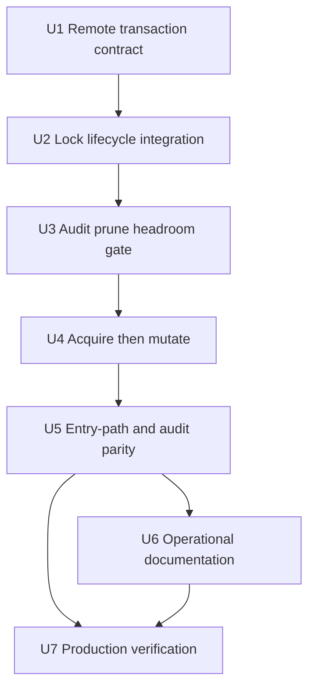
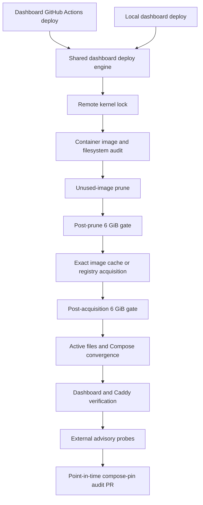

# fix: Guard dashboard deploy image retention

## Overview

Make the dashboard deploy own its host-side image lifecycle so repeated releases cannot fill the 25 GB droplet and strand production. Both GitHub Actions and local deploys will use one remote transaction under a process-bound lock that audits disk state, prunes only unused images, proves 6 GiB of headroom, acquires the exact immutable target, and only then mutates the active Compose state.

The implementation remains dashboard-local. It preserves the current digest-pinned release and audit-PR model, keeps the replaced image temporarily local until the next pre-pull prune, and adds no scheduled cleanup, volume pruning, container deletion, host resizing, or generalized deploy framework.

---

## Problem Frame

Release `2026.07.43` failed because containerd had accumulated roughly 18.38 GB of unused images and filled the droplet filesystem. The failure occurred after a healthy release had already been published, leaving production on the prior image and eventually preventing `runc` from creating temporary files. Manual `docker image prune -af` recovered the host without touching containers or volumes, proving both the immediate recovery mechanism and the missing lifecycle responsibility.

The current deploy performs remote preparation, file writes, pulls, Compose updates, and runtime changes through separate SSH/SCP processes. Adding a lock to any one command would not serialize the deployment. The repair therefore needs to address both failure classes together: retained-image exhaustion and interleaved desired-state mutation. See origin: `docs/brainstorms/2026-08-01-dashboard-deploy-image-retention-requirements.md`.

Deploy-time cleanup is the selected policy owner because the safety proof must happen immediately before the image acquisition that can exhaust the host, under the same serialization boundary. A scheduled janitor cannot fence an in-progress deploy. The 6 GiB gate deliberately prefers preserving the healthy old runtime over consuming the host's last safe margin.

---

## Requirements Trace

| ID | Plan commitment |
|---|---|
| R1 | One remote process-bound lock covers inspection, cleanup, image acquisition, active-file mutation, and runtime convergence for both deploy entry paths. |
| R2 | Every deploy records deterministic before/after container, image, mount, and integer free-byte evidence. |
| R3 | Cleanup uses unused-image pruning only; running/stopped container references, volumes, and active Compose state are preserved. |
| R4 | Free-space measurement resolves the filesystem backing Docker/containerd storage and fails closed on absent or malformed evidence. |
| R5 | A fixed 6 GiB floor is proven after prune and again after acquisition; active-state mutation is blocked when either gate is unmet. |
| R6 | Pruning is unconditional and any prune error hard-stops the deployment before target acquisition. |
| R7 | The exact expected image set is verified locally or pulled and verified before active Compose mutation. |
| R8 | Cleanup is pre-pull only, leaving the replaced image locally present as rollback capacity until the next deployment's pre-pull prune. |
| R9 | GitHub Actions and local deploys converge on the same deployment engine and remote lock. |
| R10 | Lock contention and partial failures terminate predictably without stale-lock cleanup or false success. |
| R11 | Existing digest verification, health checks, public probes, and audit-PR behavior remain intact. |
| R12 | Logs identify the failed stage and report redacted, deterministic retention evidence without exposing secrets. |
| R13 | Rerunning after a failed or interrupted deployment reconciles from observed host state without manual lock removal. |
| R14 | Lock, prune, and storage-probe commands remain fixed host-controlled operations; validated deploy inputs appear only where the selected image/config requires them. |

---

## Scope Boundaries

- No volume pruning, stopped-container deletion, `docker system prune`, direct containerd deletion, or Compose teardown.
- No scheduled janitor, disk-resize work, new monitoring/alerting system, or generalized retention policy for other applications.
- No automated rollback. Post-mutation failures report the observed desired/runtime state and remain safely rerunnable.
- No new CLI flags or workflow inputs for bypassing cleanup, lowering the floor, or deleting pinned images.
- No shared deploy-cleanup abstraction. Gateway cleanup is precedent only; dashboard semantics are intentionally stricter.
- No root-SSH authentication redesign. The current dedicated-host trust boundary remains; this plan narrows what the deploy transaction can execute and expose.
- No prose/file-content contract tests. Coverage must execute the deploy behavior or its generated remote transaction through controlled process seams.

### Deferred to Separate Tasks

- Host-wide disk monitoring and alerting: separate operational-observability work if deploy-time prevention proves insufficient.
- Generalized cross-application image retention: consider only after a third deploy target needs the same strict audit/headroom contract.
- Droplet resizing: capacity fallback, not a substitute for lifecycle ownership.

---

## Context and Research

### Relevant Code and Patterns

- `apps/dashboard/src/deploy.ts` is the single deployment engine used by the GitHub Actions workflow and local CLI path. Its input validation, digest resolution, secret handling, Compose generation, runtime digest check, and bounded public probes remain authoritative.
- `apps/dashboard/src/deploy.test.ts` already injects process, DNS, fetch, and sleep seams; new failure-order and single-session coverage should extend that behavior-oriented harness.
- `packages/cli/src/commands/dashboard/deploy.ts` already routes local deployment to the same dashboard deploy script and remote deployment to the existing workflow. No new entry point is needed.
- `.github/workflows/deploy-dashboard.yaml` already serializes dashboard workflow runs and opens the compose-pin audit PR after a successful deploy. The remote host lock adds parity for local runs and protects against cross-entry overlap.
- `apps/gateway/src/deploy.ts` demonstrates safe `docker image prune -af` usage, but its best-effort policy is not reusable because dashboard cleanup must produce evidence and fail closed.
- `packages/shared/server/droplet-helpers.ts` remains the source for established SSH environment and host-key behavior; the lock transaction should preserve those boundaries rather than inventing a second connection stack.

### Institutional Learnings

- `docs/solutions/best-practices/off-droplet-docker-image-build-gateway-deploy-2026-06-04.md`: keep builds off the target host, deploy immutable images, and verify the running digest.
- `docs/solutions/workflow-issues/aggregate-deploy-concurrency-cancels-gated-deploys-2026-06-25.md`: workflow concurrency and remote host serialization solve different problems; do not reintroduce aggregate cancellation around environment gates.
- `docs/solutions/integration-issues/dashboard-caddy-bind-mount-stale-reload-2026-07-26.md`: file-write success does not prove live runtime state; force Caddy convergence and verify the running service.
- `docs/solutions/integration-issues/dashboard-operator-session-container-hairpin-2026-06-21.md`: retain runner-side public probes; host/container-local public-hostname probes are not equivalent network evidence.
- `docs/solutions/best-practices/major-version-upstream-upgrade-playbook-2026-05-29.md`: immutable identity and a preserved rollback anchor matter more than optimistic success output.

### External References

- util-linux `flock(1)`: an advisory lock remains held by the open file description and releases when the owning process exits.
- Docker image-prune documentation: `docker image prune -a` removes images not referenced by any container; stopped-container references remain protected.
- Linux `findmnt(8)` and `statfs(2)`/`statvfs(3)`: resolve the containing mount and derive integer free bytes from filesystem block counts.
- Bun subprocess documentation: `Bun.spawn` supplies the stdin, exit, cancellation, and error boundaries needed for one supervised SSH transaction.

---

## Key Technical Decisions

| Decision | Rationale |
|---|---|
| One remote transaction under kernel `flock` | A separate lock-holder cannot fence Docker mutations if the holder dies. The process performing the mutations must own the lock. |
| Dashboard-specific remote transaction module | The shell/security lifecycle is substantial enough to isolate and test, but remains single-purpose rather than becoming a premature shared framework. |
| Lock path `/run/dashboard-deploy/lock` with a 180-second wait | A validated root-owned `0700` runtime directory prevents lockfile substitution; bounded waiting tolerates normal overlap without leaving stale queued work indefinitely. |
| Fixed 6 GiB pre-mutation floor | It leaves over ten times the observed active image footprint while avoiding the operational deadlock of requiring most of a 25 GB host to remain empty; it is checked after prune and after acquisition. |
| Strict prune failure | A nonzero prune leaves cleanup outcome and reclaimed-space evidence inconclusive. The confirmed requirements prefer fail-closed reliability over gateway-style best effort. |
| Host-wide unused-image prune on a dedicated droplet | The daemon serves only dashboard and Caddy; Docker still preserves every image referenced by running or stopped containers. No broader host ownership scheme is needed. |
| Measure Docker and containerd backing filesystems | Resolve the Docker root plus `/var/lib/containerd` when present, deduplicate their containing mounts, and gate on the minimum free-byte value so split storage cannot hide exhaustion. |
| Verify cache before registry pull | An exact locally cached digest is already immutable and keeps rollback available during registry failure; tags or unverifiable cache entries never qualify. |
| Data-only stdin framing | The fixed non-secret remote program is supplied separately from a framed data-only stdin payload. Payload bytes are decoded as files, never parsed as executable shell, sourced, or evaluated. |
| Sanitized remote environment | The transaction starts from an explicit minimal environment, fixed command search path, and pinned Docker/Compose context so forwarded or ambient variables cannot redirect execution. |
| Install active files only after image verification | Pull/inspect every immutable image in the staged Compose set first, then use per-file atomic replacement with Compose installed last, minimizing desired-state damage on acquisition or write failure. |
| Release after remote convergence | The lock covers remote health and digest verification. Existing external probes and audit work remain post-lock because they do not mutate the host and workflow-level concurrency already serializes versioned releases. |

---

## High-Level Technical Design

> This illustrates the intended approach and is directional guidance for review, not implementation specification. The implementing agent should treat it as context, not code to reproduce.

```mermaid
sequenceDiagram
  participant D as Deploy orchestrator
  participant S as Single SSH process
  participant L as Kernel flock
  participant H as Dashboard host
  participant R as Image registry

  D->>D: Validate inputs, secrets, DNS, and expected digest
  D->>S: Start fixed lock wrapper; stream framed data-only payload
  S->>L: Acquire bounded exclusive lock
  L-->>S: Lock held or deterministic contention failure
  S->>H: Validate paths and capture baseline evidence
  S->>H: Prune unused images and capture post-prune evidence
  S->>H: Enforce minimum free bytes
  S->>H: Verify every exact cached image
  alt Required image missing
    S->>R: Pull immutable staged Compose image set
    R-->>S: Exact image content
  end
  S->>H: Recheck free-space floor after acquisition
  S->>H: Verify expected digests before active-state mutation
  S->>H: Replace files individually with Compose last; converge services
  S->>H: Verify health and running digest
  S-->>D: Redacted evidence and success
  S->>L: Process exits; lock releases
  D->>D: Run advisory public probes and write point-in-time audit pin
```

The lock-owning process and the mutating process are the same process tree. No independent lease, timestamp, lock cleanup, or Docker fencing token is introduced.

---

## Implementation Units



### U1. Establish the remote transaction contract

- **Goal:** Isolate the dashboard-specific remote script/payload boundary so the critical section can be tested without turning it into a reusable deployment framework.
- **Requirements:** R1, R2, R10, R12, R14
- **Dependencies:** None
- **Files:**
  - Create: `apps/dashboard/src/remote-deploy.ts`
  - Create: `apps/dashboard/src/remote-deploy.test.ts`
  - Modify: `apps/dashboard/src/deploy.ts`
- **Approach:**
  - Define the fixed lock, wait, storage-floor, runtime-stage, and evidence contracts in one dashboard-local module.
  - Build one fixed, non-secret remote program and a separately framed stdin payload from already validated image/config inputs. SSH stdin is data-only: payload fields are decoded into files and are never shell source, command text, or delimiter-controlled executable input.
  - Version the payload protocol, impose explicit per-field and total size limits, and reject unknown, duplicate, missing, malformed, or trailing fields before host inspection.
  - Permit only compile-time command/path constants in generated shell structure. Deploy-selected values must pass through one audited quoting/data boundary; ban `eval`, payload-derived command substitution, dynamic command assembly, and unquoted expansion.
  - Validate `/run/dashboard-deploy` as a canonical root-owned `0700` directory before opening the regular lockfile or staging payload; reject symlinks, non-directories, unsafe ownership/mode, and unexpected lockfile types.
  - Start the remote program with a minimal explicit environment, fixed command search path, no forwarded shell environment, and pinned local Docker/Compose context.
  - Use a root-only per-attempt staging directory under `/run/dashboard-deploy`; ensure traps remove it on success, command failure, or SSH termination.
  - Define an evidence allowlist: stage names, service/container identity, image references/digests, mount identities, decimal byte counts, prune summaries, and health/digest results. Never log expanded Compose/env, PEM bytes, container logs, arbitrary file contents, or unredacted command stderr.
  - Model stdin write/close failure, early remote exit, and concurrent stdout/stderr draining explicitly so a short-lived remote process cannot deadlock the parent or surface a misleading later stage.
- **Execution note:** Implement the process/payload contract test-first using the repository's existing Bun subprocess injection pattern.
- **Patterns to follow:**
  - `apps/dashboard/src/deploy.ts` `SpawnFn`, `runCommand`, and stdin-only `writeRemoteFile` boundaries.
  - Existing secret redaction and fixed-command construction in dashboard/gateway deploy code.
- **Test scenarios:**
  - Happy path: a valid non-secret fixture payload executes through a controlled shell/process harness and removes its runtime staging directory on exit.
  - Security: OAuth, cookie, and PEM fixture values are present only in stdin payload bytes; they are absent from SSH argv, stage labels, stdout, stderr, and thrown error messages.
  - Security: payload values containing newlines, shell metacharacters, substitution syntax, and delimiter-like text remain inert data and cannot alter remote command structure.
  - Security: unknown/duplicate/trailing payload data, oversized fields, lock-directory substitution, unsafe lockfile types, ambient `BASH_ENV`/`ENV`/`PATH`, and Docker/Compose context overrides fail before inspection or mutation.
  - Error path: malformed or incomplete payload decoding fails before any active path is written and still removes staging files.
  - Error path: the remote process exits while stdin is still being written; the write/close failure is observed, stdout/stderr are drained, and the deploy terminates without hanging.
  - Error path: remote process cancellation or nonzero exit surfaces the transaction stage and does not report success.
  - Syntax: the generated transaction passes non-executing shell syntax validation without snapshotting arbitrary script prose.
- **Verification:** The transaction boundary is independently testable, secret-safe, dashboard-specific, and ready to own all remote deploy operations.

### U2. Replace fragmented SSH mutation with one locked remote transaction

- **Goal:** Ensure every host inspection and mutation runs under one process-bound lock shared by GitHub Actions and local deployment.
- **Requirements:** R1, R9, R10, R13, R14
- **Dependencies:** U1
- **Files:**
  - Modify: `apps/dashboard/src/deploy.ts`
  - Modify: `apps/dashboard/src/deploy.test.ts`
  - Modify: `apps/dashboard/src/remote-deploy.ts`
  - Modify: `apps/dashboard/src/remote-deploy.test.ts`
- **Approach:**
  - Preserve local preflight work: input/env/host validation, DNS, digest resolution, and Compose generation happen before remote contact.
  - Replace the current sequence of remote setup, SCP, stdin writes, pull, and `up` calls with one mutating SSH process whose remote shell acquires `flock` before the first host read.
  - Preserve identity, host-key, environment, and optional connection-reuse conventions, but allow no mutating SCP or secondary SSH command after the lock-owned transaction starts.
  - Use a distinct contention exit path after the 180-second wait; no inspection, prune, payload decode, pull, or Compose action may occur when acquisition fails.
  - Keep the SSH process and lock-owning remote process in the same lifecycle. Cancellation or connection loss closes the descriptor and releases the lock automatically.
- **Execution note:** Start with failing orchestration tests that prove the old multi-session shape cannot satisfy the new contract.
- **Patterns to follow:**
  - Existing `sshCommand`, key-file, ControlMaster, and temporary-directory cleanup logic in `apps/dashboard/src/deploy.ts`.
  - `packages/shared/server/droplet-helpers.ts` SSH environment and host-key conventions.
- **Test scenarios:**
  - Happy path: all remote deploy work is represented by one lock-owning SSH transaction rather than independent mutating SSH/SCP calls.
  - Contention: a busy lock reaches the bounded terminal state and performs zero host inspection or mutation.
  - Failure path: SSH disconnect during the transaction fails the deploy, cleans local temporary state, and does not require a stale-lock removal step on rerun.
  - Entry parity: versioned workflow inputs and committed-pin local mode both invoke the same remote transaction contract.
  - Security: lock/prune/probe command text is fixed and unaffected by version, digest, domain, or secret values.
- **Verification:** Concurrent local/workflow deploys cannot interleave remote phases, and the existing preflight boundaries remain intact.

### U3. Add deterministic audit, prune, and headroom gates

- **Goal:** Make unused-image cleanup and free-space proof mandatory before any image acquisition or active-state change.
- **Requirements:** R2, R3, R4, R5, R6, R8, R12
- **Dependencies:** U2
- **Files:**
  - Modify: `apps/dashboard/src/remote-deploy.ts`
  - Modify: `apps/dashboard/src/remote-deploy.test.ts`
  - Modify: `apps/dashboard/src/deploy.test.ts`
- **Approach:**
  - Perform read-only validation of existing dashboard paths before baseline evidence: reject symlinks/non-directories and report absent first-deploy paths without creating, chowning, or rewriting them.
  - Capture baseline `docker system df -v`, all-container image references, current compose/running digest when present, resolved mount identities, and decimal free-byte values before active-directory convergence. Normalize each storage record to the probed path, mount target, filesystem/source identity, and available bytes.
  - Resolve the Docker root and `/var/lib/containerd` when present, map each to its containing filesystem, deduplicate mounts, and use the minimum available-byte value.
  - Run only unused-image prune. Treat any nonzero result as terminal; never add volume, container, builder, system-wide, or direct-containerd cleanup.
  - Capture the same evidence after prune, report reclaimed space and stopped-container pins, then enforce the 6 GiB floor before continuing.
- **Execution note:** Build each fail-closed parser/gate from a failing behavior test before extending the remote transaction.
- **Patterns to follow:**
  - Gateway's image-only prune command as a safety precedent, not its best-effort error policy.
  - Dashboard's existing fail-closed remote path validation.
- **Test scenarios:**
  - Happy path: valid baseline/post-prune evidence above 6 GiB advances to target acquisition.
  - Cleanup: an unused old image is removed while images referenced by running and stopped containers remain listed and protected.
  - Error path: prune nonzero exit stops before target inspection/pull or active-file mutation, regardless of apparent free space.
  - Error path: missing Docker root, missing containerd evidence where expected, unresolved mount, duplicate/contradictory mount records, malformed numbers, negative/overflow values, or empty output fail closed.
  - Boundary: exactly 6 GiB passes; one byte below fails before target acquisition.
  - Safety: the transaction never invokes volume prune, container prune, Compose teardown, `docker system prune`, or direct containerd deletion.
  - Diagnostics: a floor failure identifies the limiting mount and stopped-container image pins without logging secrets or private file contents.
- **Verification:** Every deployment either proves trustworthy post-prune headroom or terminates before pulling/writing anything active.

### U4. Acquire exact images before active Compose mutation

- **Goal:** Ensure registry, cache, digest, and write failures leave the current active Compose definition and healthy runtime untouched.
- **Requirements:** R7, R8, R10, R11, R13
- **Dependencies:** U3
- **Files:**
  - Modify: `apps/dashboard/src/remote-deploy.ts`
  - Modify: `apps/dashboard/src/remote-deploy.test.ts`
  - Modify: `apps/dashboard/src/deploy.test.ts`
- **Approach:**
  - Decode the generated/committed Compose file and supporting files into the root-only runtime stage while the lock is held.
  - Bind all acquisition commands explicitly to the staged Compose file/project directory so they cannot read or mutate the active Compose path.
  - Use the staged Compose definition to enumerate every immutable image reference, including dashboard and Caddy. Accept a local image only when Docker proves the exact canonical repository+digest reference for this host platform; otherwise pull the staged image set and verify again. Characterize index-versus-platform digest representation before relying on the cache shortcut.
  - Repeat the 6 GiB free-space gate after image acquisition and before any active-file replacement.
  - Complete image-set verification before creating/converging active directories or replacing `.env`, Caddyfile, PEM, or Compose state.
  - Before replacement, require canonical root-owned non-group/world-writable parent directories; final paths must be absent or regular files, never symlinks/devices/directories. Create unpredictable same-directory temporary files with restrictive modes, then rename each file individually; install Compose last and remove the legacy override only after the new file set is ready.
  - Preserve explicit publication contracts: `.env` is root-owned mode `0600`; Caddyfile and Compose are root-owned regular files with their current non-secret readable modes; PEM follows the stricter application-owned contract below.
  - Treat replacement as per-file atomicity, not a multi-file transaction. Report whether failure occurred before Compose publication, after Compose publication but before runtime convergence, or after dashboard convergence but before Caddy convergence.
  - Publish the PEM under a separate strict contract: root-only staging, no output, final UID/GID `1000:1000`, mode `0600`, regular-file readback, and failure before Compose convergence on any mismatch.
  - Converge dashboard, verify its running digest and health, then force Caddy recreation and verify Compose health before releasing the lock. Do not add automated rollback.
- **Execution note:** Start from registry/cache/write failure tests that assert the previously active Compose bytes remain unchanged.
- **Patterns to follow:**
  - `generateComposeContent`, `parseComposeImageDigest`, and `assertRunningImageDigest` in `apps/dashboard/src/deploy.ts`.
  - Existing dashboard app-first, digest-check, then Caddy-publication order.
- **Test scenarios:**
  - Happy path: missing exact dashboard and Caddy images are pulled only from the staged Compose definition, verified, installed, and started in the existing app-before-Caddy order.
  - Cached rollback: registry access is unavailable but every staged image is already cached with its exact digest; deployment proceeds without trusting a tag.
  - Cache miss: a tag-only, wrong-digest, empty-RepoDigests, or malformed cached image does not qualify and requires a successful pull.
  - Error path: registry outage with a missing image stops before any active file replacement.
  - Error path: pulled dashboard or Caddy digest mismatch, ambiguous multi-arch identity, or post-acquisition free space below 6 GiB stops before active Compose mutation.
  - Error path: temporary-file creation or validation failure leaves prior active files intact and prevents `compose up`.
  - Security: symlink/device/directory final paths, non-root-owned or writable parent directories, wrong PEM ownership/mode, and unsafe temporary-file state all fail before `compose up`.
  - Partial mutation: support-file replacement before Compose publication, Compose publication before `up`, and dashboard convergence before Caddy convergence each report distinct actual state, perform no automatic rollback, and remain safely rerunnable.
  - Retention: after successful replacement, the prior image remains local because no post-deploy prune runs; the guarantee ends at the next deployment's pre-pull prune.
- **Verification:** Acquisition failures cannot rewrite desired state, successful deploys run the exact expected image set, and the replaced dashboard image remains local until the next deployment's cleanup phase.

### U5. Preserve entry-path, probe, and audit behavior

- **Goal:** Integrate the locked transaction without changing the public deployment contract or audit trail.
- **Requirements:** R9, R10, R11, R12, R13
- **Dependencies:** U4
- **Files:**
  - Modify: `apps/dashboard/src/deploy.ts`
  - Modify: `apps/dashboard/src/deploy.test.ts`
  - Test: `packages/cli/src/commands/dashboard/deploy.test.ts`
  - Verify unchanged: `.github/workflows/deploy-dashboard.yaml`
- **Approach:**
  - Keep versioned mode's GHCR digest resolution/cross-check and committed-pin mode's repository Compose source.
  - Preserve the same-origin operator probe and public HTTPS probe after the lock-owned remote transaction; they remain advisory and do not mutate the host.
  - Keep local compose-pin write-back strictly after remote success so the existing workflow opens an audit PR only for a completed deployment.
  - Treat the audit PR as the point-in-time record of that completed versioned transaction, not a continuously fenced assertion that no later local deploy occurred. Local deploys intentionally do not create audit PRs.
  - Preserve current CLI argument rules and workflow dispatch/environment approval behavior; no retention bypass is exposed.
- **Execution note:** Extend the existing end-to-end deploy tests before removing the old remote-call sequence.
- **Patterns to follow:**
  - Existing versioned/no-version branches and `localComposePath` success-only write-back.
  - Existing CLI local/remote dispatch tests and per-dashboard workflow concurrency.
- **Test scenarios:**
  - Versioned happy path: resolved/dispatched digest match, locked transaction succeeds, probes run, and local compose write-back occurs last.
  - Local happy path: committed pin uses the same lock/audit/prune/acquire/mutate transaction and does not write an audit pin locally.
  - Failure path: contention, prune, headroom, acquisition, write, `up`, health, or digest failure prevents local compose write-back and workflow audit continuation.
  - Race path: a later local deploy may supersede production before the workflow writes its audit pin; the audit remains an honest historical record of the earlier completed transaction and must not be described as current-state fencing.
  - Advisory path: operator/public probe failures retain their current warning-only behavior after remote convergence.
  - CLI parity: `--local` still rejects image inputs, remote dispatch still accepts the established version/digest contract, and no cleanup override is introduced.
  - Rerun: the same target after an interrupted post-mutation attempt re-audits, reacquires/verifies images, replaces active files with the same per-file/Compose-last ordering, and converges without manual lock cleanup.
- **Verification:** Existing callers observe the same inputs and success artifacts while all host mutation is protected by the new lifecycle.

### U6. Update dashboard operations documentation

- **Goal:** Make the lock, retention floor, evidence, temporary local rollback-image behavior, and manual failure response discoverable without exposing internal session history.
- **Requirements:** R3, R5, R8, R10, R12, R13
- **Dependencies:** U5
- **Files:**
  - Modify: `apps/dashboard/AGENTS.md`
  - Modify: `apps/dashboard/README.md`
  - Modify: `docs/runbooks/dashboard-released-image-rollback.md`
- **Approach:**
  - Replace the obsolete fragmented deploy sequence with the locked audit/prune/acquire/mutate order.
  - Document both 6 GiB gates, strict prune failure, exact-cache rollback behavior, one-generation-until-next-deploy retention, and deterministic contention/retry posture.
  - Document operator diagnosis when stopped containers pin enough images to fail the floor; cleanup remains explicit and manual, never an automatic deploy flag.
  - Preserve existing secret, volume, listener-data, Caddy, and no-on-host-build warnings.
- **Test scenarios:** Test expectation: none — these files document behavior already covered by executable deploy tests and production verification; do not add file-content tests.
- **Verification:** A future operator can distinguish lock contention, prune failure, low-headroom failure, acquisition failure, and post-mutation degradation and can rerun or roll back without destructive cleanup.

### U7. Verify the policy on the production deployment path

- **Goal:** Prove the implementation on the same amd64 droplet, Docker/containerd storage, environment gate, and audit workflow that experienced the incident.
- **Requirements:** R1-R13
- **Dependencies:** U5, U6
- **Files:**
  - Verify: `.github/workflows/deploy-dashboard.yaml`
  - Verify: `apps/dashboard/docker-compose.yaml`
  - Verify: production dashboard host state and resulting audit PR
- **Approach:**
  - Capture redacted before-state evidence: containing mounts, decimal free bytes, image/container references, running digest, and active compose digest.
  - Safely prove contention with a bounded, non-mutating test-only lock holder and confirm a second deploy terminates before inspection or mutation. Read back release before the real deploy; this stimulus is not a supported deployment primitive.
  - Run a real versioned deployment through the existing environment gate and inspect logs for baseline, prune, post-prune, floor, cache/pull, mutation, health, and digest stages.
  - Confirm the requested target, staged Compose, active Compose readback, running dashboard digest, and audit pin all match; verify dashboard and Caddy health through the existing public checks.
  - Record free bytes at baseline, post-prune, post-acquisition, and post-convergence; any value below the floor is a no-go even if the service is currently healthy.
  - Confirm `/opt/dashboard/data`, `caddy_data`, and `caddy_config` remain present and mounted with expected non-sensitive ownership/state evidence.
  - Confirm the replaced dashboard digest remains locally inspectable immediately after deployment. The guarantee ends at the next deployment's pre-prune phase; registry-backed rollback remains authoritative.
  - Rerun the same target once to prove idempotent reconciliation and bounded image growth; do not claim the earlier rollback image survives that next cleanup cycle.
- **Test scenarios:**
  - Integration: lock contention produces deterministic failure and zero host mutation.
  - Integration: normal deployment prunes eligible unused images, passes the floor, deploys the exact digest, and leaves persistent volumes/data intact.
  - Integration: same-target rerun succeeds from observed host state and emits complete redacted evidence.
  - Integration: audit PR contains the digest verified by the completed versioned transaction and is opened only after that deployment succeeds.
- **Verification:** Production remains healthy, all target/Compose/runtime/audit identities match, at least 6 GiB remains free after convergence, persistent data/volumes remain, and the replaced digest is locally inspectable immediately after deployment.

---

## System-Wide Impact



- **Interaction graph:** Both deploy entry points converge before the remote lock. The remote transaction owns Docker/filesystem state; post-lock probes and the versioned audit PR remain downstream point-in-time observers.
- **Error propagation:** Every lock, evidence, prune, floor, acquisition, install, runtime, or digest failure exits nonzero with a stage label. Advisory public-probe failures retain warning-only behavior.
- **State lifecycle risks:** Pre-mutation failures preserve active Compose/runtime. Post-mutation failures may leave desired/runtime mismatch but are observable, lock-safe, and rerunnable; no false rollback claim is introduced.
- **API surface parity:** CLI flags, workflow inputs, GitHub Environment gates, Compose pin format, and dashboard health endpoints remain unchanged.
- **Integration coverage:** Unit tests cannot prove kernel lock release, Docker prune eligibility, actual containerd mount accounting, or production image retention; U7 verifies those boundaries directly.
- **Unchanged invariants:** Secrets remain stdin/file-only; images remain digest-pinned; no host build occurs; volumes and `/opt/dashboard/data` are never pruned; Caddy is exposed only after dashboard health and digest verification.

---

## Open Questions

### Resolved During Planning

- **Lock architecture:** One remote SSH transaction owns both `flock` and all mutations; a separate lock-holder was rejected because Docker cannot enforce a fencing token.
- **Lock policy:** Use `/run/dashboard-deploy/lock` inside a validated root-owned `0700` runtime directory, wait up to 180 seconds, then fail without remote work.
- **Headroom policy:** Require at least 6 GiB on every relevant Docker/containerd backing filesystem after prune and again after acquisition, before active mutation.
- **Prune failure:** Hard-stop even when the subsequent filesystem might appear large enough; the cleanup result is not trusted.
- **Offline rollback:** A locally cached image is usable only after exact RepoDigest verification against the requested immutable digest.
- **Reuse boundary:** Keep implementation dashboard-local; gateway remains reference code only.
- **Lock end:** Release after remote runtime health and digest convergence; keep advisory public probes and point-in-time audit work outside the host mutation lock.

### Deferred to Implementation

- **Remote script factoring:** The implementer may adjust helper names and payload framing while preserving the fixed non-secret program, data-only stdin, single mutating process, lock, and redaction contracts.
- **Cache characterization:** Confirm Docker's local multi-arch reference representation against the real dashboard image. If exact canonical identity cannot be proven locally, retain the cache check only as a miss detector and require registry acquisition.
- **Evidence rendering:** Exact human-readable formatting may follow existing deploy log style as long as machine-significant values remain deterministic and secrets stay redacted.
- **Shell behavior harness:** Choose the smallest executable test harness that exercises failure ordering without adding production command configurability or file-content tests.

---

## Alternatives Considered

| Alternative | Disposition |
|---|---|
| Separate long-lived SSH lock-holder plus existing SSH calls | Rejected: lock loss can overlap an in-flight Docker mutation because Docker has no fencing-token check. |
| Acquire/release `flock` around each remote command | Rejected: another deploy can interleave between commands. |
| Timestamp, PID, or TTL lockfile | Rejected: introduces stale-lock recovery, clock assumptions, and manual cleanup paths. |
| Gateway-style best-effort prune | Rejected: contradicts the confirmed fail-closed cleanup/evidence contract. |
| Conditional prune only below a watermark | Rejected: recreates accumulation and burst-exhaustion behavior. |
| Scheduled cleanup | Deferred: adds another mutation path and does not protect a deploy already in progress. |
| 16 GiB fixed floor | Rejected: too restrictive for a 25 GB host relative to the observed image footprint and normal operating data. |
| Shared retention framework | Rejected until a third deploy target needs the same strict semantics. |

---

## Risks and Mitigations

| Risk | Likelihood | Impact | Mitigation |
|---|---|---|---|
| Secret payload leaks through argv or error text | Low | Critical | Stream payload over stdin, disable tracing, retain existing redaction, and test argv/stdout/stderr/error surfaces. |
| Remote script complexity hides an ordering regression | Medium | High | Isolate the dashboard-specific transaction, use behavior-first tests, syntax validation, explicit stage markers, and production verification. |
| Storage probe measures the wrong filesystem | Medium | High | Resolve and deduplicate Docker/containerd containing mounts, use integer filesystem stats, and gate on the minimum value. |
| Stopped containers pin too many images | Medium | Medium | Preserve them, report their IDs/names/image refs, fail the floor, and require explicit operator cleanup outside the deploy. |
| Registry outage blocks an emergency rollback | Medium | High | Accept only an exact cached RepoDigest; pull only when the immutable image is absent or unverifiable. |
| Active-file installation partially succeeds | Low | High | Use per-file atomic replacement, validate parent/final paths and ownership/mode, install Compose last, classify the reached state, and overwrite drift on rerun. |
| Post-mutation runtime failure leaves desired/runtime mismatch | Medium | High | Report actual state, keep the lock until remote verification completes, avoid false rollback claims, and make reruns idempotent. |
| Public probe or audit overlaps a local deploy after lock release | Low | Low | Keep probes advisory and describe the audit PR as the historical record of its completed versioned transaction, not a continuously fenced current-state assertion. |
| Floor becomes stale as image size grows | Low | Medium | Record all four capacity checkpoints every run; revisit the fixed constant only from production measurements, not an emergency bypass. |
| Pull/extraction consumes the pre-pull headroom | Medium | High | Repeat the 6 GiB gate after acquisition and record post-convergence free bytes; suppress mutation or success when capacity is unsafe. |
| Rollback image is assumed rather than retained | Medium | Medium | Read back the prior digest immediately after deploy and state honestly that the local-retention guarantee ends at the next pre-pull prune. |

---

## Operational and Rollout Notes

- No schema, API, secret, environment-variable, workflow-input, or infrastructure-resource migration is required.
- The host must provide Linux `flock`, `findmnt`, `stat`, Docker, Compose, and the existing root SSH account. Missing prerequisites fail before cleanup.
- Initial rollout is fail-closed. If production evidence differs from the planned mount contract, stop and revise the probe rather than bypassing the floor.
- The production validation should preserve screenshots/log artifacts only when they contain no secret material, private key bytes, environment values, or sensitive container output.
- The audit PR remains the repository record of the successful deployed pin; runtime/disk evidence belongs in workflow logs and summaries, not the Compose file.

### Production Go/No-Go Gates

- **GO:** contention fails before host inspection/mutation; all storage evidence is valid; both headroom gates pass; every staged image is exact-cache verified or pulled and verified; active Compose, running dashboard digest, and audit pin match; dashboard/Caddy are healthy; persistent data and volumes remain; the replaced digest is locally inspectable immediately after deployment.
- **NO-GO:** evidence is absent/malformed/wrong-mount; prune fails or touches anything beyond unused images; acquisition starts before the first floor proof; active files change before exact image verification and the second floor proof; any target/Compose/runtime/audit digest differs; persistent data/volumes regress; the audit artifact is produced after partial or drifted deployment state.
- **Failure disposition:** pre-mutation failure proves the old runtime/Compose intact and is safe to fix/rerun; post-mutation unhealthy/wrong-digest state activates the rollback runbook and suppresses audit; healthy-but-low-capacity state blocks further deploys pending explicit cleanup/capacity remediation.

| Verification path | Expected host state | Expected audit outcome | Operator disposition |
|---|---|---|---|
| Normal success | Target Compose and runtime digest match; services healthy; capacity safe | Versioned audit pin is written | Continue and monitor normal release flow |
| Lock contention | No inspection, prune, acquisition, file write, or Compose action | No audit pin | Wait for the lock-owning transaction to finish, then rerun |
| Pre-mutation failure | Previous active Compose/runtime remain authoritative | No audit pin | Correct evidence, prune, capacity, or acquisition failure and rerun |
| Post-mutation failure | Actual desired/runtime stage is reported; automatic rollback is not claimed | No audit pin | Follow rollback runbook for unhealthy/wrong-digest state, otherwise correct and rerun |
| Later local deploy | Production may supersede the versioned transaction after lock release | Audit pin remains a point-in-time record of the completed versioned transaction | Use live status for current truth; do not misstate the audit PR as continuous fencing |

---

## Success Metrics

- Every dashboard deploy logs trustworthy baseline, post-prune, post-acquisition, and post-convergence storage evidence and passes both pre-mutation 6 GiB gates.
- Local and workflow deployments cannot interleave host mutations and never require stale-lock cleanup after interruption.
- Registry/cache failures cannot modify the active Compose definition.
- Successful deployment has no mismatch among requested digest, staged/active Compose, running dashboard digest, and audit pin; persistent data/volumes remain unchanged.
- Immediately after a replacement deploy, the prior dashboard digest is locally inspectable; documentation states that this guarantee ends at the next deployment's pre-prune phase.
- A production same-target rerun completes without manual cleanup and does not reintroduce disk growth from older unused images.

---

## Sources and References

- **Origin document:** `docs/brainstorms/2026-08-01-dashboard-deploy-image-retention-requirements.md`
- **Primary implementation:** `apps/dashboard/src/deploy.ts`
- **Primary tests:** `apps/dashboard/src/deploy.test.ts`
- **Workflow:** `.github/workflows/deploy-dashboard.yaml`
- **CLI entry:** `packages/cli/src/commands/dashboard/deploy.ts`
- **Gateway cleanup precedent:** `apps/gateway/src/deploy.ts`
- **Rollback runbook:** `docs/runbooks/dashboard-released-image-rollback.md`
- **Incident recovery context:** dashboard release `2026.07.43` and infra audit PR `#994`
- **External:** util-linux `flock(1)`, Docker image-prune docs, Linux `findmnt(8)`/`statfs(2)`, and Bun subprocess docs
