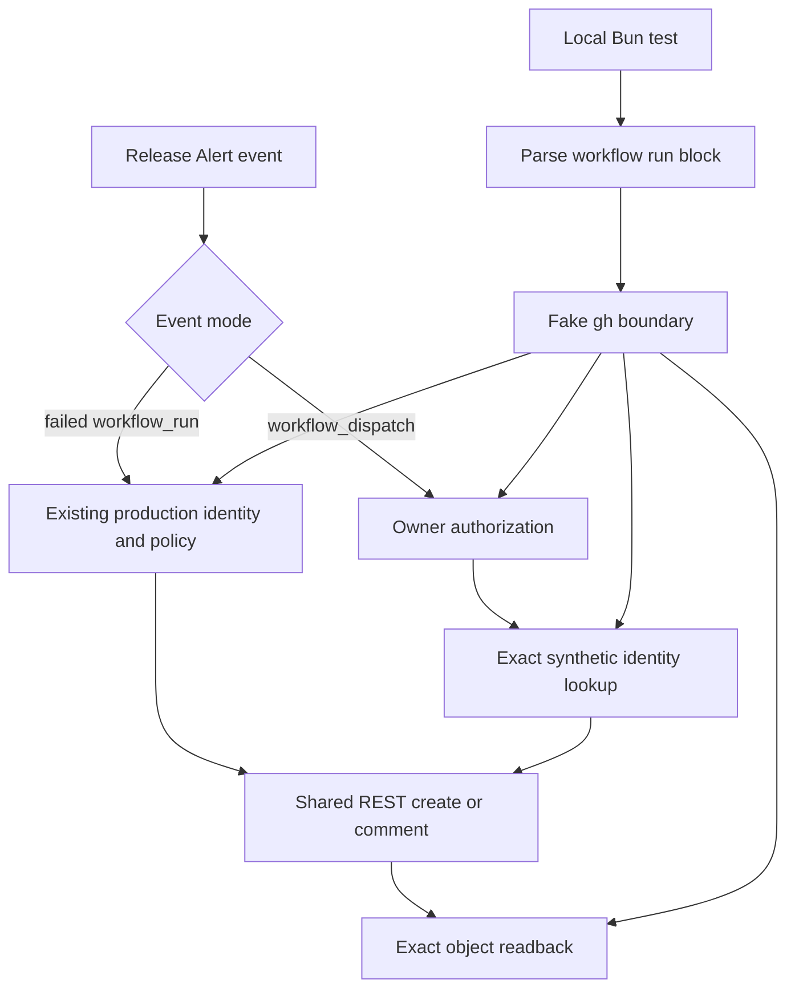

# Release Alert Synthetic Validation Plan

## Summary

Add deterministic and live coverage for Release Alert's issue create-versus-comment behavior without intentionally failing a release. The existing checkout-free `workflow_run` path retains its production identity and first-match policy. A new owner-only `workflow_dispatch` path uses a separate synthetic issue identity, fails closed on ambiguous matches, and verifies the exact GitHub issue or comment after mutation. Both modes use the same inline REST mutation functions so the synthetic update proves the path production uses.

The implementation stays inside `.github/workflows/release-alert.yaml`. Local tests execute that workflow's actual embedded shell through a fake `gh` boundary, avoiding a new CLI command, checkout step, dependency install, action dependency, secret, or token scope.

---

## Problem Frame

Release Alert has proven its first-failure create path in production: failed Release run `33142690493` created issue #1209. The existing-open-issue update and dedupe path has no equivalent runtime evidence. Triggering a real Release failure to exercise it would couple alert validation to package publication and create avoidable operational risk.

Static YAML checks are insufficient. This repository has repeatedly seen workflow safeguards pass review and tests while their real GitHub runtime branch remained unexercised. The validation must therefore combine deterministic local branch coverage with a controlled GitHub-hosted proof that creates one synthetic issue, comments on that same issue on the second run, and never touches the production alert identity.

| Mode | Trigger | Identity | Match policy | Runtime proof |
| --- | --- | --- | --- | --- |
| Production | Failed Release `workflow_run` | Existing production title, label, marker | Preserve current oldest/first matching issue behavior | Existing production evidence |
| Synthetic create | Owner `workflow_dispatch`, no exact open match | Dedicated synthetic title, label, marker | Create exactly one issue | First manual validation run |
| Synthetic update | Owner `workflow_dispatch`, one exact open match | Dedicated synthetic title, label, marker | Comment on the one exact issue | Second manual validation run |
| Synthetic conflict | Owner `workflow_dispatch`, multiple exact open matches | Dedicated synthetic title, label, marker | Fail before mutation | Deterministic test only |

---

## Context and Research

### Current implementation

- `.github/workflows/release-alert.yaml` is checkout-free and grants only `issues: write`. Its single shell step creates the production label when missing, lists open issues, selects the first marker match, then comments or creates.
- `packages/cli/src/conventions.test.ts` already parses workflow YAML and enforces repository-wide trigger and permission invariants.
- `packages/cli/src/commands/cliproxy/monitor.ts` and its tests provide the closest repository precedent for separate production/test identities, owner-only synthetic behavior, bounded GitHub retries, and boundary-mocked tests.
- `.github/workflows/cliproxy-auth-monitor.yaml` provides the closest workflow precedent for a permanent synthetic `workflow_dispatch` path.

### Institutional learnings

- `docs/solutions/workflow-issues/approval-gated-run-cancellation-2026-09-02.md` shows that shape-only validation can miss the branch that matters and that checkout-free `gh` calls must always pass `--repo` when repository context is required.
- `docs/solutions/workflow-issues/reusable-workflow-permission-parity-startup-failure-2026-09-01.md` shows that valid YAML and local linters do not prove GitHub runtime acceptance.
- `docs/solutions/workflow-issues/gateway-v0500-undeployable-upstream-2026-06-02.md` reinforces that validation must exercise the exact changed runtime contract rather than a nearby proxy.

### GitHub contract

- Workflow-level `permissions` sets unspecified `GITHUB_TOKEN` scopes to `none`; retaining only `issues: write` preserves the current least-privilege boundary.
- `workflow_dispatch` can target a selected ref when the workflow file exists on the default branch. Because Release Alert already exists on `main`, the implementation should attempt branch-ref dispatch before merge, but post-merge execution remains the authoritative proof.
- GitHub's issue and issue-comment REST endpoints return concrete object IDs and URLs. Synthetic validation should capture those identifiers and fetch the exact object rather than infer success from a list query or summary text.

---

## Prior-Art Survey

```json
{
  "schema_version": 2,
  "verdict": "extend",
  "scope": "marcusrbrown/infra release-alert and workflow-validation surfaces",
  "freshness": {
    "vcs_reference": "c0adf1df0239ca21185957992443ad0b0881db4a"
  },
  "budget": {
    "max_search_passes": 3,
    "max_candidate_inspections": 5,
    "exhausted": false
  },
  "candidates": [
    {
      "path_or_symbol": ".github/workflows/release-alert.yaml",
      "description": "Owns failed-Release issue identity, dedupe lookup, and create-or-comment mutation.",
      "disposition": "extend"
    },
    {
      "path_or_symbol": "packages/cli/src/commands/cliproxy/monitor.ts",
      "description": "Owns the repository precedent for production/test identities, owner-only synthetic validation, and bounded GitHub requests.",
      "disposition": "reuse"
    },
    {
      "path_or_symbol": ".github/workflows/cliproxy-auth-monitor.yaml",
      "description": "Owns the repository workflow precedent for a permanent synthetic workflow_dispatch entrypoint.",
      "disposition": "reuse"
    },
    {
      "path_or_symbol": "packages/cli/src/conventions.test.ts",
      "description": "Owns parsed-YAML repository invariants for workflow triggers, inputs, permissions, and step structure.",
      "disposition": "extend"
    },
    {
      "path_or_symbol": "packages/cli/src/commands/cliproxy/monitor.test.ts",
      "description": "Owns the closest boundary-mocking patterns for GitHub issue state and synthetic authorization behavior.",
      "disposition": "reuse"
    }
  ]
}
```

---

## Key Technical Decisions

- KTD1. **Keep Release Alert checkout-free.** Extend the existing embedded shell instead of adding a CLI command, checkout, Bun setup, dependency installation, or action dependency. This preserves `issues: write` as the only token scope and avoids turning a small notification workflow into a package-runtime path.
- KTD2. **Execute the exact workflow script in local tests.** Parse `.github/workflows/release-alert.yaml`, extract the alert step's `run` block, and execute it with controlled environment values plus a temporary fake `gh` executable. Tests cover the production code path rather than a separately reimplemented helper.
- KTD3. **Preserve production behavior while sharing mutation code.** Production retains its current title, label, marker, body, and first/oldest marker-match policy. Both modes call the same inline REST create/comment functions; synthetic mode alone requires exact title, label, and marker agreement and fails before mutation on multiple matches.
- KTD4. **Authorize before any GitHub request.** On `workflow_dispatch`, compare `GITHUB_ACTOR` with `GITHUB_REPOSITORY_OWNER` before label lookup, issue lookup, or mutation. Follow the existing `cliproxy monitor` exact-comparison precedent. Unauthorized dispatch fails visibly.
- KTD5. **Use one machine-readable mutation contract.** Replace the production path's high-level `gh issue create/comment` calls with shared inline `gh api` POST functions used by both modes. Parse the canonical number, ID, and URL from each write response; synthetic mode then fetches that exact REST resource and verifies its identity or run-specific body.
- KTD6. **Bound readback retries.** Perform up to three exact-object reads, waiting one second between failed verification attempts. This gives a two-second propagation allowance without hiding a persistent mismatch. The local harness covers immediate success, retry success, and exhaustion.
- KTD7. **Keep live validation intentionally small.** Two owner dispatches prove create then update. Ambiguous matches, unauthorized actors, partial identity collisions, and readback exhaustion stay deterministic tests rather than creating harmful GitHub state.
- KTD8. **Preserve workflow serialization.** Keep `concurrency.group: release-alert` with `cancel-in-progress: false`. Production and synthetic runs execute one at a time, preventing simultaneous zero-match dispatches from racing into duplicate issues.
- KTD9. **Never retry an ambiguous write.** A non-zero mutation exit or malformed mutation response fails immediately because retrying could duplicate an issue or comment. Only exact-object GET readback is retryable within the bounded policy.
- KTD10. **Retain the synthetic path with Release Alert.** This is a durable operator validation surface, not rollout scaffolding. Remove it only when Release Alert itself or its issue-mutation contract is replaced; a one-off harness would not protect the maintained runtime branch from drift.

---

## High-Level Technical Design



The shell resolves event-specific metadata before building the alert body:

- Production uses `github.event.workflow_run.html_url`, `head_sha`, and `conclusion` exactly as today.
- Synthetic uses the active Actions run URL, current workflow SHA, and an explicit synthetic conclusion value.
- Both branches pass `--repo "$REPOSITORY"` on high-level `gh` commands and repository-qualified paths on `gh api` calls.

The shared mutation response supplies the canonical object identity. A malformed write response is an immediate hard failure and is never retried. On synthetic runs, the readback loop queries the exact issue number or comment ID and verifies expected fields with `jq`; it does not repeat the broad dedupe search.

---

## Implementation Units

### U1. Add deterministic Release Alert regression coverage

- **Goal:** Establish failing behavior tests against the current workflow before changing runtime logic.
- **Files:**
  - `packages/cli/src/release-alert.test.ts` (new)
  - `packages/cli/src/conventions.test.ts`
- **Approach:**
  - Parse `.github/workflows/release-alert.yaml` with the existing `yaml` dependency and extract the alert shell step by name.
  - Execute the exact `run` block with `Bun.spawn`, a sanitized environment, and a temporary fake `gh` executable that records commands and returns fixture JSON.
  - Keep the fake boundary inside the test; add no tracked script or production helper.
  - Add parsed-YAML convention assertions for a no-input `workflow_dispatch`, exact `issues: write` permissions, absence of checkout/install steps, and authorization before the first `gh` call.
  - Assert the exact successful-Release skip guard and the existing `concurrency.group: release-alert` / `cancel-in-progress: false` contract.
- **Test scenarios:**
  - Current workflow fails because no synthetic dispatch path exists.
  - Unauthorized synthetic mode exits non-zero and records zero `gh` calls.
  - Zero exact matches selects create; one selects comment; multiple exact matches select neither.
  - Matching only title, label, or marker does not select an existing synthetic issue.
  - Production one/multiple-match behavior remains the current first/oldest selection.
  - Exact issue/comment readback succeeds immediately, succeeds after one stale response, and fails after three misses.
  - Malformed mutation JSON fails after one write attempt; malformed readback JSON follows the bounded GET retry policy.
- **Verification:** Run `bun test packages/cli/src/release-alert.test.ts` and the focused Release Alert assertions in `packages/cli/src/conventions.test.ts`; preserve the initial RED output in implementation notes.
- **Dependencies:** None.
- **Requirements:** R1-R10, R12-R14.

### U2. Extend Release Alert with isolated synthetic validation

- **Goal:** Make U1 pass while preserving the production trigger, issue identity, match policy, and permission boundary.
- **Files:**
  - `.github/workflows/release-alert.yaml`
- **Approach:**
  - Add no-input `workflow_dispatch` alongside the existing `workflow_run` trigger.
  - Expand the job guard to allow failed Release runs or manual synthetic dispatches; successful Release completions still skip.
  - Resolve production and synthetic metadata separately so absent `workflow_run` fields cannot leak blank values into manual runs.
  - Fail unauthorized manual runs before the first `gh` invocation.
  - Keep the current production title, label, marker, body, and first/oldest lookup behavior unchanged.
  - Add the reserved synthetic title `Release workflow failure (synthetic validation)`, label `release-publish-failure-test`, and marker `<!-- release-publish-failure-test:v1 -->`.
  - Require exact synthetic title, label, and marker matching; fail closed on more than one exact match.
  - Implement shared inline REST create/comment functions and route both production and synthetic mutations through them. Production observable behavior stays unchanged while the mutation API becomes machine-readable.
  - Parse each write response exactly once. A command failure or malformed response fails immediately without retrying the mutation.
  - On synthetic runs, read back the exact issue or comment up to three times with one-second waits and append the verified action plus issue URL to `GITHUB_STEP_SUMMARY`.
  - Preserve `concurrency.group: release-alert` with `cancel-in-progress: false` so manual validations and production alerts cannot race.
- **Test scenarios:** All U1 scenarios pass against the actual workflow shell. Add a production-failure fixture proving the existing body fields and selected issue number remain unchanged.
- **Verification:** Run focused Release Alert tests, conventions tests, YAML parsing, `bun run lint`, `bunx tsc --noEmit`, and `bun test --recursive`.
- **Dependencies:** U1.
- **Requirements:** R1-R14.

### U3. Prove create and update against GitHub

- **Goal:** Produce runtime evidence for the exact synthetic branch while keeping release state and the production issue untouched.
- **Files:** No additional source file is required. Evidence lives in Actions runs, the synthetic issue, and the PR record.
- **Approach:**
  - With explicit operator approval, attempt `gh workflow run release-alert.yaml --ref <branch>` before merge. This is optional early evidence only. If GitHub rejects dispatch because the default-branch workflow version lacks the new trigger, record that platform limitation rather than weakening the design; plan completion still requires the post-merge proof.
  - After the implementation reaches `main`, capture the production alert issue's number and comment count, if one is open.
  - With explicit operator approval, dispatch Release Alert once and verify the run creates exactly one open synthetic issue with the reserved identity and reports its exact URL.
  - Dispatch it a second time and verify the run comments on the same issue through the same REST comment function used by production, the comment contains the second run URL, and no second synthetic issue exists.
  - Confirm the production alert issue's body and comment count are unchanged and no Release run or package publication occurred.
  - With explicit operator approval, close the synthetic issue manually after evidence is captured.
- **Verification:** Read both workflow logs, fetch the exact issue and comment through `gh api`, list open issues matching both production and synthetic labels, and verify the Release workflow history contains no validation-caused run.
- **Dependencies:** U2 merged to `main` if branch dispatch is unavailable.
- **Requirements:** R1-R11.

---

## System-Wide Impact

- **GitHub Actions:** Release Alert gains one manual entrypoint but no new jobs, actions, checkout, dependency install, environment, secret, or permission. Its existing concurrency contract remains unchanged.
- **GitHub Issues:** Production identity, matching, and lifecycle remain unchanged, while its mutation mechanism moves from high-level `gh issue` commands to the same machine-readable REST functions used by synthetic validation. Synthetic state uses a separate label/title/marker and remains open only long enough for operator inspection.
- **CLI package:** Runtime CLI behavior and published package contents remain unchanged. `packages/cli` only hosts repository-level tests and conventions assertions.
- **Release pipeline:** No Release workflow invocation, Changesets operation, npm publication, or release-state mutation is added.
- **Fro Bot:** The synthetic issue is authored by `github-actions[bot]`; existing bot-author guards should continue to suppress issue-triggered agent work.

No changeset is required because the published CLI surface does not change.

---

## Requirements Traceability

| Requirement | Implementation | Evidence |
| --- | --- | --- |
| R1 | U1, U2, U3 | Production fixtures plus pre/post live issue state |
| R2-R4 | U1, U2, U3 | Exact identity fixtures and two-run live proof |
| R5-R6 | U2, U3 | Parsed workflow permissions/steps and Release history |
| R7 | U1, U2 | Unauthorized zero-call test and first-command ordering assertion |
| R8-R10 | U1, U2, U3 | Zero/one-match fixtures plus exact REST readback |
| R11 | U3 | Synthetic issue remains open until manual close |
| R12-R14 | U1 | Exact workflow-shell harness and fake `gh` boundary |

---

## Verification Matrix

| Scenario | Expected result | Verification surface |
| --- | --- | --- |
| Successful Release completion | Alert job skips | Parsed job guard test |
| Failed Release, no production issue | Existing production create behavior | Extracted-shell fixture |
| Failed Release, existing production issue | Existing first/oldest issue receives comment | Extracted-shell fixture |
| Non-owner manual dispatch | Fails before any GitHub request | Fake `gh` call log is empty |
| Owner dispatch, zero exact synthetic matches | Creates one synthetic issue and verifies exact issue | Fixture plus first live run |
| Owner dispatch, one exact synthetic match | Comments same issue and verifies exact comment | Fixture plus second live run |
| Owner dispatch, multiple exact matches | Fails with zero mutations | Fixture only |
| Partial synthetic identity collision | Does not select impostor issue | Fixture only |
| First readback stale, second current | Succeeds after one bounded retry | Fixture only |
| All readbacks stale or malformed | Fails after three attempts | Fixture only |
| Mutation response malformed | Fails immediately and does not retry write | Fixture only |
| Two manual dispatches overlap | Existing concurrency serializes execution | Parsed concurrency assertion |

Project gates:

```bash
bun test packages/cli/src/release-alert.test.ts
bun test packages/cli/src/conventions.test.ts
bun run lint
bunx tsc --noEmit
bun test --recursive
```

---

## Risks and Mitigations

- **Production behavior drifts while its mutation API changes:** Keep production identity, body, selected issue, and create/comment fixtures anchored to the current workflow before editing, then prove both modes call the same REST functions.
- **Synthetic state collides with production:** Require exact title, label, and marker agreement and verify production issue state before and after live runs.
- **Tests validate a reimplementation:** Extract and execute the workflow's actual `run` block; the fake boundary replaces only `gh` network I/O.
- **Read-after-write produces a false failure:** Retry the exact object three times with bounded one-second waits; never repeat the broad dedupe search.
- **A failed write is retried into a duplicate:** Treat every mutation as single-attempt and fail immediately on command or response-parse failure.
- **Concurrent dispatches race on zero matches:** Preserve the existing non-cancelling `release-alert` concurrency group and pin it in conventions tests.
- **Fake `gh` behavior diverges from the CLI:** Keep fixtures limited to command arguments and documented JSON fields; live runs remain the authority.
- **Branch dispatch is unavailable before merge:** Treat post-merge two-run validation as the authoritative gate and do not infer success from local tests.
- **macOS local shell differs from GitHub's runner:** Keep the embedded script compatible with Bash 3.2 constructs used by the local harness.
- **Synthetic issue is forgotten:** Use an unmistakable test title and label; manual close remains an explicit final operation.

---

## Scope Boundaries

- No intentional Release failure, Changesets operation, package publication, or release-state mutation.
- No new CLI command, reusable issue service, workflow emulator, tracked helper script, action dependency, checkout, or dependency installation.
- No new GitHub Environment, PAT, GitHub App token, secret, or permission scope.
- No change to the production title, label, marker, body, trigger, concurrency, or first-match behavior; only its mutation command moves to the shared REST function.
- No automated synthetic cleanup or broader Release workflow branch coverage.
- No live creation of duplicate synthetic issues merely to prove the multiple-match failure branch.

---

## Sources and References

- `docs/brainstorms/2026-09-11-release-alert-validation-requirements.md`
- `.github/workflows/release-alert.yaml`
- `.github/workflows/cliproxy-auth-monitor.yaml`
- `packages/cli/src/conventions.test.ts`
- `packages/cli/src/commands/cliproxy/monitor.ts`
- `packages/cli/src/commands/cliproxy/monitor.test.ts`
- `docs/solutions/workflow-issues/approval-gated-run-cancellation-2026-09-02.md`
- `docs/solutions/workflow-issues/reusable-workflow-permission-parity-startup-failure-2026-09-01.md`
- `docs/solutions/workflow-issues/gateway-v0500-undeployable-upstream-2026-06-02.md`
- GitHub Actions workflow syntax: `docs.github.com/actions/reference/workflows-and-actions/workflow-syntax`
- GitHub Actions manual workflow runs: `docs.github.com/actions/how-tos/manage-workflow-runs/manually-run-a-workflow`
- GitHub REST API issue endpoints: `docs.github.com/rest/issues/issues` and `docs.github.com/rest/issues/comments`
