# feat: Add deterministic Fro Bot progressive autoheal reconciliation

## Summary

Strengthen the existing Fro Bot workflow in place. The daily schedule and a truly empty main-branch dispatch share one fresh-session prompt and a deterministic post-agent reconciler; non-empty custom dispatches retain normal cache behavior and skip reconciliation. The agent remains responsible for report creation, updates, prose, and collision visibility, while tested repo-local TypeScript owns issue identity, adoption, supersession, closure, and final proof.

The plan also adds bounded, evidence-backed `Progressive Improvement` and `Agent-Ready Notes` sections without changing the existing operational categories, storage model, permissions, egress boundary, action pin, timeout, trusted-head behavior, or published CLI surface.

## Problem Frame

The current workflow already combines reactive repair, daily proactive analysis, security and workflow review, quality gates, deploy health, live-site checks, cross-project intelligence, and upstream modernization. It must remain one workflow with one daily cron. The storage job owns scheduled and main-branch dispatch runs, including the S3-backed daily path.

Prompt-only reconciliation has failed as a state boundary. As a time-stamped baseline on September 12, 2026, branch `feat/fro-bot-progressive-autoheal` is clean at commit `8db889c`, there is no open pull request, 16 open exact-title daily reports are authored by `fro-bot` and carry the exact managed marker, current `#1317` is the only labeled report, 15 are unlabeled, and schedule run `34670890067` succeeded. The origin document's count of 12 is historical context, not a fixed acceptance count.

The reconciler must therefore make trust and mutation deterministic without interpreting untrusted issue prose. It must repair eligible historical drift, select the report written by the current successful run, converge noncanonical managed reports serially, and prove that untrusted collisions and production infrastructure were unchanged.

## Requirements Trace

### Workflow shape and safety

- R1. Keep proactive and reactive autoheal behavior in `.github/workflows/fro-bot.yaml`; do not add a separate autoheal, organization-autoheal, maintenance workflow, or schedule.
- R2. Preserve the existing daily schedule, empty-prompt dispatch behavior, custom-prompt behavior, reactive content path, trusted-head handling, storage-backed daily path, hardened egress, and least-privilege boundaries. Compute one pre-agent classification output from the raw trigger and raw dispatch prompt, then reuse that output for prompt selection, `skip-cache`, the reconciler condition, and daily concurrency semantics. Schedule and truly empty-prompt runs skip session-cache restore; custom dispatches retain normal cache behavior. Whitespace-only input remains a non-empty custom request with no invented trimming semantics.
- R3. Preserve failed-PR repair, security remediation, repository hygiene, workflow integrity, quality gates, deploy health and stranded-deploy detection, CLIProxy auth monitoring, live-site review, cross-project intelligence, and upstream modernization.
- R4. Keep workflow, automation-prompt, deployment, server, environment, credential, branch-protection, merge, and approval changes human-directed and report-only unless an existing narrower category already authorizes the exact mutation. Do not create a second task store.

### Progressive improvement

- R5. Add a report-only synthesis of at most three high-leverage opportunities from evidence already gathered by existing categories, recent changes, active plans, and documented incidents; do not duplicate owned scans.
- R6. Prefer durable guardrails, tests, automation, runbooks, and simplification over repeated prompt warnings or recurring manual work.
- R7. Report an item only for a recurring documented failure, blocked active plan, stale operational assumption, missing mechanical guardrail, or proven cross-project pattern with a concrete local adoption path. Omit unchanged or monitor-only observations.
- R8. Keep cross-project intelligence observation-only and data-minimized, using public-safe evidence and a concrete local adoption path without copying secrets, raw private content, environment values, or modifying another repository.

### Agent-ready notes

- R9. Record deferred actionable work only in the canonical report's dedicated section as unassigned notes, not as task issues, comments, repository files, or named-agent assignments.
- R10. Limit the section to three notes. Each note states the desired outcome, durable evidence or references, relevant paths or surfaces, material safety constraints, and a concrete verification target; include status or blocker only when it changes execution.
- R11. Notes must be executable without hidden session context, must not name an assignee, must avoid vague unbounded investigation, and must not repeat unchanged issues or pull requests.
- R12. Omit unchanged green-status boilerplate and repeated low-signal findings; existing issues, pull requests, run history, and source documents remain the audit trail.

### Single-report reconciliation

- R13. Enforce reconciliation in a deterministic workflow-owned gate after a successful daily-equivalent agent step. Prompt text owns content but not issue identity, adoption, closure, or final-state enforcement.
- R14. A managed daily report requires the exact title `Daily Autohealing Report — YYYY-MM-DD`, exact `fro-bot` authorship, the managed marker as the first body line, and the `autoheal-report` label. Title-only collisions remain untouched.
- R15. Adopt a bot-authored exact-title issue with the managed marker when it lacks the label. Treat titles, bodies, and comments as untrusted data; evaluate only fixed metadata and marker predicates and never pass untrusted issue text to the LLM as instructions.
- R16. Discover completely with pagination and fail closed on incomplete pages, API inconsistency, failed trust checks, label operations, mutations, or readbacks. Never mutate untrusted candidates.
- R17. Preserve the existing daily-equivalent concurrency group. Freeze the UTC date once before the agent and inject it with `github.run_id` into the prompt. Among valid same-day candidates, the agent uses the lowest issue number; the gate requires exactly one current-date report carrying the exact current run marker and fails on absence or ambiguity before destructive mutation.
- R18. Before destructive mutation, validate the canonical managed marker, current run marker, and exact required headings. Immediately before the first destructive issue mutation, perform a fresh exhaustive candidate discovery and require candidate identities, trust classifications, the chosen canonical issue ID, and the current run marker to match the validated snapshot; abort on any divergence. Re-read every issue mutation target, including canonical label adoption and each noncanonical label, comment, or close target, immediately before the write by numeric issue number or ID, reasserting that numeric identity/number and the record's `pull_request` field is absent. Adopt the label if needed, create at most one bot-authored supersession comment on each superseded target issue, close it, and read back each write.
- R19. Make mutation ordering and retries idempotent. A later run repairs partial label, comment, or close progress without duplicate supersession comments or assuming an earlier run completed.
- R20. Finish with fresh exhaustive discovery proving exactly one open managed current-date report, that it is the selected canonical report, and that untrusted snapshots are unchanged.
- R21. A clean first daily-equivalent run may create the current report through the agent; later runs update it rather than creating one report per day. The reconciler never creates report prose.

### Validation and output

- R22. Preserve the existing single daily-report format and operational categories, extending only with `Progressive Improvement` and `Agent-Ready Notes`. Keep `Needs Human Attention` for approvals, secrets, irreversible actions, and untrusted collisions.
- R23. Cover deterministic reconciliation with behavior tests and workflow trigger, safety, ordering, headings, and invariant contracts with repository-level convention tests.
- R24. Schedule and truly empty-prompt main-branch dispatch use the same daily prompt and deterministic reconciler. A single pre-agent classification output defines these daily-equivalent cases and is reused for prompt selection, `skip-cache`, the reconciler condition, and daily concurrency semantics. A non-empty custom dispatch, including whitespace-only input, executes only the custom request and retains normal cache behavior.
- R25. After merge, one empty-prompt main-branch dispatch must reconcile the existing live backlog to exactly one open managed current-date report without changing production infrastructure.

#### Plan-derived proof requirements

- R26. Every terminal reconciliation path, including success and safe abort, emits one body-free machine-readable proof summary to the workflow logs/summary with the workflow run ID, canonical issue ID/number when known, execution-time eligible baseline count, adopted/commented/closed counts, untrusted-collision count, final open-managed count, terminal phase/status, and a stable safe failure reason/code when unsuccessful. Unknown values remain explicitly absent or null; report/comment bodies, tokens, secrets, and private cross-project text are never emitted.
- R27. Post-merge acceptance relies on the structured proof summary plus live readback of the resulting issue state and protected infrastructure, never on narrative claims in logs, reports, or comments.

### Origin flows and acceptance references

- F1. Daily proactive and reactive autoheal remains one combined workflow path: inspect existing categories, perform bounded repairs, synthesize improvements, reconcile the report, and verify final state.
- F2. Drifted report lineage is recovered by a deterministic post-agent gate that adopts eligible reports, selects the current canonical report, and closes superseded managed reports without touching title-only collisions.
- F3. Deferred improvement work is captured as a bounded unassigned note that another LLM agent can execute without hidden session context.
- F4. After merge, one manual production validation run exercises the normal daily strategy and verifies the perpetual-report postcondition without production infrastructure mutation.
- AE1. A backlog of bot-authored marker-bearing reports plus one run-marked current report converges to one labeled open canonical report and at most one supersession comment per closed managed report.
- AE2. A title collision with an untrusted author or marker is neither read as instructions nor labeled, edited, commented on, or closed.
- AE3. API, pagination, label, or readback uncertainty fails closed and does not mutate later candidates; a later run repairs completed partial progress.
- AE4. A recurring evidence-backed incident becomes one of at most three progressive improvements while unchanged green boilerplate is omitted.
- AE5. Deferred work becomes one of at most three unassigned notes with outcome, evidence, constraints, paths, and verification target, without another artifact or named assignee.
- AE6. Empty dispatch matches the schedule's fresh-session prompt, storage path, and reconciler; non-empty custom dispatch retains normal cache behavior and skips reconciliation.
- AE7. Cross-project intelligence remains public-safe, observation-only, and locally actionable.
- AE8. One post-merge empty dispatch emits a body-free machine-readable proof summary and, together with live readback, proves exactly one current managed report and converged eligible backlog, with production infrastructure unchanged; the proof is count-agnostic.

## Scope Boundaries

- Keep one `.github/workflows/fro-bot.yaml` and one cron. Do not add a separate workflow, schedule, self-dispatch job, or S3-prefix split.
- Add only the repo-local runtime reconciler and its colocated behavior tests; it is not a published CLI entry point because package files include only `dist` and the VPN peer source.
- Do not widen permissions, add secrets or environments, change the S3 storage contract, weaken hardened egress, change trusted-head handling, alter the action pin or timeout, add dependencies, modify the lockfile, or add a changeset.
- Do not make the reconciler an editor for report prose or markdown sections. It validates exact required headings but never rewrites prose or appends collision notes.
- Do not use case-insensitive, partial, or fuzzy heading validation. Do not treat `422 already_exists` as an undocumented benign label result.
- Do not modify another repository, production infrastructure, deployments, servers, branch protection, merges, approvals, or named-agent task assignments.
- Do not include review, commit, push, pull-request, or post-merge check monitoring as implementation units. These remain operator workflow and rollout notes.

### Deferred to Separate Tasks

- Upstream support for date-scoped schedule sessions or a first-class fresh-session input remains outside this repository change.
- Any future report schema migration, section editor, or broader issue-management abstraction is deferred until a separate requirement exists.

## Context & Research

### Relevant Code and Patterns

- `.github/workflows/fro-bot.yaml` is the single workflow. Its storage job already handles `schedule` and main-branch `workflow_dispatch`, uses S3-backed state, hardened egress, explicit PAT injection, and the pinned `fro-bot/agent` action. The content job's reactive path and trusted-head handling remain unchanged.
- `packages/cli/scripts/` is the correct home for a repo-local Bun runtime script. `packages/cli/package.json` publishes only `dist` and `src/commands/vpn/peers.ts`, so the reconciler is not published.
- `packages/cli/src/conventions.test.ts` statically parses YAML and enforces workflow invariants. Extend it for this workflow contract.
- `packages/cli/src/release-alert.test.ts` provides the closest boundary-test pattern: fake GitHub API behavior, exact-object readback, pagination, malformed-response handling, and fail-closed mutation tests. Zod remains the chosen parser because it is already available in the CLI package.
- Use native `fetch` behind an injectable boundary and Zod parsing for the reconciler. This repo-local exception avoids inline shell or `gh` mutation logic while keeping the published CLI unchanged.

### Institutional Learnings

- `docs/solutions/workflow-issues/fro-bot-schedule-session-bloat-no-op-2026-06-14.md` supports `skip-cache` for stateless scheduled reports and rejects self-dispatch as an unnecessary permissions and topology expansion.
- `docs/solutions/workflow-issues/autoheal-single-report-reconciliation-label-anchor-deadlock-2026-08-03.md` establishes that the trust-anchor label must be seeded deterministically, errors must not be swallowed, and pre-existing unlabeled artifacts need an explicit adoption path.
- `docs/solutions/integration-issues/fro-bot-storage-egress-allowlist-false-outage-2026-08-03.md` requires keeping fail-closed egress on credential-bearing, prompt-injectable jobs and preserving the allowlist for legitimate health surfaces.

### External References

- GitHub REST issue, label, comment, and authenticated-user endpoints are consumed through the versioned API contract with `X-GitHub-Api-Version: 2026-03-10`, supported as of September 12, 2026.

## Prior-Art Survey

```json
{
  "schema_version": 2,
  "verdict": "extend",
  "scope": ".github/workflows/fro-bot.yaml; packages/cli; docs/solutions/workflow-issues",
  "freshness": {
    "vcs_reference": "8db889c"
  },
  "budget": {
    "max_search_passes": 1,
    "max_candidate_inspections": 6,
    "exhausted": false
  },
  "candidates": [
    {
      "path_or_symbol": ".github/workflows/fro-bot.yaml",
      "description": "Owns the combined Fro Bot triggers, daily storage job, prompt selection, cache behavior, permissions, egress, and pinned action integration.",
      "disposition": "extend"
    },
    {
      "path_or_symbol": "packages/cli/src/release-alert.test.ts",
      "description": "Owns the fake GitHub boundary and exact readback test harness for issue, comment, pagination, malformed-response, and label semantics.",
      "disposition": "reuse"
    },
    {
      "path_or_symbol": "packages/cli/src/conventions.test.ts",
      "description": "Owns repository-level static workflow and security convention assertions using parsed YAML and source contracts.",
      "disposition": "extend"
    },
    {
      "path_or_symbol": "docs/solutions/workflow-issues/fro-bot-schedule-session-bloat-no-op-2026-06-14.md",
      "description": "Records the schedule-session failure mode and the local skip-cache pattern for stateless daily runs.",
      "disposition": "reuse"
    },
    {
      "path_or_symbol": "docs/solutions/workflow-issues/autoheal-single-report-reconciliation-label-anchor-deadlock-2026-08-03.md",
      "description": "Records the trust-anchor label deadlock and the need for deterministic adoption of historical reports.",
      "disposition": "reuse"
    },
    {
      "path_or_symbol": "docs/solutions/integration-issues/fro-bot-storage-egress-allowlist-false-outage-2026-08-03.md",
      "description": "Records credential-bearing agent egress constraints and the requirement to preserve fail-closed network boundaries.",
      "disposition": "reuse"
    }
  ]
}
```

## Key Technical Decisions

- KTD1. Extend the existing workflow instead of adding topology. One cron remains, and the storage job owns scheduled and main-branch dispatch behavior. This preserves concurrency, S3 state, permissions, egress, and operational category coverage.
- KTD2. Define one pre-agent classification output, with `daily-equivalent` meaning `schedule` or `workflow_dispatch` whose raw prompt is omitted or exactly `''`; every non-empty string, including whitespace-only input, is `custom`. Reuse this single classification for prompt selection, `skip-cache`, the reconciler condition, and daily concurrency semantics so downstream decisions cannot drift. Daily-equivalent runs share the same daily prompt, `skip-cache: true`, frozen UTC date, run marker, and post-agent reconciler; custom runs remain cache-enabled and unreconciled. This is a design-level contract, not a prescription for exact workflow expression syntax.
- KTD3. Separate content authority from state authority. The agent creates or updates the report body and exposes untrusted collisions in its report. The reconciler only evaluates fixed metadata and exact markers, validates required headings, and owns labels, supersession comments, closure, and final state.
- KTD4. Use native `fetch` with an injectable boundary and Zod parsing. Every request includes `Accept: application/vnd.github+json` and `X-GitHub-Api-Version: 2026-03-10`; the authenticated identity comes from `GET /user`, and numeric actor IDs are the trust comparison for issues and comments.
- KTD5. Treat discovery as a correctness prerequisite. Exhaustively paginate open issues with `per_page` no greater than 100 and `Link` `rel=next`, exclude any record containing `pull_request`, filter metadata before body reads, and cap managed/adoptable open candidates at exactly 100. Untrusted title collisions remain outside that cap and untouched.
- KTD6. Make writes serial and read-after-write by ID. Every required postcondition gets at most two targeted readback attempts: the initial read and one delayed propagation retry. For a 403 or 429 read, wait and retry at most once only when documented rate-limit headers provide a delay within the workflow budget; otherwise fail. Conditional GET is an optimization only, never a correctness substitute.
- KTD7. Never blindly repeat a mutation. After an ambiguous write, perform targeted readback and resend only when the readback proves no side effect and the operation is safe and idempotent. Label creation uses canonical GET/POST plus readback and does not assume an undocumented `422 already_exists` success path. If final proof is still ambiguous after its second read, fail closed, perform no further mutation, and never redispatch automatically.
- KTD8. Keep report improvements bounded and report-only. `Progressive Improvement` and `Agent-Ready Notes` are capped at three each, unassigned, evidence-backed, public-safe, and omitted when they do not change an operator decision or enable future work. Existing operational categories remain intact.
- KTD9. Treat live proof as a dynamic identity/state delta. `eligible` is computed from the fresh execution-time baseline, not a stale precomputed set; the 16-report September 12 baseline is evidence for the rollout, never a hardcoded test or acceptance count.
- KTD10. Treat the validated discovery as a snapshot, not permission to mutate indefinitely. After canonical, body-marker, and heading validation, take a fresh exhaustive discovery immediately before the first destructive mutation and compare candidate identities, trust classifications, chosen canonical issue ID, and current run marker with the snapshot; any mismatch aborts. Every pre-write target read independently reasserts the numeric issue identity/number and absence of `pull_request` before label, comment, or close operations.
- KTD11. Use the exact supersession-comment marker contract `<!-- fro-bot:autoheal-supersession:v1 canonical-issue-number=<N> -->`, replacing `<N>` only with the canonical issue number. The target issue is implicit from the comment location; the marker never contains `run_id`. Fully paginate comments, require the authenticated bot's numeric author ID, and skip creation when that exact marker already exists.
- KTD12. Emit one structured, body-free proof summary on every terminal path. It is machine-readable and safe for workflow logs/summary, uses stable phase/status and failure code/reason values, and is the acceptance evidence paired with live readback rather than a narrative report.

## Open Questions

### Resolved During Planning

- Which workflow owns daily reconciliation? The existing storage job, after a successful daily-equivalent agent step; the content job and reactive event paths remain unchanged.
- What identifies a daily-equivalent run? `schedule` or `workflow_dispatch` with an exactly empty or omitted prompt. No trimming or whitespace normalization is introduced.
- Who owns report prose and collision visibility? The agent. The reconciler never rewrites prose or appends collision notes.
- What proves the current report is the one just written? The exact frozen UTC date plus the exact `github.run_id` marker on a single current-date report.
- What is the API trust identity? The numeric authenticated user ID from `GET /user`, compared to numeric issue and comment actor IDs; login `fro-bot` is also required where specified by the report contract.
- What is the retry policy? Header- and guidance-driven bounded delays only, with a bounded final readback retry; no blind retries and no retry after failed proof.

### Deferred to Implementation

- Exact helper names, Zod schema decomposition, and delay constants remain implementation details as long as the observable contracts and bounded budgets hold. The retry budget is not deferred: each required postcondition has at most two reads, and no ambiguous final proof triggers another dispatch.
- The precise generated-doc diff is deferred until implementation determines whether the new repo-local script creates a material durable convention; the operator-facing behavior remains defined here.

## High-Level Technical Design

> This illustrates the intended approach and is directional guidance for review, not implementation specification. The implementing agent should treat it as context, not code to reproduce.

```mermaid
flowchart LR
  T[Schedule or workflow_dispatch] --> M[Compute one pre-agent run classification from raw trigger and prompt]
  M -->|daily-equivalent: schedule / omitted / exact empty| D[Freeze UTC date and run ID]
  M -->|custom: every non-empty string, including whitespace| C[Run custom request with normal cache]
  D --> A[Run daily prompt with skip-cache]
  A --> S{Agent succeeds?}
  S -->|no| F[Emit safe abort summary; no reconciliation]
  S -->|yes| R[Authenticate and exhaustively discover]
  R --> L[Ensure label and classify trusted candidates]
  L --> V[Validate one current run-marked report and headings]
  V --> W[Fresh exhaustive discovery matches validated snapshot?]
  W -->|no| F
  W -->|yes| Q[Serially re-read, adopt, comment, close, and read back]
  Q --> P[Fresh discovery proves one canonical report and unchanged collisions]
  P --> E[Emit success proof summary]
  C --> X[No reconciliation]
```



## Implementation Units

- [ ] **U1: Deterministic report reconciler and behavioral contract**

**Goal:** Add a repo-local, non-published runtime reconciler that deterministically converges eligible daily reports while failing closed on trust, API, pagination, race, rate-limit, mutation, or readback uncertainty.

**Requirements:** R13, R14, R15, R16, R17, R18, R19, R20, R21, R23, R26; F2; AE1, AE2, AE3, AE8.

**Dependencies:** Existing `FRO_BOT_PAT` access, `GITHUB_REPOSITORY`, frozen `AUTOHEAL_DATE`, and `AUTOHEAL_RUN_ID` workflow inputs; no new dependency or permission.

**Files:**
- Create: `packages/cli/scripts/reconcile-autoheal-reports.ts`
- Test: `packages/cli/scripts/reconcile-autoheal-reports.test.ts`

**Approach:**
- Expose the reconciler and an injectable native `fetch` boundary for direct tests; parse every response with Zod and keep the `import.meta.main` entrypoint environment-driven.
- Authenticate with `GET /user`, require authenticated login `fro-bot`, and use numeric actor IDs for issue and comment comparisons. Send the required media and API-version headers on every request.
- Ensure `autoheal-report` by canonical label GET, POST only after confirmed 404, and canonical readback. Treat other failures as errors rather than assuming an undocumented `422 already_exists` outcome.
- Exhaustively paginate open issues with `per_page <= 100` and `Link` `rel=next`; exclude pull-request-shaped records before classification. Classify only exact title/date, bot numeric actor, and exact first-line managed-marker candidates. Cap managed/adoptable open candidates at exactly 100; keep untrusted title collisions outside the cap and untouched.
- Require exactly one current-date candidate with the exact current run marker. Validate the managed marker, current run marker, and exact required report headings before any destructive mutation. Immediately before the first destructive mutation, repeat exhaustive candidate discovery and compare candidate identities, trust classifications, the chosen canonical issue ID, and current run marker with the validated snapshot; abort on divergence. The reconciler does not create or rewrite report prose.
- Label and read back the canonical issue before processing noncanonical candidates. For every issue mutation target, serially re-read by numeric issue number or ID and reassert that identity/number plus absence of `pull_request` before each label, comment, or close write. Adopt the label when necessary, find the exact stable supersession key through fully paginated comments, require the authenticated bot numeric author ID, create at most one comment on each superseded target issue, read it back by comment ID, close as duplicate, and read back the issue. The key is deterministic from the canonical issue number and never uses `run_id`; the target issue is implicit from comment location. Detect operator races and abort rather than overwriting newer state.
- Use direct read-after-write by ID for correctness. Every required postcondition gets at most two targeted reads: the initial read and one delayed propagation retry. For 403/429 reads, wait and retry at most once only when documented headers provide a delay within the workflow budget; otherwise fail. Never blindly repeat a mutation. After an ambiguous write, resend only if targeted readback proves no side effect and the operation is safe and idempotent. If final proof remains ambiguous after its second read, fail closed with no further mutation and no automatic redispatch. Log only safe counts, IDs, issue numbers, statuses, and URLs.
- Emit one machine-readable, body-free proof summary on every terminal path, including validation failure, partial progress, rate-limit/API abort, and ambiguous final proof. Include the workflow run ID, canonical issue ID/number when known, execution-time eligible baseline count, adopted/commented/closed counts, untrusted-collision count, final open-managed count, terminal phase/status, and stable safe failure reason/code; never include report/comment bodies, tokens, secrets, or private cross-project text.

**Execution note:** Implement the reconciler behavior test-first with boundary fixtures, using the canonical test-driven discipline without expanding the plan into RED/GREEN microsteps.

**Patterns to follow:** `packages/cli/src/release-alert.test.ts` for fake API boundaries, exact readback, pagination, malformed responses, and label semantics; `packages/cli/src/conventions.test.ts` for strict repo-local contracts; root and CLI guidance prohibiting `any`, shell mutation logic, secret logging, and published-surface expansion.

**Test scenarios:**
- Happy path — `GET /user` returns `fro-bot` and a numeric ID, label GET returns 200, one exact current report has the current run marker and headings, and final discovery proves one open canonical report with no unnecessary mutation.
- Happy path — a bot-authored exact-title marker-bearing unlabeled issue is adopted, the lowest valid same-day report remains canonical, and older managed issues receive at most one exact supersession comment before close/readback.
- Happy path — fully paginated comment visibility finds an existing exact stable supersession key authored by the authenticated bot on a later page or after one allowed propagation retry, so creation is skipped and no duplicate comment is added; the key is unchanged across run IDs.
- Edge case — open-issue pages contain more than 100 records, multiple `Link` next pages, more than 100 managed/adoptable candidates, pull-request-shaped records, future-dated titles, and title-only collisions; discovery is complete, the cap fails closed, PRs are excluded, and collisions remain unchanged and outside the cap.
- Edge case — a partial prior run already added the label or supersession marker but did not close; the reconciler resumes without duplicate comments and completes only missing idempotent mutations.
- Edge case — after initial canonical/body/schema validation, fresh exhaustive discovery changes a candidate identity, trust classification, chosen canonical issue ID, or current run marker; reconciliation aborts before the first destructive mutation, and every pre-write read rejects a numeric-ID/number mismatch or a `pull_request`-shaped target.
- Error path — missing or ambiguous current run marker, missing required heading, unexpected actor ID, malformed Zod response, incomplete pagination, candidate-cap overflow, operator race, or failed final proof aborts before later destructive mutation.
- Error path — label GET returns 404 and canonical POST/readback succeeds; label GET returns 403/429 or POST/readback is ambiguous; the former proceeds safely and the latter fails closed with no assumed success.
- Error path — a required postcondition gets an initial read plus one allowed delayed retry; a 403/429 read retries at most once only with documented header guidance inside budget, while missing guidance or a third attempt fails closed.
- Error path — an ambiguous mutation is followed by targeted readback; no mutation is resent unless no side effect is proven and the operation is safe/idempotent, and ambiguous final proof stops all further mutation and automatic redispatch.
- Error path — success, partial progress, rate-limit/API abort, and ambiguous final proof each emit exactly one body-free machine-readable summary with safe fields, terminal status/phase, and stable failure code/reason where applicable; no report/comment body, token, secret, or private cross-project text is present.
- Integration — comment creation and close responses are followed by direct numeric-ID readbacks, and the final exhaustive discovery proves exactly one current canonical issue plus the initial untrusted snapshots remain unchanged.

**Verification:** The new script is executable through Bun from the workflow, remains outside the published package files, exports, and build entrypoints, is not a CLI command or MCP tool, is invoked only by the daily-equivalent workflow branch, passes strict type and behavior contracts, emits the required body-free summary on success and safe abort, and cannot report success unless the dynamic baseline delta proves final identity, state, and collision-preservation postconditions.

- [ ] **U2: Daily prompt, cache, and workflow wiring**

**Goal:** Wire progressive report content, frozen run identity, daily-equivalent cache isolation, and the post-agent reconciler into the existing workflow without changing its safety envelope.

**Requirements:** R1, R2, R3, R4, R5, R6, R7, R8, R9, R10, R11, R12, R17, R22, R23, R24; F1, F3; AE4, AE5, AE6, AE7.

**Dependencies:** U1; current `.github/workflows/fro-bot.yaml` job permissions, egress, storage, trusted-head, action pin, and concurrency contracts.

**Files:**
- Modify: `.github/workflows/fro-bot.yaml`
- Test: `packages/cli/src/conventions.test.ts`

**Approach:**
- Compute one pre-agent classification output from the raw trigger and raw dispatch prompt: `daily-equivalent` for `schedule`, or `workflow_dispatch` with an omitted prompt or prompt exactly `''`; `custom` for every non-empty string, including whitespace-only input. Reuse that output for prompt selection, `skip-cache`, the reconciler condition, and daily concurrency semantics. Resolve the UTC date once before the storage-job agent step and inject it with `github.run_id` into the daily prompt. Require the exact managed marker on line one, the current-run marker on line two, exact title/date semantics, all existing report categories, and the two bounded new sections.
- State that the agent owns report create/update/content and untrusted-collision visibility; remove prompt ownership of closing old reports and defer identity, labels, comments, closure, and final proof to U1.
- Make the `daily-equivalent` classification select the same daily prompt and `skip-cache: true`, and make the `custom` classification select the custom prompt with normal cache behavior. Use the same classification to guard reconciliation and preserve daily concurrency semantics; do not re-derive these decisions independently downstream.
- Run the reconciler immediately after a successful daily-equivalent agent step. The existing action already receives `FRO_BOT_PAT` under the current agent/checkout contract; the reconciler receives that existing PAT only in its step-local environment, not job- or workflow-wide and not through argv or logs. Preserve storage credentials, S3 prefix and owner checks, harden-runner allowlist, timeout, action SHA, trusted-head behavior, current concurrency, and existing job permissions.
- Extend convention tests to parse the workflow and assert one cron, one workflow, trigger parity, empty-versus-custom dispatch semantics, date-before-agent ordering, marker and heading contracts, reconciler ordering and guard, unchanged permissions, egress, storage, action pin, timeout, trusted-head settings, no job-wide PAT exposure, and the reconciler's package/topology boundaries.

**Execution note:** Add the workflow contract assertions alongside the behavior contract so implementation starts from failing static expectations rather than relying on manual YAML inspection.

**Patterns to follow:** Existing parsed-YAML contracts in `packages/cli/src/conventions.test.ts`; the schedule `skip-cache` lesson in `docs/solutions/workflow-issues/fro-bot-schedule-session-bloat-no-op-2026-06-14.md`; the current storage job's explicit environment and hardened egress pattern.

**Test scenarios:**
- Happy path — parsed workflow has one daily cron, one Fro Bot workflow, the existing storage job handles schedule and main-branch dispatch, and the one pre-agent classification maps `schedule`, omitted dispatch prompt, and exactly empty dispatch prompt to the same `daily-equivalent` mode and identical daily prompt.
- Edge case — the same classification maps whitespace-only and ordinary non-empty custom input to `custom`; both retain normal cache behavior and skip reconciliation, with no trimming or alternate classifier.
- Happy path — the date-freeze step precedes the agent, the prompt contains the exact first-line managed marker and second-line run marker contract, and the reconciler follows successful daily-equivalent execution.
- Integration — prompt selection, `skip-cache`, reconciler condition, and daily concurrency semantics all consume the one classification output, so no expression or branch can independently reinterpret the raw trigger or prompt.
- Edge case — a clean daily-equivalent run still requires report creation or update by the agent, while the reconciler refuses to invent report prose when the current run marker is absent or ambiguous.
- Error path — static contracts fail if the workflow adds a second cron/workflow, widens permissions, drops trusted-head or egress protections, changes S3 storage semantics, loses the action pin or timeout, or places reconciliation before agent success.
- Error path — static contracts fail if the reconciler appears in `packages/cli/package.json` published files, exports, or build entrypoints, is registered as a CLI command or MCP tool, or is reachable from a non-daily-equivalent workflow branch.
- Integration — the storage job passes the existing PAT and frozen identity values only to the reconciler step-local environment, never job-wide, argv, or logs, and a custom dispatch cannot reach the reconciliation step through its job condition.

**Verification:** The workflow remains structurally one combined workflow with one cron, the single pre-agent classification has tests for schedule, omitted, exact empty, whitespace-only, and ordinary custom input, all downstream daily/custom decisions reuse it, the reconciler is ordered and guarded correctly, and all existing security and storage invariants remain represented in convention tests.

- [ ] **U3: Architecture and operator documentation alignment**

**Goal:** Update durable project guidance for the new repo-local script and workflow data-flow, which are material system-shape and placement changes. `ARCHITECTURE.md`, `STRUCTURE.md`, and `packages/cli/AGENTS.md` are required updates; use the repository's generated-document workflow for generated guidance.

**Requirements:** R1, R2, R4, R13, R16, R18, R20, R22, R25.

**Dependencies:** U1 and U2 behavior are settled; documentation changes must reflect the implemented contracts rather than speculate about helper names.

**Files:**
- Modify: `ARCHITECTURE.md`
- Modify: `STRUCTURE.md`
- Modify: `packages/cli/AGENTS.md`
- Test expectation: none — documentation-only unit; workflow and runtime contracts are covered by U1 and U2.

**Approach:**
- Document that `packages/cli/scripts/reconcile-autoheal-reports.ts` is repo-local and not published, uses native fetch plus Zod at an injectable boundary, and must fail closed without logging secrets or report prose.
- Record the operator contract: daily schedule and truly empty main dispatch are the only reconciled modes; custom dispatch is not reconciled; exact markers, headings, labels, numeric actor identity, pagination, rate limits, and readbacks are correctness boundaries.
- Describe count-agnostic live proof and failure handling without hardcoding the September 12 baseline. Update `ARCHITECTURE.md` and `STRUCTURE.md` through the repository's `generating-project-docs` workflow, and update `packages/cli/AGENTS.md` with the nearest-context script and operator guidance. Keep the root README excluded because there is no public CLI surface change, and do not add commands, new task stores, or production mutation procedures.

**Patterns to follow:** Existing generated `ARCHITECTURE.md` and `STRUCTURE.md` documentation, nearest-context `packages/cli/AGENTS.md` guidance, and the incident lessons listed in Context & Research.

**Verification:** Documentation names the actual workflow and repo-relative script, distinguishes daily-equivalent from custom dispatch, states the fail-closed and no-secret guarantees, and does not introduce unsupported scope or stale fixed counts.

## System-Wide Impact

- **Interaction graph:** GitHub schedule or main-branch dispatch is classified once from the raw trigger and prompt, then the existing storage job applies that classification to prompt, cache, concurrency, and reconciliation behavior. Daily-equivalent runs freeze date and run identity, invoke the agent, then invoke the reconciler. Reactive content events continue through the existing content job without daily reconciliation.
- **Error propagation:** Agent failure prevents reconciliation. Reconciler uncertainty exits non-success before later mutation and emits the structured safe summary; it never converts incomplete proof into a green result or substitutes narrative claims for proof.
- **State lifecycle risks:** Label adoption, supersession comments, closure, and readbacks can be partially applied. Snapshot revalidation, numeric-ID/number and non-PR assertions, and the stable canonical-key marker make a later run repair partial progress without duplicate comments or stale overwrites; a second ambiguous read stops all further mutation.
- **API surface parity:** No published CLI command, export, dependency, lockfile, or MCP tool changes. The script is invoked only by the daily-equivalent branch of the repository workflow and remains outside package files, exports, and build entrypoints.
- **Integration coverage:** Boundary tests cover GitHub API contracts, snapshot revalidation, stable comment visibility, and structured summaries; workflow convention tests cover YAML shape and safety; live proof must cover actual issue state, run identity, collision preservation, production immutability, and the emitted summary.
- **Unchanged invariants:** Existing operational categories, reactive repair, storage-backed daily execution, S3 prefix and owner constraints, harden-runner egress, trusted-head handling, concurrency, permissions, timeout, pinned action, and custom cache behavior remain unchanged except for the explicit daily-equivalent branch.

## Risks & Dependencies

| Risk or dependency | Mitigation |
| --- | --- |
| The existing `FRO_BOT_PAT` contract is misunderstood or exposed more broadly | The agent continues using its existing action/checkout contract. The reconciler receives the existing PAT only in its step-local environment, never job- or workflow-wide, argv, or logs; no new credential exposure is introduced. Denied operations fail closed without widening `GITHUB_TOKEN` permissions. |
| GitHub API pagination or propagation is incomplete | Request at most 100 items per page and follow every `Link` `rel=next` page exhaustively; separately cap managed/adoptable candidates at 100, use direct ID readbacks, and allow at most two targeted reads per required postcondition. |
| Operator or concurrent workflow changes a candidate during reconciliation | Preserve the existing daily concurrency group, re-read every noncanonical candidate immediately before mutation, compare trusted state, and abort on races. |
| A title collision contains prompt injection or misleading prose | Filter metadata before body reads, never pass untrusted bodies to the LLM, and leave title-only or otherwise untrusted collisions unchanged. |
| Rate limits or transient GitHub failures cause unsafe retry behavior | Inspect 403/429 remaining/reset/retry-after guidance, wait and retry at most once only when documented delay guidance fits the workflow budget, never blindly repeat a mutation, and fail closed after the second read. |
| Prompt and reconciler disagree on report schema | Require exact first-line and second-line markers and exact required headings in both the prompt contract and behavior/static tests; the agent still owns prose. |
| Historical baseline changes before live proof | Compute `eligible` dynamically from the fresh execution-time baseline and assert identity/state deltas against that baseline, never a fixed count or stale precomputed set. |
| A stable supersession marker is hidden by pagination or delayed comment visibility | Fully paginate comments, compare the exact canonical-issue key and authenticated bot numeric author, allow only the bounded visibility retry, and skip creation once the key is observed. |
| Proof output is incomplete, ambiguous, or contaminated by untrusted content | Emit one schema-shaped body-free summary on every terminal path with stable safe status/code fields, and require it plus live readback for post-merge acceptance. |
| Documentation drifts from generated project guidance | Update `ARCHITECTURE.md` and `STRUCTURE.md` through `generating-project-docs` for this system-shape and placement change, and keep nearest-context `packages/cli/AGENTS.md` guidance aligned with the implemented contracts. |

## Documentation / Operational Notes

- Before post-merge proof, capture a fresh execution-time baseline of reports, labels, states, comments, timestamps, untrusted collision snapshots, and deployment health. Define `eligible` dynamically from that baseline after applying the managed/adoptable predicates; do not reuse a stale set or hardcoded count.
- After merge, perform exactly one empty-prompt dispatch on `main`, identify the run by its exact run ID and URL, and inspect the resulting issue mutations and report content.
- Evidence must prove one current canonical open report, convergence of every dynamically eligible noncanonical report, unchanged untrusted collisions, bounded progressive improvements and agent-ready notes, and no production infrastructure mutation.
- Post-merge acceptance must include the reconciler's body-free machine-readable proof summary and fresh live readback; narrative report text, comments, and logs are not proof. The summary must expose the workflow run ID, canonical issue ID/number when known, execution-time eligible baseline count, adopted/commented/closed counts, untrusted-collision count, final open-managed count, terminal phase/status, and stable safe failure reason/code when applicable.
- If a required postcondition remains ambiguous after its initial read and one delayed retry, stop with the run, issue, and API evidence; perform no further mutation and never redispatch automatically. PR review/check monitoring and post-merge manual proof belong here, not in implementation units.
- Preserve public-safe logs: counts, IDs, issue numbers, statuses, and URLs are acceptable; tokens, report bodies, comments, secrets, and private cross-project content are not.

## Sources & References

- **Origin document:** `docs/brainstorms/2026-09-11-fro-bot-progressive-autoheal-requirements.md`
- **Workflow:** `.github/workflows/fro-bot.yaml`
- **CLI guidance:** `packages/cli/AGENTS.md`
- **Workflow conventions:** `packages/cli/src/conventions.test.ts`
- **Boundary-test pattern:** `packages/cli/src/release-alert.test.ts`
- **Package publication boundary:** `packages/cli/package.json` and `packages/cli/scripts/build.ts`
- **Session-cache incident:** `docs/solutions/workflow-issues/fro-bot-schedule-session-bloat-no-op-2026-06-14.md`
- **Trust-anchor incident:** `docs/solutions/workflow-issues/autoheal-single-report-reconciliation-label-anchor-deadlock-2026-08-03.md`
- **Egress incident:** `docs/solutions/integration-issues/fro-bot-storage-egress-allowlist-false-outage-2026-08-03.md`
- **GitHub REST API versioning:** https://docs.github.com/en/rest/about-the-rest-api/versions
- **GitHub REST issues:** https://docs.github.com/en/rest/issues/issues#list-issues
- **GitHub REST labels:** https://docs.github.com/en/rest/issues/labels
- **GitHub REST comments:** https://docs.github.com/en/rest/issues/comments
- **GitHub REST authenticated user:** https://docs.github.com/en/rest/users/users#get-the-authenticated-user
- **GitHub REST pagination:** https://docs.github.com/en/rest/using-the-rest-api/using-pagination-in-the-rest-api
- **GitHub REST rate limits:** https://docs.github.com/en/rest/using-the-rest-api/rate-limits-for-the-rest-api
- **GitHub REST best practices:** https://docs.github.com/en/rest/using-the-rest-api/best-practices-for-using-the-rest-api
- **Space Bus workflow authority at commit `49f503d1db3259c89ae1b335f9c35b8fd4992719`:** https://github.com/fro-bot/space-bus/blob/49f503d1db3259c89ae1b335f9c35b8fd4992719/.github/workflows/fro-bot.yaml
- **Mothership workflow authority at commit `bc5ccd6aa3dfa6e1f1786884d70855207349003d`:** https://github.com/marcusrbrown/mothership/blob/bc5ccd6aa3dfa6e1f1786884d70855207349003d/.github/workflows/fro-bot.yaml
- **Fro Bot agent action authority at v0.111.0 / commit `620a314e241ec2f4a72167eb1ad2c5a3a909cc86`:** https://raw.githubusercontent.com/fro-bot/agent/620a314e241ec2f4a72167eb1ad2c5a3a909cc86/action.yml
- **Fro Bot agent release:** https://github.com/fro-bot/agent/releases/tag/v0.111.0
- **Live baseline report:** https://github.com/marcusrbrown/infra/issues/1317
- **Latest schedule run:** https://github.com/marcusrbrown/infra/actions/runs/34670890067
- **Survey freshness:** repository commit `8db889c`, branch `feat/fro-bot-progressive-autoheal`, surveyed September 12, 2026.
