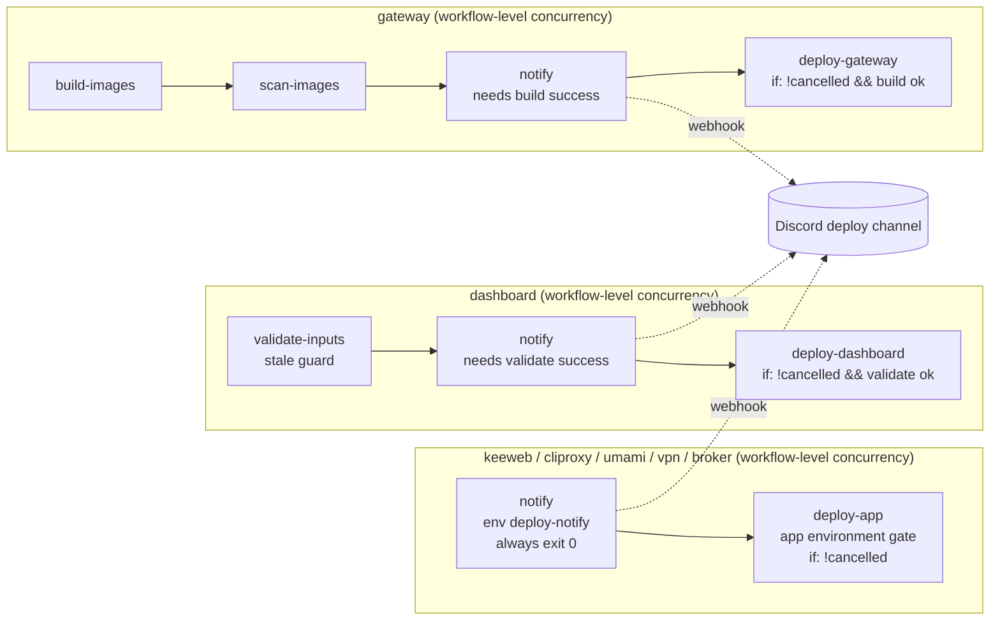

# feat: Post a Discord notification when a deploy reaches its approval gate

## Overview

Each of the seven app deploy workflows gains a `notify` job that runs immediately before its environment-gated deploy job. It posts one message to a dedicated Discord deploy channel, naming the app, the trigger, the change waiting to deploy, and the run link. A notify failure never fails or skips the deploy and can delay the gate by at most the notify job's timeout. The daily Fro Bot report stops opening issues for deploys stuck or cancelled at a gate, and the four stale deploy-wait issues are closed.

## Problem Frame

Every app deploy waits at a required-reviewer GitHub Environment gate. Unnoticed gates strand changes: an umami image bump ran the old version for about three weeks, and the dashboard fell five releases behind. The only signal today is the daily report's stranded-deploy check, which arrives up to a day late and opens GitHub issues that outlive the condition (#1412, #1436, #1437, #1440 are all superseded). See origin: `docs/brainstorms/2026-10-07-deploy-gate-discord-notification-requirements.md`.

## Requirements Trace

**Gate notification**
- R1. One message per gated run, posted before the run waits, from outside the gated job.
- R2. Message names app, trigger, change (push: commit subject + short SHA; dashboard dispatch: version + digest; other manual dispatch: ref + short SHA), and run link.
- R3. All seven gated apps, on router, direct-dispatch, and dashboard image-pin paths from `main`.
- R4. One post per run; a bounded retry may rarely duplicate; no edits or reminders.

**Failure behavior**
- R5. A failed or skipped post never fails or skips the deploy, delays the gate by at most the notify timeout, and leaves a visible warning.
- R6. No secrets, env values, or logs in the message; mentions disabled; commit text rendered as plain text.

**Delivery channel**
- R7. Dedicated Discord webhook, independent of the gateway and the cliproxy monitor, readable only from `main`.

**Daily report**
- R8. Deploys waiting or cancelled at the gate become report-only rows; failed deploys and down apps keep their issues.

**Cleanup**
- R9. Close #1412, #1436, #1437, #1440 with a note citing the superseding deploy.

**Success criteria**
- A gated deploy is seen within minutes as a phone push notification.
- No new deploy-wait issues.
- GitHub's pending-deployment notification is enabled and checked during rollout as the fallback.

## Scope Boundaries

- No reminders, no outcome edits, no follow-up messages.
- No gateway `/v1/announce` or Fro Bot persona.
- No consolidation of other alerts into the deploy channel.
- `fro-bot-storage` has no reviewer gate and is not covered.
- No change to which environments require approval, their reviewers, or router paths-filter behavior.
- No shared notification library; the cliproxy monitor sender stays as-is.
- Branch dispatches never post.

## Context & Research

### Relevant Code and Patterns

- `.github/workflows/deploy.yaml`: router; explicit `secrets:` per caller job, no top-level concurrency, `workflow_dispatch` fans out to all seven apps.
- `.github/workflows/deploy-{keeweb,cliproxy,umami,vpn,broker}.yaml`: single gated job; workflow-level concurrency `deploy-<app>-${{ github.ref_name }}`, `cancel-in-progress: false`. A pending run starts no jobs.
- `.github/workflows/deploy-gateway.yaml`: ungated `build-images` → `scan-images`, then gated `deploy-gateway` carrying the concurrency group at job level.
- `.github/workflows/deploy-dashboard.yaml`: ungated `validate-inputs` (input validation + stale-dispatch guard), then gated `deploy-dashboard` carrying the concurrency group at job level; `version`/`digest` dispatch inputs.
- `packages/cli/src/commands/cliproxy/monitor.ts` `sendDiscord`: 3 attempts, 10s `AbortController` timeout, retry only on 429/≥500/network/timeout, `Retry-After` capped, `allowed_mentions: {parse: []}`, throws on non-retryable status. Behavior to mirror, not import.
- `packages/cli/scripts/reconcile-autoheal-reports.ts`, `packages/cli/scripts/prune-untagged-packages.ts`: repo-local workflow script pattern (Bun shebang, injectable `fetch`, env reader, JSON `summaryLine`, `import.meta.main` guard, colocated tests, not published).
- `.github/workflows/fro-bot.yaml` storage job and the `fro-bot-storage` environment: main-only environment with no reviewer, the precedent for the notify environment.
- `packages/cli/src/conventions.test.ts`: router permission parity, no-aggregate-concurrency guard, per-app concurrency list (omits broker), dashboard `validate-inputs` pins including exact `needs` and an assertion that `deploy-dashboard` has no `if`, gateway exact-`needs` pins, reconciler off-surface checks.
- `.github/workflows/fro-bot.yaml` daily prompt, category 7 (Deploy Pipeline Health): stranded-deploy check block, seven per-app "open an issue" bullets, and the closing "Report findings as issues only for this category" line.

### Institutional Learnings

- `docs/solutions/workflow-issues/reusable-workflow-permission-parity-startup-failure-2026-09-01.md`: a callee asking for more than its caller grants fails the whole router at startup with zero jobs; verify with a live branch dispatch of `deploy.yaml`.
- `docs/solutions/workflow-issues/approval-gated-run-cancellation-2026-09-02.md`: a gated job is paused before any step runs; `waiting` runs ignore cancel; CI-manipulating-CI changes need live exercise.
- `docs/solutions/workflow-issues/aggregate-deploy-concurrency-cancels-gated-deploys-2026-06-25.md`: never add router-level concurrency; waiting runs behave as pending; per-app groups bound blast radius.
- `docs/solutions/workflow-issues/renovate-changesets-monorepo-targeting-2026-04-15.md`: `.github/**` and repo-local scripts need no changeset.
- `docs/runbooks/discord-token-lifecycle.md`: secret handling and rotation precedent.

## Prior-Art Survey

```json
{
  "schema_version": 2,
  "verdict": "extend",
  "scope": ".",
  "freshness": {
    "vcs_reference": "0bf5f44f9032ea728ada3e0f133eb4c2a19a0305",
    "scope_baseline": "deploy router plus seven deploy-<app>.yaml callees, packages/cli monitor and scripts, conventions tests, gateway announce wiring, docs/solutions workflow learnings"
  },
  "budget": {
    "max_search_passes": 3,
    "max_candidate_inspections": 10,
    "exhausted": false
  },
  "candidates": [
    {
      "path_or_symbol": "packages/cli/src/commands/cliproxy/monitor.ts sendDiscord",
      "description": "Discord webhook delivery with bounded retries, timeout, Retry-After, and mentions disabled",
      "disposition": "extend"
    },
    {
      "path_or_symbol": "packages/cli/scripts/reconcile-autoheal-reports.ts",
      "description": "Repo-local, unpublished workflow script pattern with env reader, injectable fetch, summary line, colocated tests",
      "disposition": "extend"
    },
    {
      "path_or_symbol": ".github/workflows/deploy-dashboard.yaml validate-inputs",
      "description": "Existing ungated pre-approval job with a stale-dispatch guard",
      "disposition": "extend"
    },
    {
      "path_or_symbol": ".github/workflows/fro-bot.yaml fro-bot-storage environment",
      "description": "Main-only environment with no reviewer protecting a secret used by an unattended job",
      "disposition": "extend"
    },
    {
      "path_or_symbol": "apps/gateway/src/deploy.ts /v1/announce wiring",
      "description": "Optional gateway announce ingress",
      "disposition": "insufficient",
      "insufficiency_reason": "Depends on the gateway being up, which is the app that may be waiting at its own gate"
    },
    {
      "path_or_symbol": ".github/workflows/fro-bot.yaml Deploy Pipeline Health prompt",
      "description": "Daily after-the-fact stranded-deploy reporting",
      "disposition": "insufficient",
      "insufficiency_reason": "Runs once a day after the fact; does not notify when a run reaches a gate"
    }
  ]
}
```

## Key Technical Decisions

- **Separate `notify` job, gated job `needs:` it:** GitHub pauses a gated job before any step, so an in-job step would post only after approval.
- **All seven apps hold their concurrency group at workflow level:** a run queued behind a deploy waiting for approval starts no jobs, so its notify fires only when it is next in line for its own gate. Gateway and dashboard move from job level to workflow level; the cost is that a queued gateway run builds its images only after the previous gateway deploy clears.
- **Webhook lives in a dedicated `deploy-notify` environment limited to `main`, with no reviewer:** code on other branches can't read it and branch dispatches can't post. The router passes nothing; callees declare no new `workflow_call` secret. Each notify run records a deployment in that environment, which is accepted.
- **The gated job tolerates notify failure:** it runs on `!cancelled()` plus its existing upstream success conditions, so a runner, setup, environment-policy, or script failure in notify cannot skip the deploy.
- **Bounded delay:** notify has a 3-minute job timeout, the most it can delay the gate.
- **Notify stays success-gated on upstream pre-gate work:** gateway notify requires `build-images` success; dashboard notify requires `validate-inputs` success. A run that cannot reach the gate posts nothing, and the dashboard stale-dispatch guard dedupes superseded dispatches.
- **Zero-dependency script, no `bun install`:** `packages/cli/scripts/deploy-gate-notify.ts` uses only Bun built-ins, global `fetch`, and `process.env`.
- **Mirror `sendDiscord` semantics rather than extracting a shared helper:** keeps the monitor untouched and avoids a notification framework with one consumer.
- **Always exit 0:** every failure path emits a `::warning::`, a step-summary line, and a body-free JSON summary.
- **Webhook only via `env:`:** never interpolated into `run:`, argv, or logs.
- **Plain-text rendering:** mentions disabled via `allowed_mentions`, Discord markdown and masked-link syntax escaped in commit text, content bounded below Discord's 2000-character limit.
- **Accept seven posts on a manual router dispatch:** it fans out to every app, and each post is a real gate.
- **"Cancelled at the gate" means the deploy job never ran a step:** the run is still waiting, or the deploy job was cancelled before its first step. A deploy job that ran and then failed or was cancelled partway through still opens an issue, as do down-app checks.

## Open Questions

### Resolved During Planning

- Notify placement: separate job per callee, not a shared reusable workflow.
- Sender reuse: mirror `sendDiscord` behavior in a standalone script.
- Secret scope: main-only `deploy-notify` environment, not a repository secret.
- Queued runs: workflow-level concurrency on all seven apps, so queued runs post only when next in line.
- Retry semantics: 3 attempts, 10s timeout, retry on 429/≥500/network/timeout, `Retry-After` honored with a cap; duplicates accepted.
- Daily prompt scope: only deploys whose job never ran a step become report-only.

### Deferred to Implementation

- Where the commit subject comes from on each path (event payload versus `git log` on the checked-out SHA) and which GitHub context values are passed as env.
- The exact `if:` expression on each gated job that preserves today's gating on `build-images`, `scan-images`, and `validate-inputs` while ignoring notify's result.
- Whether the dashboard stale-dispatch guard's run query behaves the same once its concurrency group moves to workflow level; keep the pre-gate and in-gate guard bodies byte-identical.
- The `Retry-After` cap and the content truncation length.

## High-Level Technical Design

> *This illustrates the intended approach and is directional guidance for review, not implementation specification. The implementing agent should treat it as context, not code to reproduce.*



## Implementation Units

- [ ] **Unit 1: Deploy-gate notify script**

**Goal:** A repo-local script that builds the gate message from env and posts it once to Discord, never failing.

**Requirements:** R2, R4, R5, R6

**Dependencies:** None

**Files:**
- Create: `packages/cli/scripts/deploy-gate-notify.ts`
- Test: `packages/cli/scripts/deploy-gate-notify.test.ts`

**Approach:**
- Env reader parses webhook, app name, event name, actor, ref, SHA, commit subject, repository, server URL, run ID, and optional dashboard version and digest. A missing webhook yields a `skipped` outcome, not an error.
- Message builder selects the change line by path: push (subject + short SHA), dashboard dispatch with version (version + digest), other manual dispatch (ref + short SHA). Escapes Discord markdown and masked links, bounds length.
- Sender mirrors `sendDiscord`: injectable `fetch` and sleep, `allowed_mentions: {parse: []}`, 3 attempts, 10s timeout, retry on 429/≥500/network/timeout, capped `Retry-After`.
- Entry point catches everything, emits `::warning::` on skip or failure, appends a step-summary line, prints a body-free JSON summary, and exits 0.
- No package imports, so it runs without `bun install`.

**Execution note:** Test-first for the message builder and sender contract.

**Patterns to follow:**
- `packages/cli/scripts/reconcile-autoheal-reports.ts` (structure, env reader, `summaryLine`, `import.meta.main`)
- `packages/cli/src/commands/cliproxy/monitor.ts` `sendDiscord` and `packages/cli/src/commands/cliproxy/monitor.test.ts` (retry and mention tests)

**Test scenarios:**
- Happy path: push event with subject and SHA → one POST whose content names the app, "push", subject, short SHA, and run URL; `allowed_mentions.parse` is empty.
- Happy path: dashboard dispatch with version and digest → content names version and short digest, not the commit subject.
- Happy path: non-dashboard manual dispatch → content names ref, short SHA, and the dispatching actor.
- Edge case: subject containing `@everyone`, `@here`, `<@&1234>`, backticks, `**bold**`, and `[run](https://evil.example)` → rendered inert; no mention parsing; no live masked link.
- Edge case: 3000-character subject → content under Discord's limit.
- Error path: webhook unset or empty → no request, `skipped` summary, warning emitted, exit 0.
- Error path: 429 with `Retry-After` then 204 → two attempts, honored delay within cap, `sent`.
- Error path: 500 three times → three attempts, `failed`, warning, exit 0.
- Error path: 404 (revoked webhook) → one attempt, `failed`, warning, exit 0.
- Error path: timeout on every attempt → three attempts, `failed`, exit 0.
- Error path: unexpected exception in message building → caught, warning, exit 0.
- Edge case: webhook value never appears in stdout, the summary line, or the step-summary text.

**Verification:**
- Colocated tests pass; the script runs from a fresh checkout without `node_modules`.

- [ ] **Unit 2: Wire notify into the seven deploy workflows**

**Goal:** Every gated deploy runs notify first, tolerates its failure, and holds its concurrency group at workflow level.

**Requirements:** R1, R3, R5, R7

**Dependencies:** Unit 1

**Files:**
- Modify: `.github/workflows/deploy-keeweb.yaml`
- Modify: `.github/workflows/deploy-cliproxy.yaml`
- Modify: `.github/workflows/deploy-gateway.yaml`
- Modify: `.github/workflows/deploy-umami.yaml`
- Modify: `.github/workflows/deploy-vpn.yaml`
- Modify: `.github/workflows/deploy-dashboard.yaml`
- Modify: `.github/workflows/deploy-broker.yaml`

**Approach:**
- New `notify` job per callee: `environment: deploy-notify`, `permissions: contents: read`, `timeout-minutes: 3`, checkout without persisted credentials, SHA-pinned `setup-bun` matching existing pins, run the script with the webhook and context values bound through `env:` only.
- Gateway notify `needs: [build-images, scan-images]` and runs only when the build succeeded; dashboard notify `needs: validate-inputs`.
- Each gated job adds `notify` to `needs:` with an `if:` that combines `!cancelled()` with its existing upstream success requirements.
- Gateway and dashboard move their `deploy-<app>-${{ github.ref_name }}` group, `cancel-in-progress: false`, from the gated job to workflow level; the other five are unchanged.
- `.github/workflows/deploy.yaml` is unchanged: no new secret pass-through, and notify asks only for `contents: read`.

**Patterns to follow:**
- `.github/workflows/deploy-dashboard.yaml` `validate-inputs` (ungated pre-gate job shape)
- `.github/workflows/deploy-keeweb.yaml` (workflow-level concurrency block)
- `.github/workflows/cliproxy-auth-monitor.yaml` (checkout and setup-bun steps, webhook via `env:`)

**Test scenarios:**
- Covered by Unit 3 conventions tests and Unit 5 live verification.

**Verification:**
- Conventions tests pass; a branch dispatch of `deploy.yaml` creates jobs (no startup failure).

- [ ] **Unit 3: Conventions tests for the notify contract**

**Goal:** Lock the topology so a later edit can't silently drop coverage, expose the webhook, or make notify block a deploy.

**Requirements:** R1, R3, R5, R7

**Dependencies:** Unit 2

**Files:**
- Modify: `packages/cli/src/conventions.test.ts`

**Approach:**
- For each of the seven callees: a `notify` job exists with `environment: deploy-notify`, `timeout-minutes` no more than 3, runs `packages/cli/scripts/deploy-gate-notify.ts`, has no `bun install` step, and binds the webhook only via `env:`.
- The gated job lists `notify` in `needs:`, and its `if:` contains `!cancelled()` and does not require `needs.notify.result`.
- Every callee holds its concurrency group at workflow level; add `deploy-broker` to the per-app concurrency list it currently omits; update placement assertions for gateway and dashboard.
- Update existing exact-`needs` pins: dashboard's gated job needs `validate-inputs` and `notify`; gateway's gated job needs `build-images`, `scan-images`, and `notify`. Update the pin that asserts `deploy-dashboard` has no `if`.
- Gateway notify depends on `build-images`; dashboard notify depends on `validate-inputs`.
- The webhook secret is referenced only inside notify jobs, never in a `run:` body, never declared under `workflow_call.secrets`, and never passed by the router.
- The script stays off the published surface: not in `packages/cli/package.json` `files`/`exports`, not registered in the CLI, not in the MCP allowlist.

**Execution note:** Write these tests before Unit 2's workflow edits land so they fail first.

**Patterns to follow:**
- Existing per-app concurrency, dashboard `validate-inputs`, router permission-parity, and reconciler off-surface tests in `packages/cli/src/conventions.test.ts`.

**Test scenarios:**
- Happy path: all seven callees satisfy the notify contract.
- Error path: a gated job whose `if:` requires notify success fails the tolerance test.
- Error path: a notify job without `environment: deploy-notify` fails the secret-scope test.
- Error path: adding `bun install` to a notify job fails the zero-dependency test.
- Error path: interpolating the webhook in a `run:` body, or passing it from the router, fails the secret-handling test.
- Error path: moving a concurrency group back to job level fails the placement test.

**Verification:**
- `bun test packages/cli` passes with the new suite.

- [ ] **Unit 4: Daily report scope and docs**

**Goal:** The daily report stops opening issues for deploys whose job never ran; docs describe the notification, its environment, and its secret.

**Requirements:** R8, R7

**Dependencies:** None (independent of Units 1–3)

**Files:**
- Modify: `.github/workflows/fro-bot.yaml`
- Modify: `AGENTS.md`
- Modify: `ARCHITECTURE.md`
- Create: `docs/runbooks/deploy-gate-notifications.md`

**Approach:**
- In the Deploy Pipeline Health category, the stranded-deploy check and each per-app bullet classify a deploy as at-gate when the app's deploy job never ran a step (still waiting, or cancelled before its first step). At-gate runs without a later successful deploy are a table row only and never open, update, or comment on issues. A deploy job that ran and then failed or was cancelled partway through still opens an issue, as do down-app checks. Rewrite "Report findings as issues only for this category" to match.
- Keep every required heading and the managed report structure the reconciler depends on.
- `AGENTS.md` NOTES: `DEPLOY_GATE_DISCORD_WEBHOOK` is the only secret in the `deploy-notify` environment, which is limited to `main` and has no reviewer.
- `ARCHITECTURE.md` deploy-gating concern mentions the pre-gate notification and the workflow-level concurrency on all seven apps; update through the `generating-project-docs` skill.
- Runbook: channel and webhook creation, creating `deploy-notify` with its main-only branch policy before any workflow references it, storing the secret, enabling phone push and GitHub pending-deployment notifications, rotation and revocation, reading the notify warning.

**Patterns to follow:**
- `docs/runbooks/discord-token-lifecycle.md`
- `docs/runbooks/agent-s3-durable-storage.md` (main-only environment without reviewer)

**Test scenarios:**
- Happy path: conventions tests for required report headings and prompt bounds still pass.
- Test expectation for docs: none -- documentation only.

**Verification:**
- `bun test packages/cli` and `bun run lint` pass; no prompt text tells the agent to open an issue for a deploy whose job never ran.

- [ ] **Unit 5: Rollout and live verification**

**Goal:** Prove the router still starts, branch runs neither post nor block, a real gate produces a phone notification, and close the stale issues.

**Requirements:** R1, R3, R5, R7, R9, success criteria

**Dependencies:** Units 1–4 on a branch; the operator creates the Discord webhook and the `deploy-notify` environment with its secret before the first dispatch (an environment referenced before it exists is auto-created without a branch policy)

**Files:**
- Test expectation: none -- operational verification.

**Approach:**
- Pre-merge: dispatch `deploy.yaml` on the branch. Expect jobs created for every app (no startup failure), each notify job rejected by the `deploy-notify` branch policy with nothing posted, and each gated job still attempted. This exercises notify-failure tolerance live.
- After merge, the first real gated run on `main` confirms the message content, plain-text rendering, run link, no mentions, a phone push within minutes, and GitHub's own pending-deployment notification.
- Close #1412, #1436, #1437, #1440, each with a one-line note citing the superseding successful deploy (drafted for approval before posting).

**Verification:**
- Raw evidence saved: branch run ID with per-job conclusions, the first `main` run ID, the Discord message, and the closed-issue readbacks.

## System-Wide Impact

- **Interaction graph:** every deploy path gains one job before the gate; router fan-out unchanged.
- **Error propagation:** notify failures surface as run warnings and step-summary lines only; the gated job ignores notify's result.
- **State lifecycle risks:** none persisted beyond `deploy-notify` deployment records; duplicate posts possible on ambiguous Discord failures (accepted).
- **Concurrency:** gateway and dashboard queue whole runs instead of only their gated jobs; a queued gateway run builds after the previous gateway deploy clears.
- **Integration coverage:** router startup and real gate timing are only provable by live dispatch (Unit 5).
- **Unchanged invariants:** no router-level concurrency; `cancel-in-progress: false` everywhere; app environment reviewers and branch policies unchanged; dashboard stale-dispatch guards byte-identical; cliproxy monitor untouched; router permissions and secrets unchanged.

## Risks & Dependencies

| Risk | Mitigation |
|------|------------|
| Router `startup_failure` blocks all seven deploys | Notify asks only for `contents: read` and no new caller secret; branch dispatch of `deploy.yaml` before merge |
| Notify infrastructure or policy failure skips a deploy | Gated jobs use `!cancelled()`; no `bun install`; script always exits 0; 3-minute timeout bounds the delay |
| `deploy-notify` auto-created without a branch policy | Operator creates it with the policy before the first dispatch; runbook calls this out |
| Webhook leak lets anyone post to the channel | Main-only environment secret, `env:`-only binding, rotation steps in the runbook |
| Discord outage hides a gate | GitHub's pending-deployment notification, checked during rollout; daily report row |
| Channel muted or unwatched | Phone push confirmed during rollout |
| Gateway build latency after a long-waiting prior deploy | Accepted; builds run once the previous gateway deploy clears |

## Documentation / Operational Notes

- New `deploy-notify` environment (main-only, no reviewer) holding `DEPLOY_GATE_DISCORD_WEBHOOK`; operator-created, never in tracked files.
- No changeset: changes are under `.github/**`, `docs/**`, and unpublished `packages/cli/scripts/`.
- Issue closures and any public comments require per-action approval.

## Sources & References

- **Origin document:** [docs/brainstorms/2026-10-07-deploy-gate-discord-notification-requirements.md](../brainstorms/2026-10-07-deploy-gate-discord-notification-requirements.md)
- Related code: `packages/cli/src/commands/cliproxy/monitor.ts`, `.github/workflows/deploy*.yaml`, `.github/workflows/fro-bot.yaml`, `packages/cli/src/conventions.test.ts`
- Related issues: #1412, #1436, #1437, #1440
